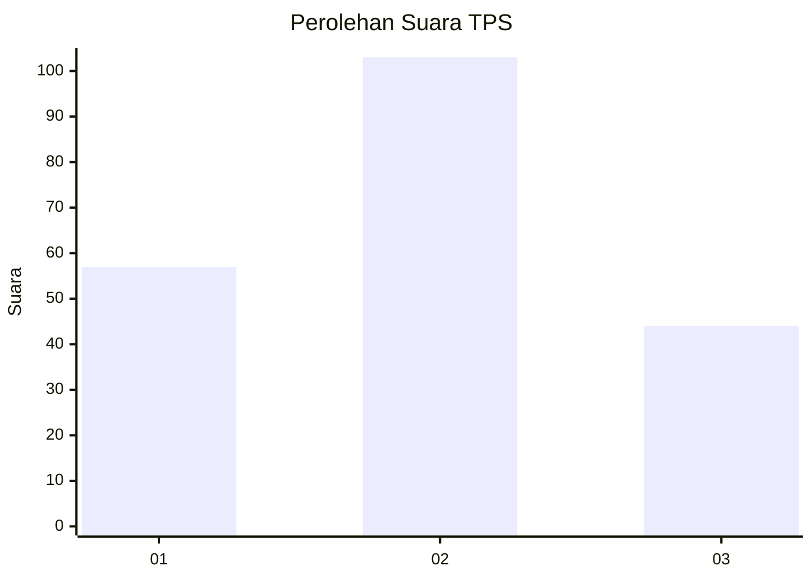
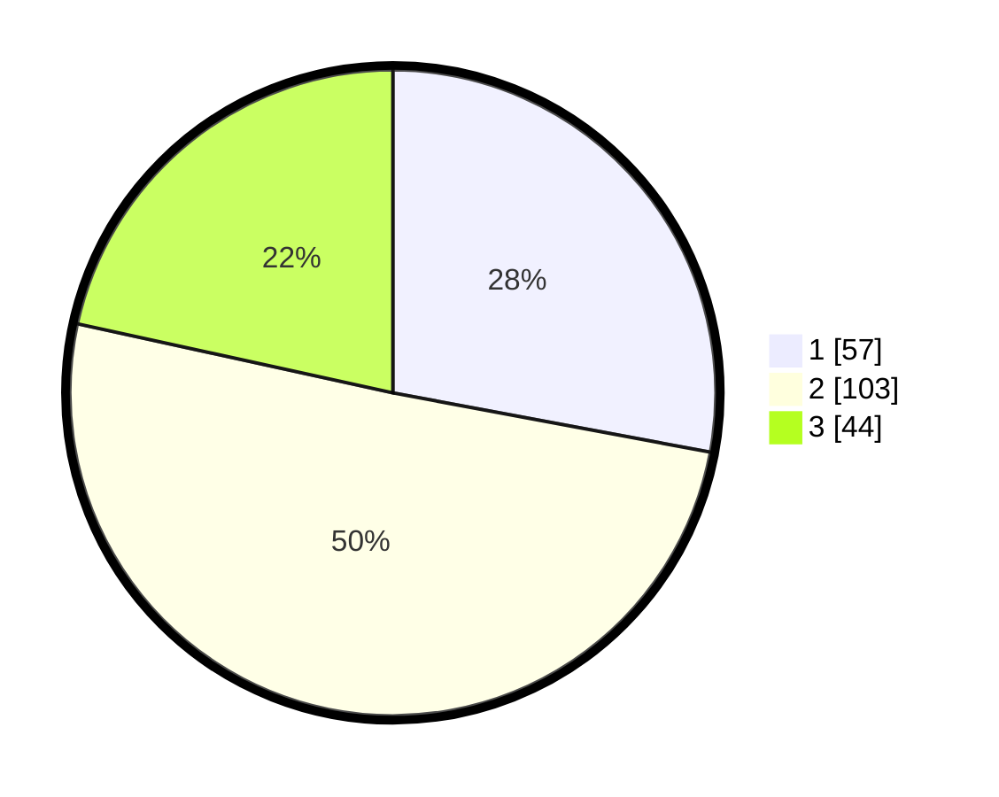

# Hasil

## Grafik

## Tabel

| No. | Nama Paslon    | Suara | Suara (raw) | Persentase |
|:--- |:-------------- | -----:| -----------:| ----------:|
| 1   | ANIES MUHAIMIN | 57    | [57][p-1]   | 27,94      |
| 2   | PRABOWO GIBRAN | 103   | [103][p-2]  | 50,49      |
| 3   | GANJAR MAHFUD  | 44    | [44][p-3]   | 21,57      |

[p-1]: https://github.com/gigit-pemilu/pemilu-2024-35-jawa-timur/blob/main/pilpres/hitung-suara/sub/35-jawa-timur/sub/15-sidoarjo/sub/08-sidoarjo/sub/2008-rangkahkidul/sub/009-tps/sub/paslon-1.txt
[p-2]: https://github.com/gigit-pemilu/pemilu-2024-35-jawa-timur/blob/main/pilpres/hitung-suara/sub/35-jawa-timur/sub/15-sidoarjo/sub/08-sidoarjo/sub/2008-rangkahkidul/sub/009-tps/sub/paslon-2.txt
[p-3]: https://github.com/gigit-pemilu/pemilu-2024-35-jawa-timur/blob/main/pilpres/hitung-suara/sub/35-jawa-timur/sub/15-sidoarjo/sub/08-sidoarjo/sub/2008-rangkahkidul/sub/009-tps/sub/paslon-3.txt

## Foto C Plano

https://sirekap-obj-formc.kpu.go.id/568b/pemilu/ppwp/35/15/08/20/08/3515082008009-20240217-211416--2ca724fc-6313-4cf2-8a27-9bbd13309e6e.jpg

https://sirekap-obj-formc.kpu.go.id/568b/pemilu/ppwp/35/15/08/20/08/3515082008009-20240217-205110--502935b8-5cfb-4db6-9b0d-f36041873316.jpg

https://sirekap-obj-formc.kpu.go.id/568b/pemilu/ppwp/35/15/08/20/08/3515082008009-20240217-205149--c3a75910-a79c-42bd-8a1c-407d8f958b4d.jpg

## Metadata

| Key        | Value               |
| ---------- | ------------------- |
| Time Stamp | 2024-02-26 12:00:00 |

