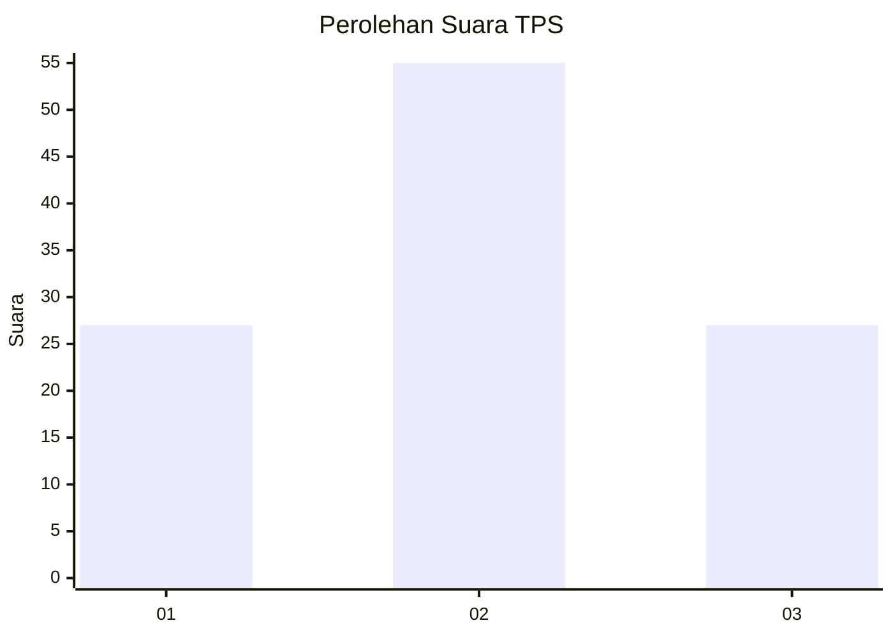
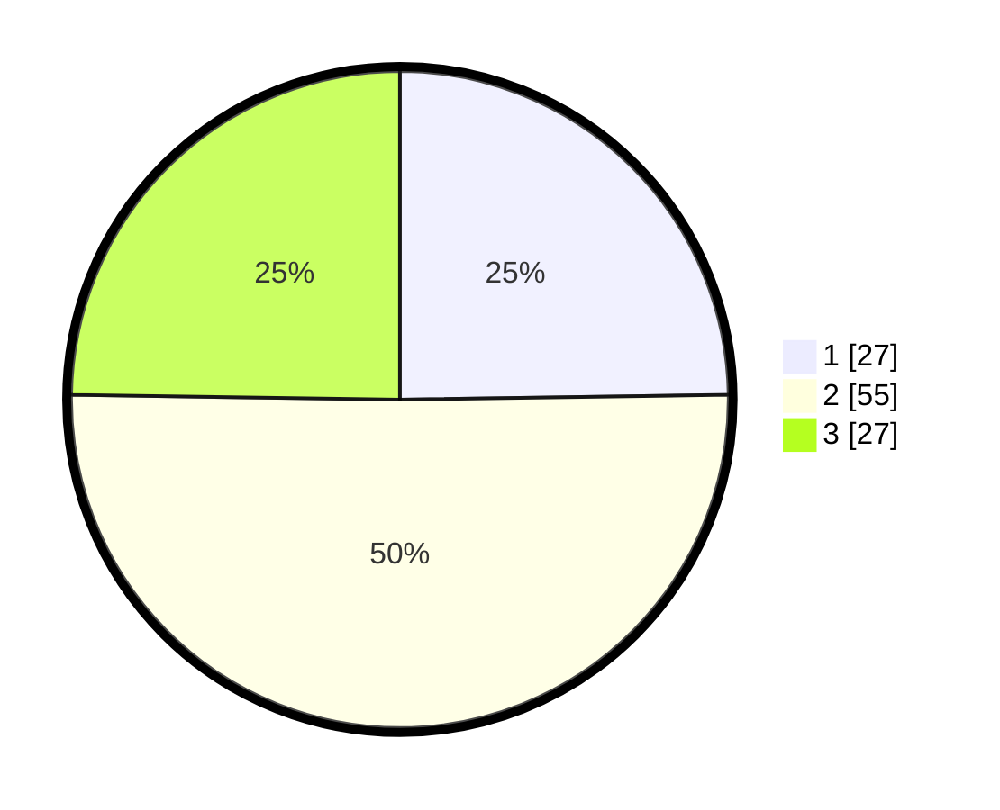

# Hasil

## Grafik

## Tabel

| No. | Nama Paslon    | Suara | Suara (raw) | Persentase |
|:--- |:-------------- | -----:| -----------:| ----------:|
| 1   | ANIES MUHAIMIN | 27    | [27][p-1]   | 24,77      |
| 2   | PRABOWO GIBRAN | 55    | [55][p-2]   | 50,46      |
| 3   | GANJAR MAHFUD  | 27    | [27][p-3]   | 24,77      |

[p-1]: https://github.com/gigit-pemilu/pemilu-2024/blob/main/pilpres/hitung-suara/sub/35-jawa-timur/sub/15-sidoarjo/sub/08-sidoarjo/sub/2008-rangkahkidul/sub/013-tps/sub/paslon-1.txt
[p-2]: https://github.com/gigit-pemilu/pemilu-2024/blob/main/pilpres/hitung-suara/sub/35-jawa-timur/sub/15-sidoarjo/sub/08-sidoarjo/sub/2008-rangkahkidul/sub/013-tps/sub/paslon-2.txt
[p-3]: https://github.com/gigit-pemilu/pemilu-2024/blob/main/pilpres/hitung-suara/sub/35-jawa-timur/sub/15-sidoarjo/sub/08-sidoarjo/sub/2008-rangkahkidul/sub/013-tps/sub/paslon-3.txt

## Foto C Plano

https://sirekap-obj-formc.kpu.go.id/bf03/pemilu/ppwp/35/15/08/20/08/3515082008013-20240216-192344--3234067a-c3b7-4298-9ac3-3ba322b6b7dd.jpg

https://sirekap-obj-formc.kpu.go.id/bf03/pemilu/ppwp/35/15/08/20/08/3515082008013-20240216-193526--5933ef68-cadd-4af7-a724-83f7a402f718.jpg

https://sirekap-obj-formc.kpu.go.id/bf03/pemilu/ppwp/35/15/08/20/08/3515082008013-20240216-195403--6d611cba-b7ad-46fe-907c-3c8bfe8cf28e.jpg

## Metadata

| Key        | Value               |
| ---------- | ------------------- |
| Time Stamp | 2024-02-16 21:01:00 |

## DATA PEMILIH TETAP

Jumlah pemilih dalam DPT: **109**.
 * L: **51**.
 * P: **58**.

## DATA PENGGUNA HAK PILIH

Jumlah pengguna hak pilih dalam DPT: **84**.
 * L: **42**.
 * P: **42**.

Jumlah pengguna hak pilih dalam DPTb: **3**.
 * L: **1**.
 * P: **2**.

Jumlah pengguna hak pilih dalam DPK: **22**.
 * L: **12**.
 * P: **10**.

Jumlah pengguna hak pilih: **109**.
 * L: **55**.
 * P: **54**.

## JUMLAH SUARA SAH DAN TIDAK SAH

JUMLAH SELURUH SUARA SAH: **109**.

JUMLAH SUARA TIDAK SAH: **0**.

JUMLAH SELURUH SUARA SAH DAN SUARA TIDAK SAH: **109**.

