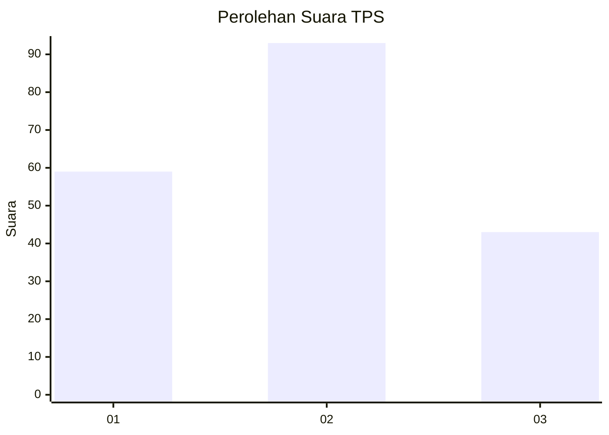
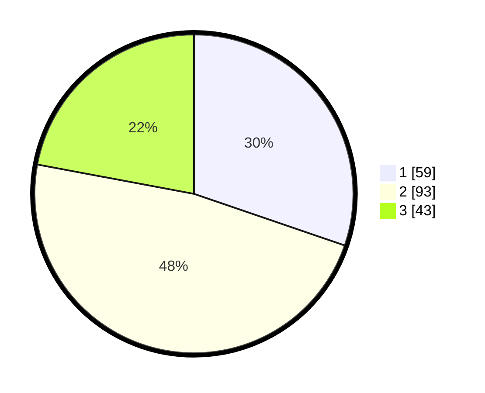

# Hasil

## Grafik

## Tabel

| No. | Nama Paslon    | Suara | Suara (raw) | Persentase |
|:--- |:-------------- | -----:| -----------:| ----------:|
| 1   | ANIES MUHAIMIN | 59    | [59][p-1]   | 30,26      |
| 2   | PRABOWO GIBRAN | 93    | [93][p-2]   | 47,69      |
| 3   | GANJAR MAHFUD  | 43    | [43][p-3]   | 22,05      |

[p-1]: https://github.com/gigit-pemilu/pemilu-2024-35-jawa-timur/blob/main/pilpres/hitung-suara/sub/35-jawa-timur/sub/15-sidoarjo/sub/08-sidoarjo/sub/2015-blurukidul/sub/018-tps/sub/paslon-1.txt
[p-2]: https://github.com/gigit-pemilu/pemilu-2024-35-jawa-timur/blob/main/pilpres/hitung-suara/sub/35-jawa-timur/sub/15-sidoarjo/sub/08-sidoarjo/sub/2015-blurukidul/sub/018-tps/sub/paslon-2.txt
[p-3]: https://github.com/gigit-pemilu/pemilu-2024-35-jawa-timur/blob/main/pilpres/hitung-suara/sub/35-jawa-timur/sub/15-sidoarjo/sub/08-sidoarjo/sub/2015-blurukidul/sub/018-tps/sub/paslon-3.txt

## Foto C Plano

https://sirekap-obj-formc.kpu.go.id/4f1b/pemilu/ppwp/35/15/08/20/15/3515082015018-20240214-185508--43732d6a-6871-4278-8c2f-233eacc848d3.jpg

https://sirekap-obj-formc.kpu.go.id/4f1b/pemilu/ppwp/35/15/08/20/15/3515082015018-20240214-185511--c56dfc3a-bf54-413e-a567-7baa3d45d1d2.jpg

https://sirekap-obj-formc.kpu.go.id/4f1b/pemilu/ppwp/35/15/08/20/15/3515082015018-20240214-185513--9c87d052-e174-4c01-8741-d5612dd3bf12.jpg

## Metadata

| Key        | Value               |
| ---------- | ------------------- |
| Time Stamp | 2024-02-25 12:00:00 |

