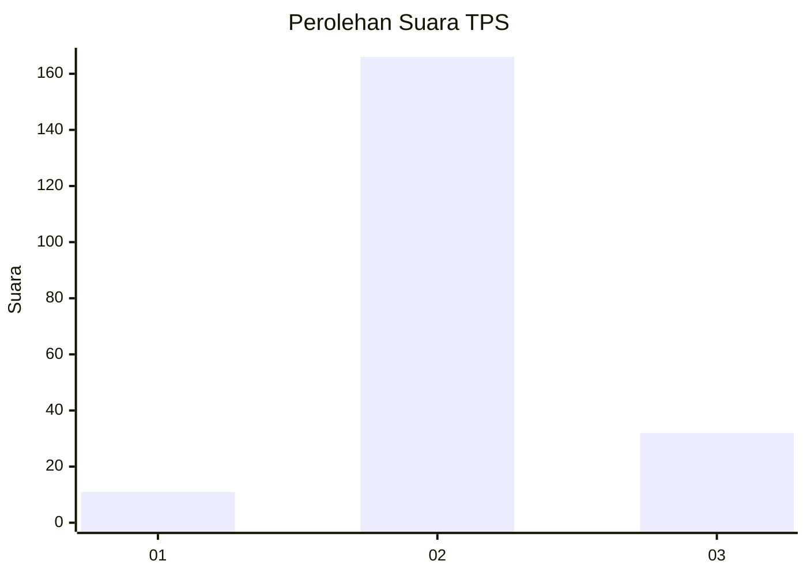
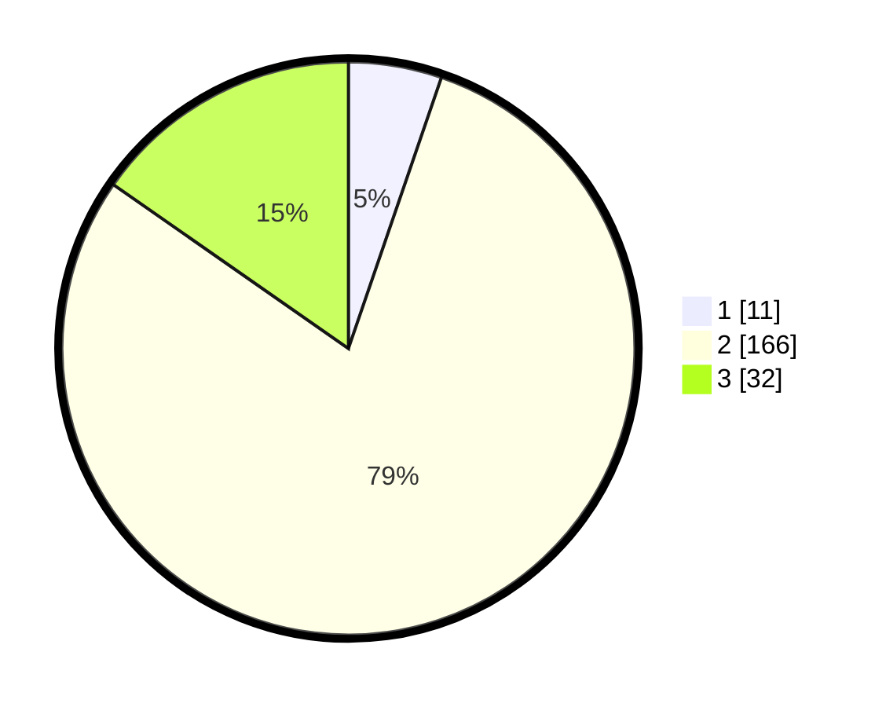

# Hasil

## Grafik

## Tabel

| No. | Nama Paslon    | Suara | Suara (raw) | Persentase |
|:--- |:-------------- | -----:| -----------:| ----------:|
| 1   | ANIES MUHAIMIN | 11    | [11][p-1]   | 5,26       |
| 2   | PRABOWO GIBRAN | 166   | [166][p-2]  | 79,43      |
| 3   | GANJAR MAHFUD  | 32    | [32][p-3]   | 15,31      |

[p-1]: https://github.com/gigit-pemilu/pemilu-2024/blob/main/pilpres/hitung-suara/sub/35-jawa-timur/sub/15-sidoarjo/sub/09-tulangan/sub/2004-gelang/sub/014-tps/sub/paslon-1.txt
[p-2]: https://github.com/gigit-pemilu/pemilu-2024/blob/main/pilpres/hitung-suara/sub/35-jawa-timur/sub/15-sidoarjo/sub/09-tulangan/sub/2004-gelang/sub/014-tps/sub/paslon-2.txt
[p-3]: https://github.com/gigit-pemilu/pemilu-2024/blob/main/pilpres/hitung-suara/sub/35-jawa-timur/sub/15-sidoarjo/sub/09-tulangan/sub/2004-gelang/sub/014-tps/sub/paslon-3.txt

## Foto C Plano

https://sirekap-obj-formc.kpu.go.id/d29f/pemilu/ppwp/35/15/09/20/04/3515092004014-20240216-202204--94a2bbc8-6209-4dbe-b102-bf6d5293e1f2.jpg

https://sirekap-obj-formc.kpu.go.id/d29f/pemilu/ppwp/35/15/09/20/04/3515092004014-20240216-201929--4689298e-dd16-43ec-999b-48d22f5c4874.jpg

https://sirekap-obj-formc.kpu.go.id/d29f/pemilu/ppwp/35/15/09/20/04/3515092004014-20240216-202101--6f0b0e6e-ff66-4b52-9cf7-276c96f4bea4.jpg

## Metadata

| Key        | Value               |
| ---------- | ------------------- |
| Time Stamp | 2024-02-24 22:31:28 |

