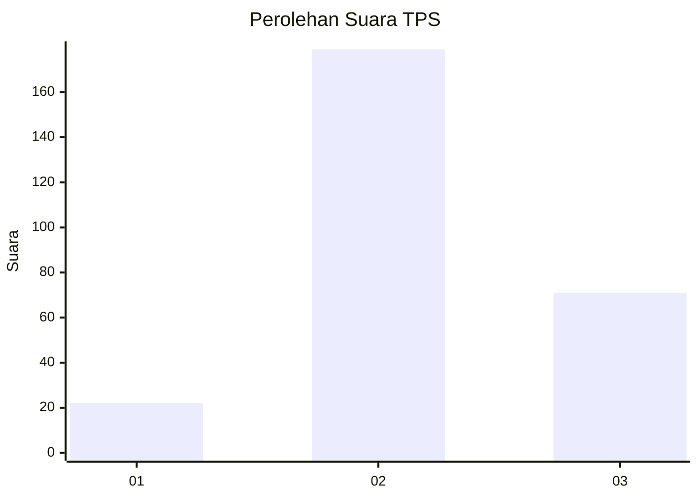
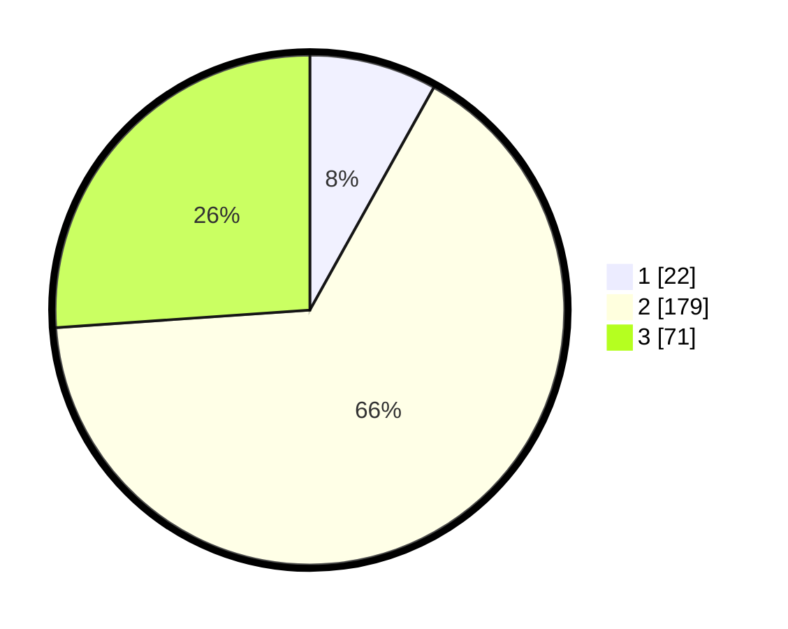

# Hasil

## Grafik

## Tabel

| No. | Nama Paslon    | Suara | Suara (raw) | Persentase |
|:--- |:-------------- | -----:| -----------:| ----------:|
| 1   | ANIES MUHAIMIN | 22    | [22][p-1]   | 8,09       |
| 2   | PRABOWO GIBRAN | 179   | [179][p-2]  | 65,81      |
| 3   | GANJAR MAHFUD  | 71    | [71][p-3]   | 26,10      |

[p-1]: https://github.com/gigit-pemilu/pemilu-2024-35-jawa-timur/blob/main/pilpres/hitung-suara/sub/35-jawa-timur/sub/15-sidoarjo/sub/09-tulangan/sub/2007-kepatihan/sub/013-tps/sub/paslon-1.txt
[p-2]: https://github.com/gigit-pemilu/pemilu-2024-35-jawa-timur/blob/main/pilpres/hitung-suara/sub/35-jawa-timur/sub/15-sidoarjo/sub/09-tulangan/sub/2007-kepatihan/sub/013-tps/sub/paslon-2.txt
[p-3]: https://github.com/gigit-pemilu/pemilu-2024-35-jawa-timur/blob/main/pilpres/hitung-suara/sub/35-jawa-timur/sub/15-sidoarjo/sub/09-tulangan/sub/2007-kepatihan/sub/013-tps/sub/paslon-3.txt

## Foto C Plano

https://sirekap-obj-formc.kpu.go.id/e5ae/pemilu/ppwp/35/15/09/20/07/3515092007013-20240221-124455--1183ca06-7dfc-4ac2-8ef6-9be4acf3ef7c.jpg

https://sirekap-obj-formc.kpu.go.id/e5ae/pemilu/ppwp/35/15/09/20/07/3515092007013-20240221-124248--751f6849-314f-4c2f-8622-aed977904eb1.jpg

https://sirekap-obj-formc.kpu.go.id/e5ae/pemilu/ppwp/35/15/09/20/07/3515092007013-20240221-124310--e23040a5-2709-42c3-8e7a-6b5d6397f229.jpg

## Metadata

| Key        | Value               |
| ---------- | ------------------- |
| Time Stamp | 2024-02-21 13:00:00 |

