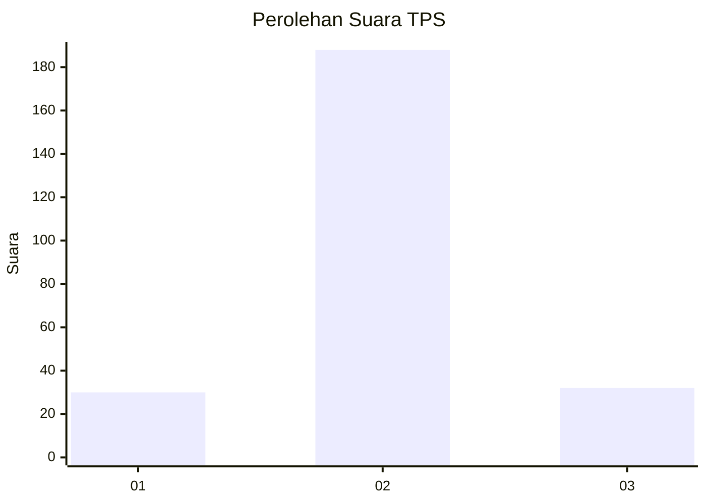
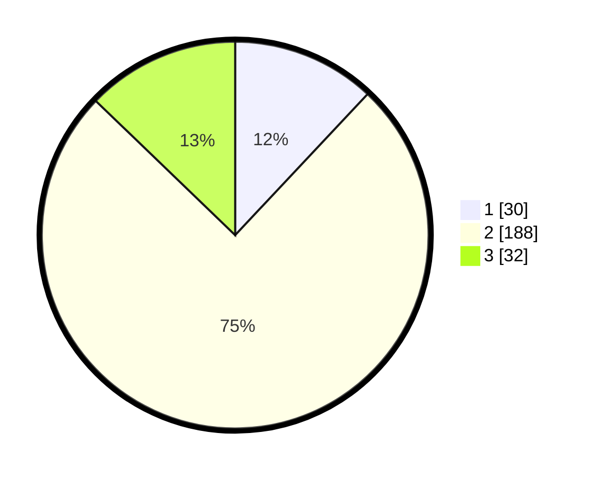

# Hasil

## Grafik

## Tabel

| No. | Nama Paslon    | Suara | Suara (raw) | Persentase |
|:--- |:-------------- | -----:| -----------:| ----------:|
| 1   | ANIES MUHAIMIN | 30    | [30][p-1]   | 12,00      |
| 2   | PRABOWO GIBRAN | 188   | [188][p-2]  | 75,20      |
| 3   | GANJAR MAHFUD  | 32    | [32][p-3]   | 12,80      |

[p-1]: https://github.com/gigit-pemilu/pemilu-2024-35-jawa-timur/blob/main/pilpres/hitung-suara/sub/35-jawa-timur/sub/15-sidoarjo/sub/09-tulangan/sub/2016-grinting/sub/004-tps/sub/paslon-1.txt
[p-2]: https://github.com/gigit-pemilu/pemilu-2024-35-jawa-timur/blob/main/pilpres/hitung-suara/sub/35-jawa-timur/sub/15-sidoarjo/sub/09-tulangan/sub/2016-grinting/sub/004-tps/sub/paslon-2.txt
[p-3]: https://github.com/gigit-pemilu/pemilu-2024-35-jawa-timur/blob/main/pilpres/hitung-suara/sub/35-jawa-timur/sub/15-sidoarjo/sub/09-tulangan/sub/2016-grinting/sub/004-tps/sub/paslon-3.txt

## Foto C Plano

https://sirekap-obj-formc.kpu.go.id/afa5/pemilu/ppwp/35/15/09/20/16/3515092016004-20240215-195834--5e5b52f3-c435-4d99-94d4-d6a0204c6dc8.jpg

https://sirekap-obj-formc.kpu.go.id/afa5/pemilu/ppwp/35/15/09/20/16/3515092016004-20240218-161539--4c0e31d1-c462-4b65-9d50-416ce2aeaa33.jpg

https://sirekap-obj-formc.kpu.go.id/afa5/pemilu/ppwp/35/15/09/20/16/3515092016004-20240218-161538--8565bfc4-ba7b-493e-b126-c047a0fc4527.jpg

## Metadata

| Key        | Value               |
| ---------- | ------------------- |
| Time Stamp | 2024-02-21 19:00:00 |

