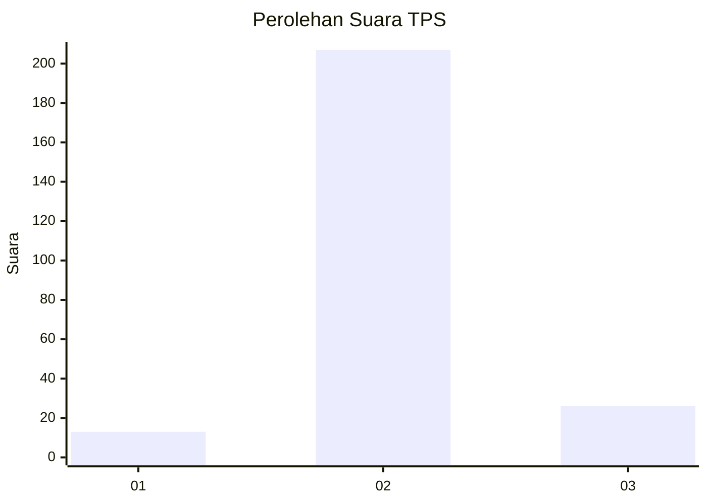
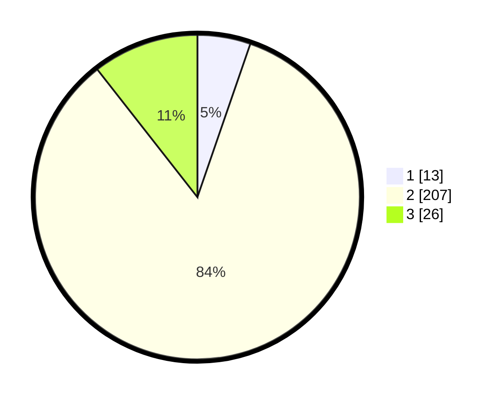

# Hasil

## Grafik

## Tabel

| No. | Nama Paslon    | Suara | Suara (raw) | Persentase |
|:--- |:-------------- | -----:| -----------:| ----------:|
| 1   | ANIES MUHAIMIN | 13    | [13][p-1]   | 5,28       |
| 2   | PRABOWO GIBRAN | 207   | [207][p-2]  | 84,15      |
| 3   | GANJAR MAHFUD  | 26    | [26][p-3]   | 10,57      |

[p-1]: https://github.com/gigit-pemilu/pemilu-2024-35-jawa-timur/blob/main/pilpres/hitung-suara/sub/35-jawa-timur/sub/15-sidoarjo/sub/09-tulangan/sub/2020-sudimoro/sub/001-tps/sub/paslon-1.txt
[p-2]: https://github.com/gigit-pemilu/pemilu-2024-35-jawa-timur/blob/main/pilpres/hitung-suara/sub/35-jawa-timur/sub/15-sidoarjo/sub/09-tulangan/sub/2020-sudimoro/sub/001-tps/sub/paslon-2.txt
[p-3]: https://github.com/gigit-pemilu/pemilu-2024-35-jawa-timur/blob/main/pilpres/hitung-suara/sub/35-jawa-timur/sub/15-sidoarjo/sub/09-tulangan/sub/2020-sudimoro/sub/001-tps/sub/paslon-3.txt

## Foto C Plano

https://sirekap-obj-formc.kpu.go.id/b9a6/pemilu/ppwp/35/15/09/20/20/3515092020001-20240220-162430--be00db9e-7177-4d40-ae62-2a2d6179b26e.jpg

https://sirekap-obj-formc.kpu.go.id/b9a6/pemilu/ppwp/35/15/09/20/20/3515092020001-20240220-162520--2e34dcb6-9fba-41cd-8a9b-44fa44f5f2eb.jpg

https://sirekap-obj-formc.kpu.go.id/b9a6/pemilu/ppwp/35/15/09/20/20/3515092020001-20240218-094815--030765cd-8308-4948-b208-a814e86e7aea.jpg

## Metadata

| Key        | Value               |
| ---------- | ------------------- |
| Time Stamp | 2024-02-25 11:00:00 |

