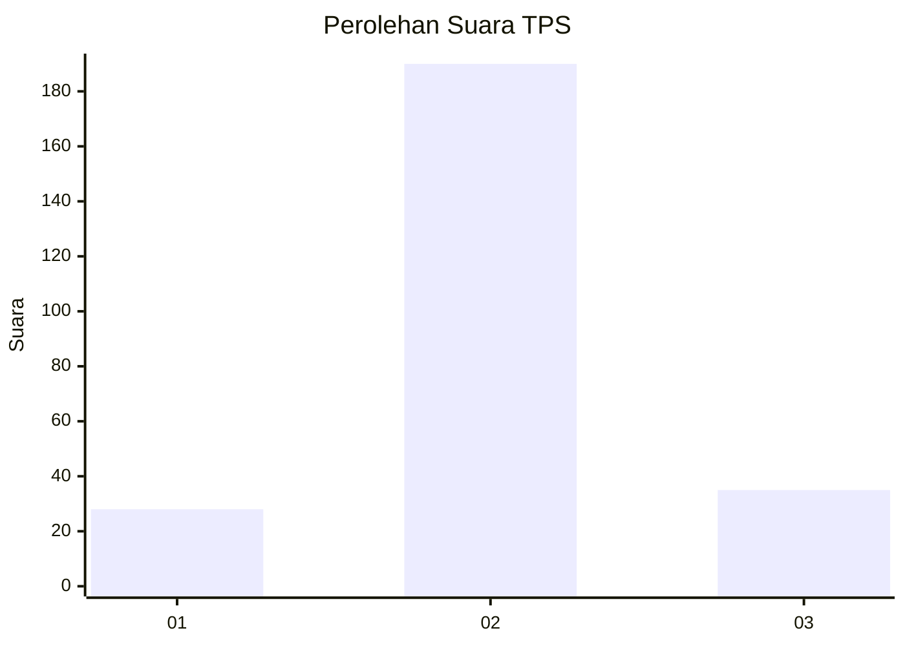
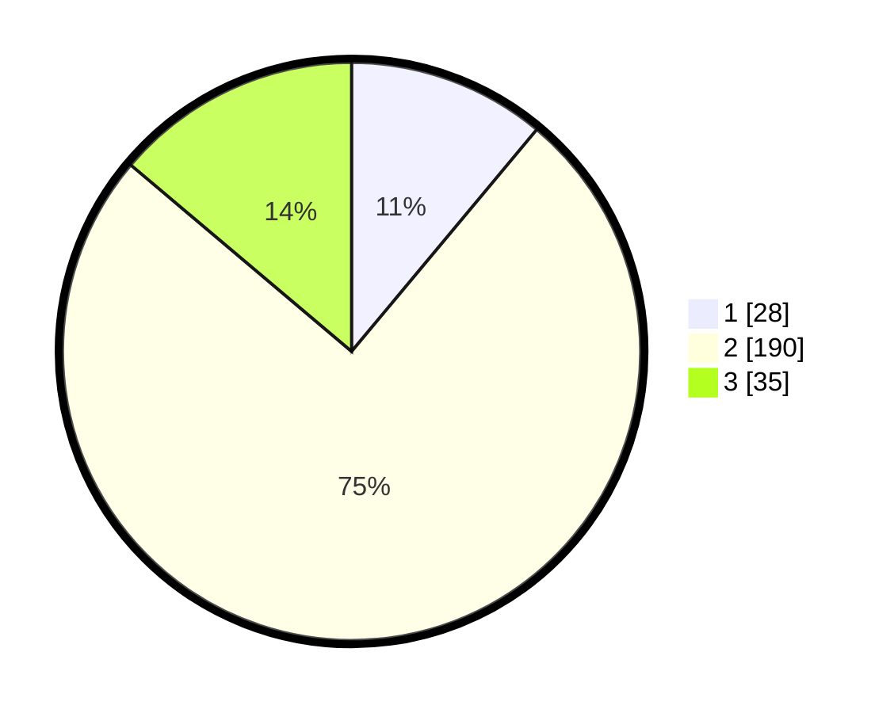

# Hasil

## Grafik

## Tabel

| No. | Nama Paslon    | Suara | Suara (raw) | Persentase |
|:--- |:-------------- | -----:| -----------:| ----------:|
| 1   | ANIES MUHAIMIN | 28    | [28][p-1]   | 11,07      |
| 2   | PRABOWO GIBRAN | 190   | [190][p-2]  | 75,10      |
| 3   | GANJAR MAHFUD  | 35    | [35][p-3]   | 13,83      |

[p-1]: https://github.com/gigit-pemilu/pemilu-2024-35-jawa-timur/blob/main/pilpres/hitung-suara/sub/35-jawa-timur/sub/15-sidoarjo/sub/09-tulangan/sub/2020-sudimoro/sub/008-tps/sub/paslon-1.txt
[p-2]: https://github.com/gigit-pemilu/pemilu-2024-35-jawa-timur/blob/main/pilpres/hitung-suara/sub/35-jawa-timur/sub/15-sidoarjo/sub/09-tulangan/sub/2020-sudimoro/sub/008-tps/sub/paslon-2.txt
[p-3]: https://github.com/gigit-pemilu/pemilu-2024-35-jawa-timur/blob/main/pilpres/hitung-suara/sub/35-jawa-timur/sub/15-sidoarjo/sub/09-tulangan/sub/2020-sudimoro/sub/008-tps/sub/paslon-3.txt

## Foto C Plano

https://sirekap-obj-formc.kpu.go.id/0553/pemilu/ppwp/35/15/09/20/20/3515092020008-20240214-195302--46b34eb8-a781-496b-8bf2-4ed8550858aa.jpg

https://sirekap-obj-formc.kpu.go.id/0553/pemilu/ppwp/35/15/09/20/20/3515092020008-20240214-195445--8566c3f4-df8a-4f6e-aa9b-4ec7b8e1c159.jpg

https://sirekap-obj-formc.kpu.go.id/0553/pemilu/ppwp/35/15/09/20/20/3515092020008-20240214-195539--9dbf917d-b908-4d2a-bfd1-4bdbed841e89.jpg

## Metadata

| Key        | Value               |
| ---------- | ------------------- |
| Time Stamp | 2024-02-25 13:00:00 |

