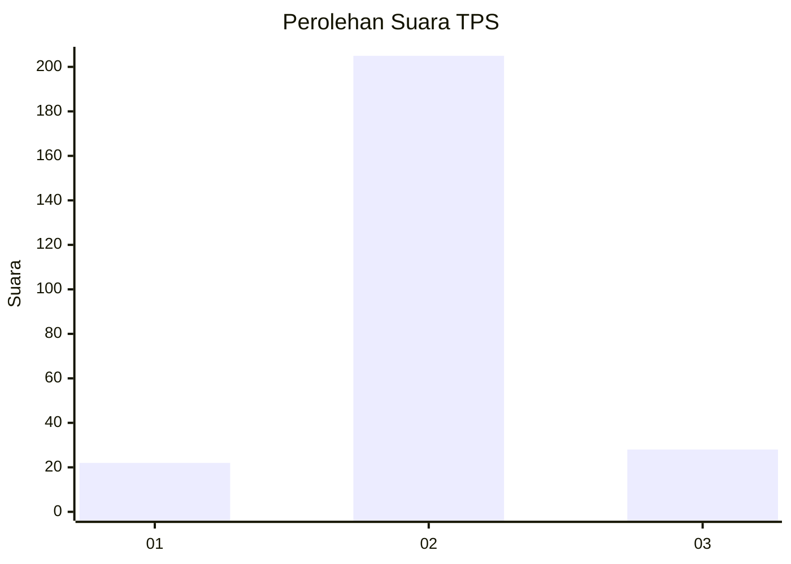
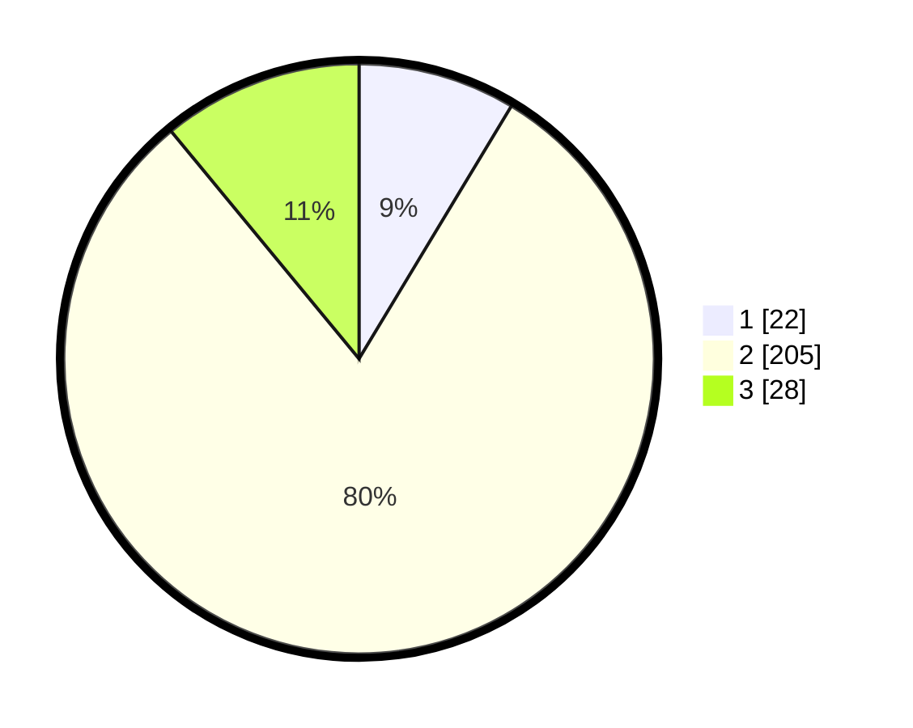

# Hasil

## Grafik

## Tabel

| No. | Nama Paslon    | Suara | Suara (raw) | Persentase |
|:--- |:-------------- | -----:| -----------:| ----------:|
| 1   | ANIES MUHAIMIN | 22    | [22][p-1]   | 8,63       |
| 2   | PRABOWO GIBRAN | 205   | [205][p-2]  | 80,39      |
| 3   | GANJAR MAHFUD  | 28    | [28][p-3]   | 10,98      |

[p-1]: https://github.com/gigit-pemilu/pemilu-2024-35-jawa-timur/blob/main/pilpres/hitung-suara/sub/35-jawa-timur/sub/15-sidoarjo/sub/09-tulangan/sub/2020-sudimoro/sub/009-tps/sub/paslon-1.txt
[p-2]: https://github.com/gigit-pemilu/pemilu-2024-35-jawa-timur/blob/main/pilpres/hitung-suara/sub/35-jawa-timur/sub/15-sidoarjo/sub/09-tulangan/sub/2020-sudimoro/sub/009-tps/sub/paslon-2.txt
[p-3]: https://github.com/gigit-pemilu/pemilu-2024-35-jawa-timur/blob/main/pilpres/hitung-suara/sub/35-jawa-timur/sub/15-sidoarjo/sub/09-tulangan/sub/2020-sudimoro/sub/009-tps/sub/paslon-3.txt

## Foto C Plano

https://sirekap-obj-formc.kpu.go.id/441f/pemilu/ppwp/35/15/09/20/20/3515092020009-20240220-220550--66f33f6d-5daa-45ce-ab56-a805704ad5b7.jpg

https://sirekap-obj-formc.kpu.go.id/441f/pemilu/ppwp/35/15/09/20/20/3515092020009-20240220-220631--09a47f77-0f23-43e1-9fc7-d8ce5e189a94.jpg

https://sirekap-obj-formc.kpu.go.id/441f/pemilu/ppwp/35/15/09/20/20/3515092020009-20240220-220807--4b18b6c9-5563-477f-9908-771674855fca.jpg

## Metadata

| Key        | Value               |
| ---------- | ------------------- |
| Time Stamp | 2024-02-24 22:31:28 |

