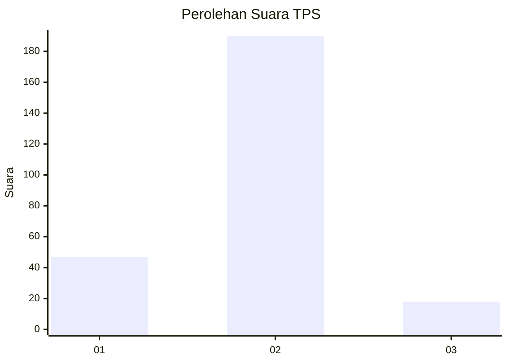
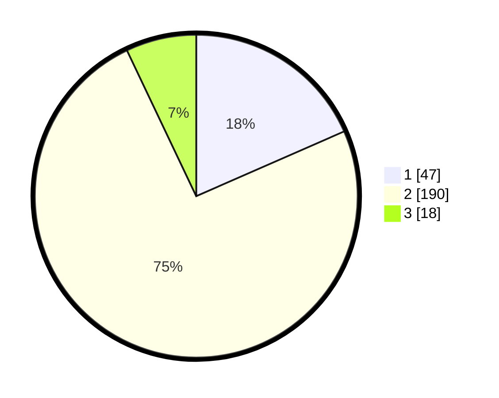

# Hasil

## Grafik

## Tabel

| No. | Nama Paslon    | Suara | Suara (raw) | Persentase |
|:--- |:-------------- | -----:| -----------:| ----------:|
| 1   | ANIES MUHAIMIN | 47    | [47][p-1]   | 18,43      |
| 2   | PRABOWO GIBRAN | 190   | [190][p-2]  | 74,51      |
| 3   | GANJAR MAHFUD  | 18    | [18][p-3]   | 7,06       |

[p-1]: https://github.com/gigit-pemilu/pemilu-2024-35-jawa-timur/blob/main/pilpres/hitung-suara/sub/35-jawa-timur/sub/15-sidoarjo/sub/09-tulangan/sub/2020-sudimoro/sub/010-tps/sub/paslon-1.txt
[p-2]: https://github.com/gigit-pemilu/pemilu-2024-35-jawa-timur/blob/main/pilpres/hitung-suara/sub/35-jawa-timur/sub/15-sidoarjo/sub/09-tulangan/sub/2020-sudimoro/sub/010-tps/sub/paslon-2.txt
[p-3]: https://github.com/gigit-pemilu/pemilu-2024-35-jawa-timur/blob/main/pilpres/hitung-suara/sub/35-jawa-timur/sub/15-sidoarjo/sub/09-tulangan/sub/2020-sudimoro/sub/010-tps/sub/paslon-3.txt

## Foto C Plano

https://sirekap-obj-formc.kpu.go.id/e9ec/pemilu/ppwp/35/15/09/20/20/3515092020010-20240215-015557--fcfd7068-4aab-4723-9d24-08e16c4b4230.jpg

https://sirekap-obj-formc.kpu.go.id/e9ec/pemilu/ppwp/35/15/09/20/20/3515092020010-20240220-220302--bc389349-8614-4f52-bffb-17f4cab49fe7.jpg

https://sirekap-obj-formc.kpu.go.id/e9ec/pemilu/ppwp/35/15/09/20/20/3515092020010-20240215-015803--5682c2c5-710a-49ba-94d9-c9dbe79fdf97.jpg

## Metadata

| Key        | Value               |
| ---------- | ------------------- |
| Time Stamp | 2024-02-24 22:31:28 |

