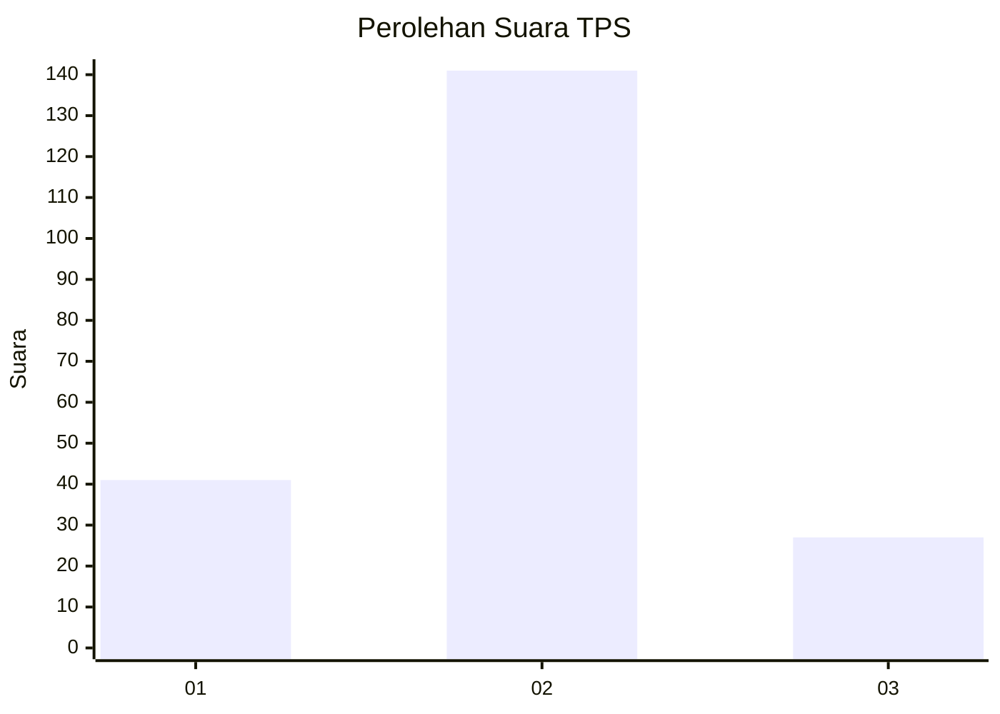
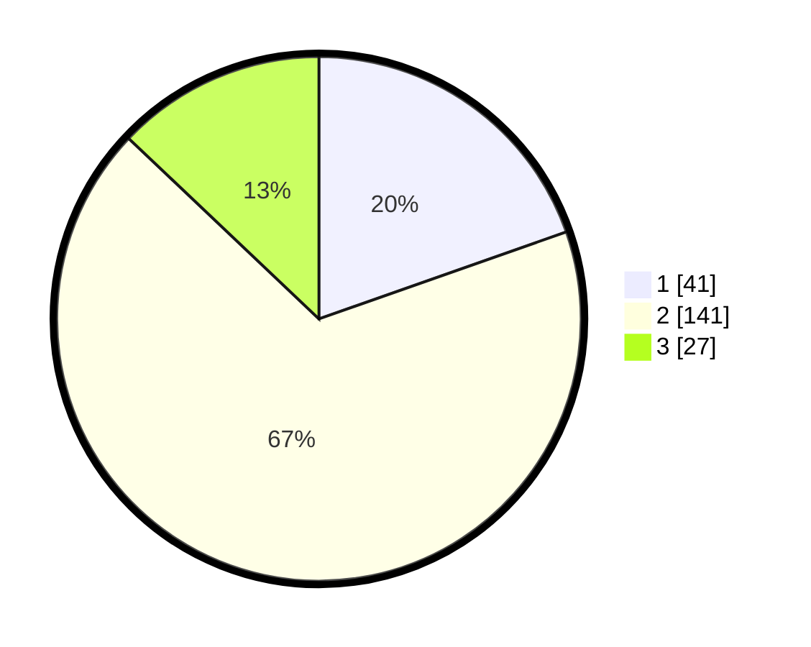

# Hasil

## Grafik

## Tabel

| No. | Nama Paslon    | Suara | Suara (raw) | Persentase |
|:--- |:-------------- | -----:| -----------:| ----------:|
| 1   | ANIES MUHAIMIN | 41    | [41][p-1]   | 19,62      |
| 2   | PRABOWO GIBRAN | 141   | [141][p-2]  | 67,46      |
| 3   | GANJAR MAHFUD  | 27    | [27][p-3]   | 12,92      |

[p-1]: https://github.com/gigit-pemilu/pemilu-2024-35-jawa-timur/blob/main/pilpres/hitung-suara/sub/35-jawa-timur/sub/15-sidoarjo/sub/10-wonoayu/sub/2015-simoangin-angin/sub/003-tps/sub/paslon-1.txt
[p-2]: https://github.com/gigit-pemilu/pemilu-2024-35-jawa-timur/blob/main/pilpres/hitung-suara/sub/35-jawa-timur/sub/15-sidoarjo/sub/10-wonoayu/sub/2015-simoangin-angin/sub/003-tps/sub/paslon-2.txt
[p-3]: https://github.com/gigit-pemilu/pemilu-2024-35-jawa-timur/blob/main/pilpres/hitung-suara/sub/35-jawa-timur/sub/15-sidoarjo/sub/10-wonoayu/sub/2015-simoangin-angin/sub/003-tps/sub/paslon-3.txt

## Foto C Plano

https://sirekap-obj-formc.kpu.go.id/ce7c/pemilu/ppwp/35/15/10/20/15/3515102015003-20240215-162010--4fe630f4-3e7c-4afa-8d8b-6bc55b2c75ec.jpg

https://sirekap-obj-formc.kpu.go.id/ce7c/pemilu/ppwp/35/15/10/20/15/3515102015003-20240215-162117--f1bac9b5-4f33-4b44-a5a7-e6073b0a7deb.jpg

https://sirekap-obj-formc.kpu.go.id/ce7c/pemilu/ppwp/35/15/10/20/15/3515102015003-20240215-162227--7ea224a6-8a38-4f75-b1d0-93466b986c26.jpg

## Metadata

| Key        | Value               |
| ---------- | ------------------- |
| Time Stamp | 2024-02-15 22:00:27 |

