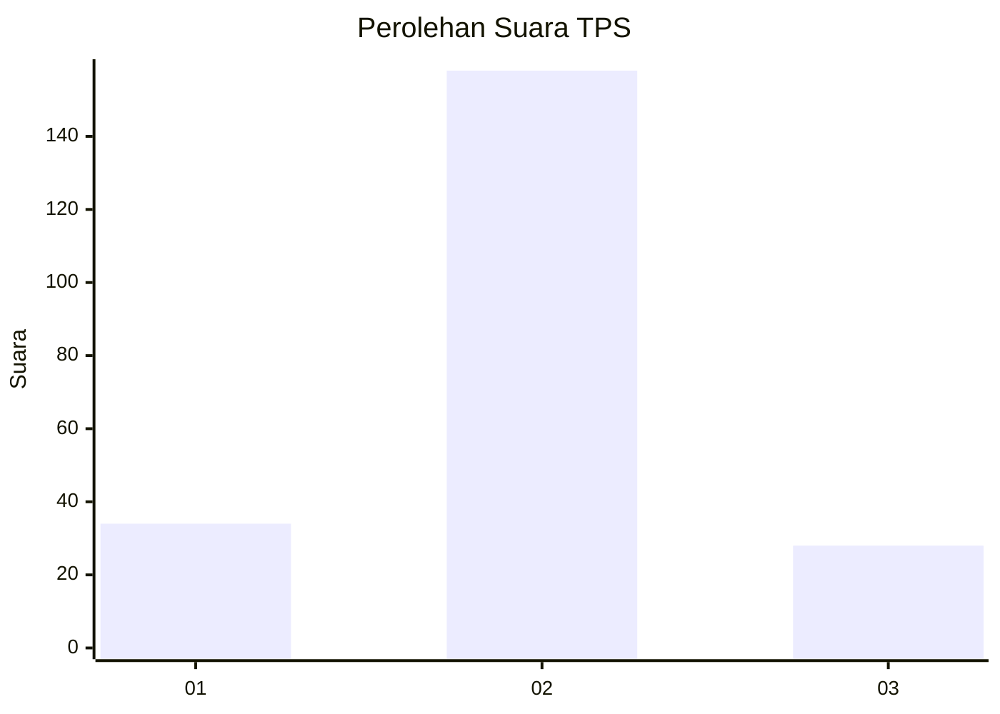
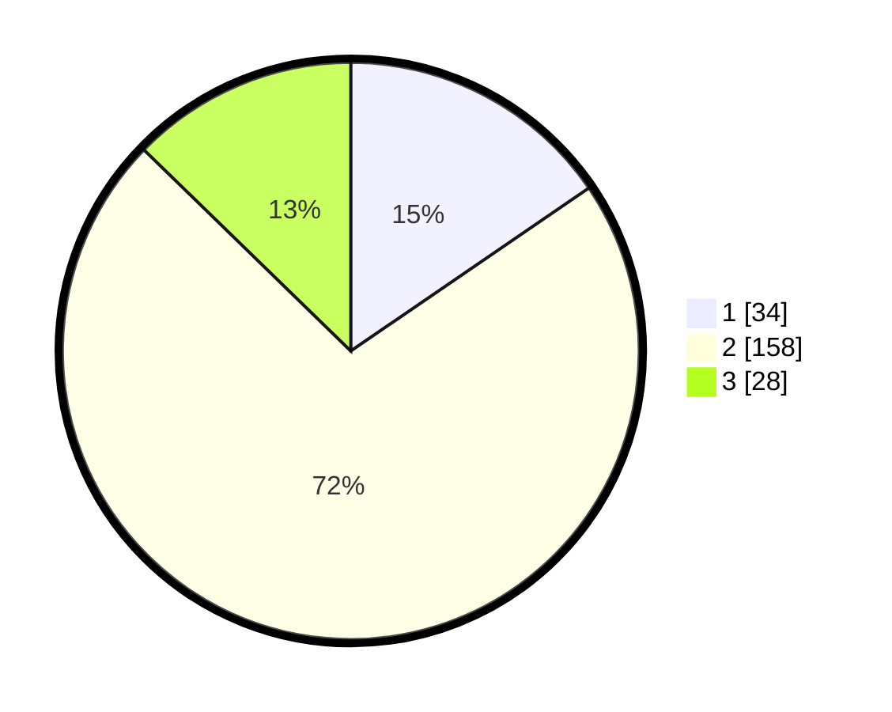

# Hasil

## Grafik

## Tabel

| No. | Nama Paslon    | Suara | Suara (raw) | Persentase |
|:--- |:-------------- | -----:| -----------:| ----------:|
| 1   | ANIES MUHAIMIN | 34    | [34][p-1]   | 15,45      |
| 2   | PRABOWO GIBRAN | 158   | [158][p-2]  | 71,82      |
| 3   | GANJAR MAHFUD  | 28    | [28][p-3]   | 12,73      |

[p-1]: https://github.com/gigit-pemilu/pemilu-2024/blob/main/pilpres/hitung-suara/sub/35-jawa-timur/sub/15-sidoarjo/sub/10-wonoayu/sub/2017-pagerngumbuk/sub/004-tps/sub/paslon-1.txt
[p-2]: https://github.com/gigit-pemilu/pemilu-2024/blob/main/pilpres/hitung-suara/sub/35-jawa-timur/sub/15-sidoarjo/sub/10-wonoayu/sub/2017-pagerngumbuk/sub/004-tps/sub/paslon-2.txt
[p-3]: https://github.com/gigit-pemilu/pemilu-2024/blob/main/pilpres/hitung-suara/sub/35-jawa-timur/sub/15-sidoarjo/sub/10-wonoayu/sub/2017-pagerngumbuk/sub/004-tps/sub/paslon-3.txt

## Foto C Plano

https://sirekap-obj-formc.kpu.go.id/9e84/pemilu/ppwp/35/15/10/20/17/3515102017004-20240215-195537--fa3fa353-ea21-4671-94c9-22c3dd2d2c06.jpg

https://sirekap-obj-formc.kpu.go.id/9e84/pemilu/ppwp/35/15/10/20/17/3515102017004-20240215-204432--8c5790ab-53d7-46c0-af4e-c0224a1fd2ad.jpg

https://sirekap-obj-formc.kpu.go.id/9e84/pemilu/ppwp/35/15/10/20/17/3515102017004-20240215-211746--3f0a5289-e95f-4450-8f6a-3901898c930e.jpg

## Metadata

| Key        | Value               |
| ---------- | ------------------- |
| Time Stamp | 2024-02-16 12:51:22 |

