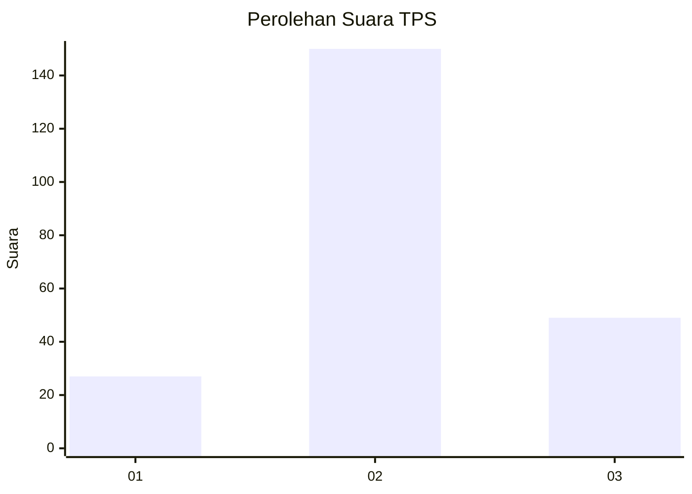
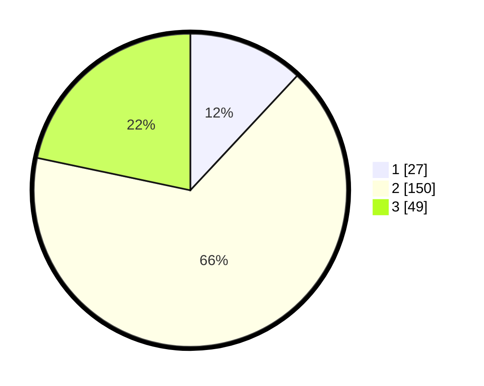

# Hasil

## Grafik

## Tabel

| No. | Nama Paslon    | Suara | Suara (raw) | Persentase |
|:--- |:-------------- | -----:| -----------:| ----------:|
| 1   | ANIES MUHAIMIN | 27    | [27][p-1]   | 11,95      |
| 2   | PRABOWO GIBRAN | 150   | [150][p-2]  | 66,37      |
| 3   | GANJAR MAHFUD  | 49    | [49][p-3]   | 21,68      |

[p-1]: https://github.com/gigit-pemilu/pemilu-2024/blob/main/pilpres/hitung-suara/sub/35-jawa-timur/sub/15-sidoarjo/sub/11-krian/sub/1015-tambakkemerakan/sub/008-tps/sub/paslon-1.txt
[p-2]: https://github.com/gigit-pemilu/pemilu-2024/blob/main/pilpres/hitung-suara/sub/35-jawa-timur/sub/15-sidoarjo/sub/11-krian/sub/1015-tambakkemerakan/sub/008-tps/sub/paslon-2.txt
[p-3]: https://github.com/gigit-pemilu/pemilu-2024/blob/main/pilpres/hitung-suara/sub/35-jawa-timur/sub/15-sidoarjo/sub/11-krian/sub/1015-tambakkemerakan/sub/008-tps/sub/paslon-3.txt

## Foto C Plano

https://sirekap-obj-formc.kpu.go.id/442f/pemilu/ppwp/35/15/11/10/15/3515111015008-20240214-191219--e10b4244-eecb-45e6-8dc7-b42d781e6cbf.jpg

https://sirekap-obj-formc.kpu.go.id/442f/pemilu/ppwp/35/15/11/10/15/3515111015008-20240214-191534--52eaf12a-6fb1-4cca-9771-f5f4dfb2ae50.jpg

https://sirekap-obj-formc.kpu.go.id/442f/pemilu/ppwp/35/15/11/10/15/3515111015008-20240214-191846--69f1e185-4edd-46f8-9ae5-f6110bc9c700.jpg

## Metadata

| Key        | Value               |
| ---------- | ------------------- |
| Time Stamp | 2024-02-25 11:00:00 |

