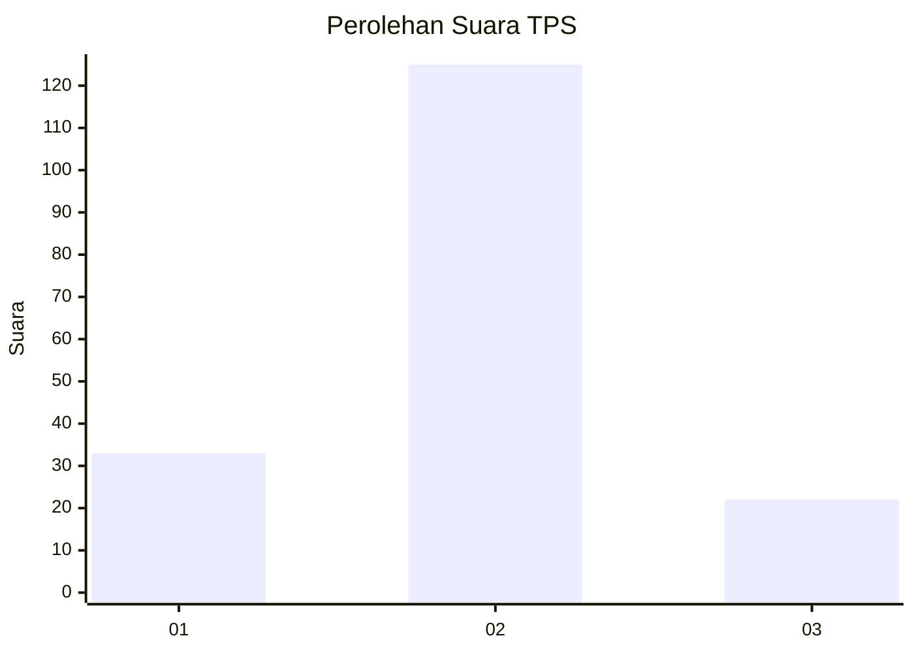
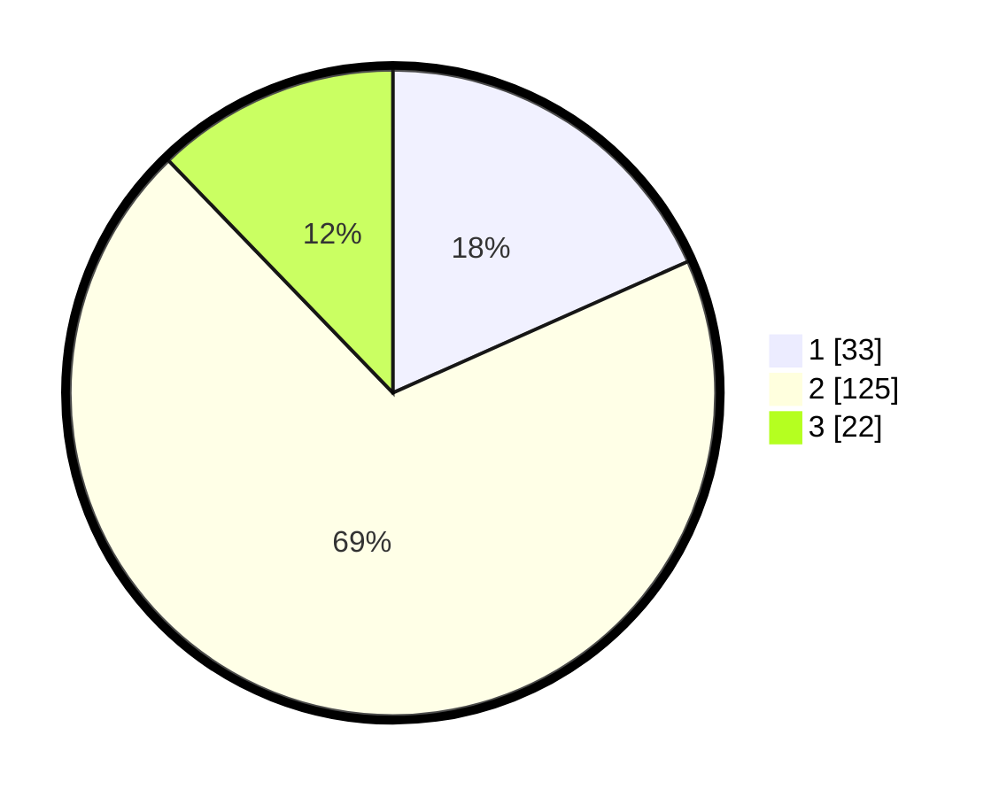

# Hasil

## Grafik

## Tabel

| No. | Nama Paslon    | Suara | Suara (raw) | Persentase |
|:--- |:-------------- | -----:| -----------:| ----------:|
| 1   | ANIES MUHAIMIN | 33    | [33][p-1]   | 18,33      |
| 2   | PRABOWO GIBRAN | 125   | [125][p-2]  | 69,44      |
| 3   | GANJAR MAHFUD  | 22    | [22][p-3]   | 12,22      |

[p-1]: https://github.com/gigit-pemilu/pemilu-2024-35-jawa-timur/blob/main/pilpres/hitung-suara/sub/35-jawa-timur/sub/15-sidoarjo/sub/11-krian/sub/1016-krian/sub/015-tps/sub/paslon-1.txt
[p-2]: https://github.com/gigit-pemilu/pemilu-2024-35-jawa-timur/blob/main/pilpres/hitung-suara/sub/35-jawa-timur/sub/15-sidoarjo/sub/11-krian/sub/1016-krian/sub/015-tps/sub/paslon-2.txt
[p-3]: https://github.com/gigit-pemilu/pemilu-2024-35-jawa-timur/blob/main/pilpres/hitung-suara/sub/35-jawa-timur/sub/15-sidoarjo/sub/11-krian/sub/1016-krian/sub/015-tps/sub/paslon-3.txt

## Foto C Plano

https://sirekap-obj-formc.kpu.go.id/fafd/pemilu/ppwp/35/15/11/10/16/3515111016015-20240216-211854--bb6f6034-d7b6-4dff-a493-68a7a9c2382a.jpg

https://sirekap-obj-formc.kpu.go.id/fafd/pemilu/ppwp/35/15/11/10/16/3515111016015-20240216-212454--947de064-8c5d-4776-b74f-e46d263f789c.jpg

https://sirekap-obj-formc.kpu.go.id/fafd/pemilu/ppwp/35/15/11/10/16/3515111016015-20240216-212653--2857bb29-7388-498a-ba6d-0b9c896888ef.jpg

## Metadata

| Key        | Value               |
| ---------- | ------------------- |
| Time Stamp | 2024-02-19 06:16:00 |

## DATA PEMILIH TETAP

Jumlah pemilih dalam DPT: **552**.
 * L: **839**.
 * P: **822**.

## DATA PENGGUNA HAK PILIH

Jumlah pengguna hak pilih dalam DPT: **882**.
 * L: **93**.
 * P: **88**.

Jumlah pengguna hak pilih dalam DPTb: **0**.
 * L: **40**.
 * P: **0**.

Jumlah pengguna hak pilih dalam DPK: **83**.
 * L: **483**.
 * P: **2**.

Jumlah pengguna hak pilih: **835**.
 * L: **294**.
 * P: **98**.

## JUMLAH SUARA SAH DAN TIDAK SAH

JUMLAH SELURUH SUARA SAH: **180**.

JUMLAH SUARA TIDAK SAH: **5**.

JUMLAH SELURUH SUARA SAH DAN SUARA TIDAK SAH: **185**.

