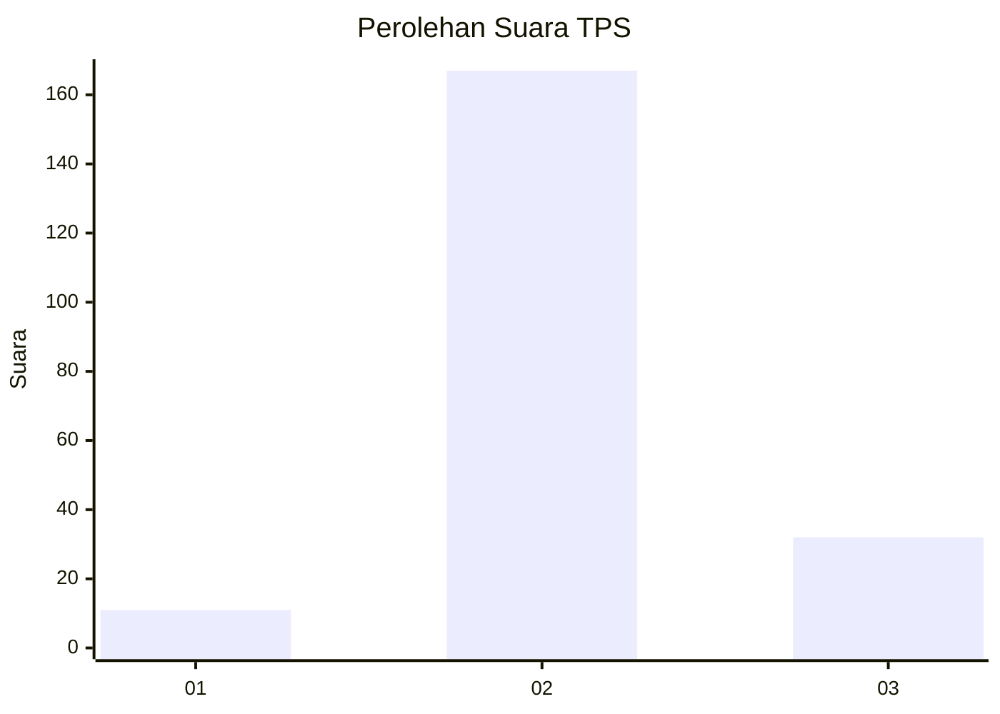

# Hasil

## Grafik

## Tabel

| No. | Nama Paslon    | Suara | Suara (raw) | Persentase |
|:--- |:-------------- | -----:| -----------:| ----------:|
| 1   | ANIES MUHAIMIN | 11    | [11][p-1]   | 5,24       |
| 2   | PRABOWO GIBRAN | 167   | [167][p-2]  | 79,52      |
| 3   | GANJAR MAHFUD  | 32    | [32][p-3]   | 15,24      |

[p-1]: https://github.com/gigit-pemilu/pemilu-2024/blob/main/pilpres/hitung-suara/sub/35-jawa-timur/sub/15-sidoarjo/sub/11-krian/sub/2001-tropodo/sub/005-tps/sub/paslon-1.txt
[p-2]: https://github.com/gigit-pemilu/pemilu-2024/blob/main/pilpres/hitung-suara/sub/35-jawa-timur/sub/15-sidoarjo/sub/11-krian/sub/2001-tropodo/sub/005-tps/sub/paslon-2.txt
[p-3]: https://github.com/gigit-pemilu/pemilu-2024/blob/main/pilpres/hitung-suara/sub/35-jawa-timur/sub/15-sidoarjo/sub/11-krian/sub/2001-tropodo/sub/005-tps/sub/paslon-3.txt

## Foto C Plano

https://sirekap-obj-formc.kpu.go.id/2aec/pemilu/ppwp/35/15/11/20/01/3515112001005-20240220-194624--3bbb94cd-d2e1-48ac-bd05-9f90cd9d2334.jpg

https://sirekap-obj-formc.kpu.go.id/2aec/pemilu/ppwp/35/15/11/20/01/3515112001005-20240220-194842--e13d3491-e78c-4d33-a394-e01ee6388cdc.jpg

https://sirekap-obj-formc.kpu.go.id/2aec/pemilu/ppwp/35/15/11/20/01/3515112001005-20240220-195109--e955dc05-beb6-4c58-b3a3-8df6b156b0de.jpg

## Metadata

| Key        | Value               |
| ---------- | ------------------- |
| Time Stamp | 2024-02-24 22:31:28 |

