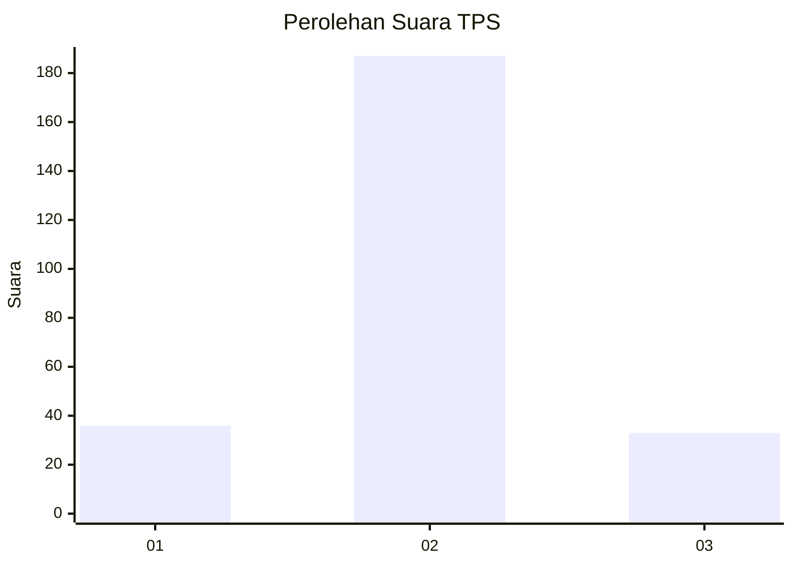
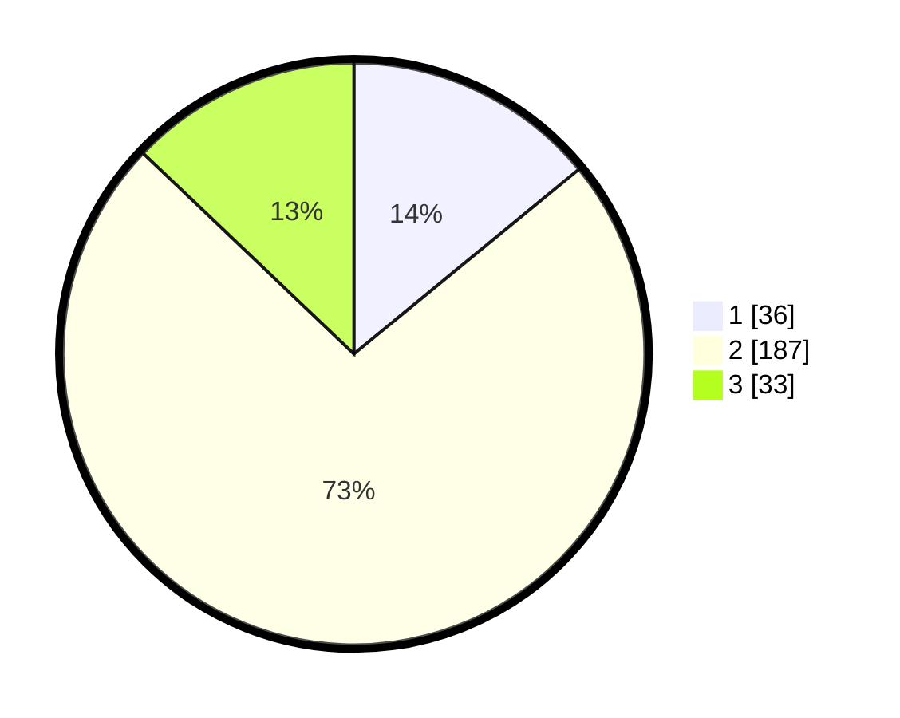

# Hasil

## Grafik

## Tabel

| No. | Nama Paslon    | Suara | Suara (raw) | Persentase |
|:--- |:-------------- | -----:| -----------:| ----------:|
| 1   | ANIES MUHAIMIN | 36    | [36][p-1]   | 14,06      |
| 2   | PRABOWO GIBRAN | 187   | [187][p-2]  | 73,05      |
| 3   | GANJAR MAHFUD  | 33    | [33][p-3]   | 12,89      |

[p-1]: https://github.com/gigit-pemilu/pemilu-2024/blob/main/pilpres/hitung-suara/sub/35-jawa-timur/sub/15-sidoarjo/sub/11-krian/sub/2002-sedenganmijen/sub/009-tps/sub/paslon-1.txt
[p-2]: https://github.com/gigit-pemilu/pemilu-2024/blob/main/pilpres/hitung-suara/sub/35-jawa-timur/sub/15-sidoarjo/sub/11-krian/sub/2002-sedenganmijen/sub/009-tps/sub/paslon-2.txt
[p-3]: https://github.com/gigit-pemilu/pemilu-2024/blob/main/pilpres/hitung-suara/sub/35-jawa-timur/sub/15-sidoarjo/sub/11-krian/sub/2002-sedenganmijen/sub/009-tps/sub/paslon-3.txt

## Foto C Plano

https://sirekap-obj-formc.kpu.go.id/42ce/pemilu/ppwp/35/15/11/20/02/3515112002009-20240214-155832--4bdf9dda-f905-4388-92d8-b6a9afe3b287.jpg

https://sirekap-obj-formc.kpu.go.id/42ce/pemilu/ppwp/35/15/11/20/02/3515112002009-20240214-160057--8ad870ee-81ce-475e-8c4d-3b0d158b707a.jpg

https://sirekap-obj-formc.kpu.go.id/42ce/pemilu/ppwp/35/15/11/20/02/3515112002009-20240214-160058--847cc900-286a-4649-ad43-d26d547c0d1d.jpg

## Metadata

| Key        | Value               |
| ---------- | ------------------- |
| Time Stamp | 2024-02-24 22:31:28 |

