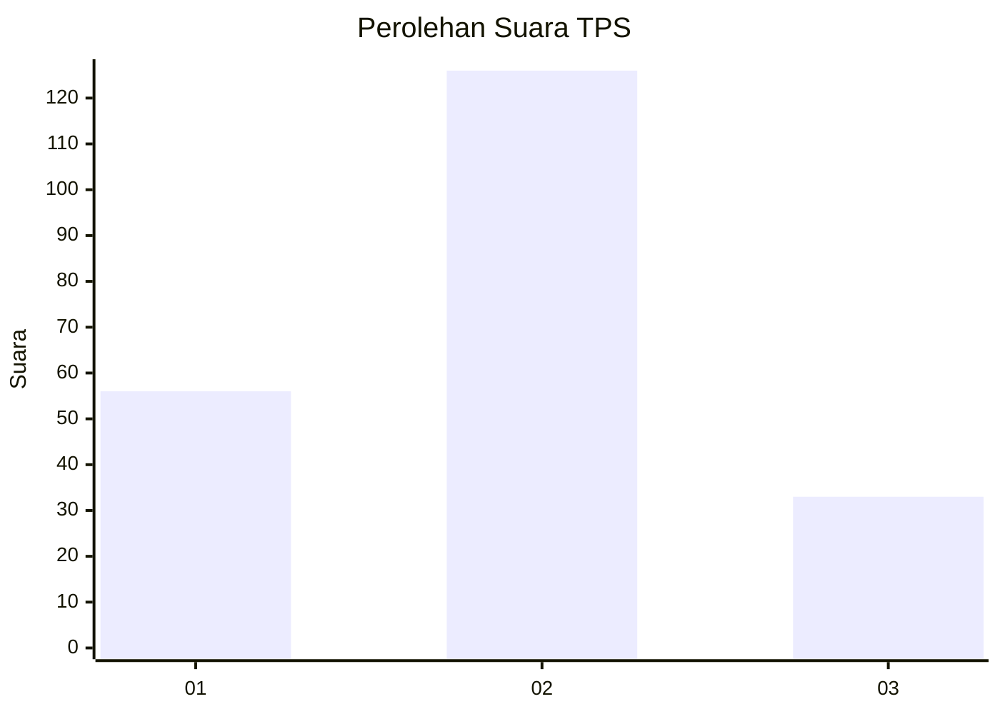

# Hasil

## Grafik

## Tabel

| No. | Nama Paslon    | Suara | Suara (raw) | Persentase |
|:--- |:-------------- | -----:| -----------:| ----------:|
| 1   | ANIES MUHAIMIN | 56    | [56][p-1]   | 26,05      |
| 2   | PRABOWO GIBRAN | 126   | [126][p-2]  | 58,60      |
| 3   | GANJAR MAHFUD  | 33    | [33][p-3]   | 15,35      |

[p-1]: https://github.com/gigit-pemilu/pemilu-2024/blob/main/pilpres/hitung-suara/sub/35-jawa-timur/sub/15-sidoarjo/sub/11-krian/sub/2004-jerukgamping/sub/006-tps/sub/paslon-1.txt
[p-2]: https://github.com/gigit-pemilu/pemilu-2024/blob/main/pilpres/hitung-suara/sub/35-jawa-timur/sub/15-sidoarjo/sub/11-krian/sub/2004-jerukgamping/sub/006-tps/sub/paslon-2.txt
[p-3]: https://github.com/gigit-pemilu/pemilu-2024/blob/main/pilpres/hitung-suara/sub/35-jawa-timur/sub/15-sidoarjo/sub/11-krian/sub/2004-jerukgamping/sub/006-tps/sub/paslon-3.txt

## Foto C Plano

https://sirekap-obj-formc.kpu.go.id/fd05/pemilu/ppwp/35/15/11/20/04/3515112004006-20240214-211802--91b09501-5deb-4058-b0cf-27d8d459aa23.jpg

https://sirekap-obj-formc.kpu.go.id/fd05/pemilu/ppwp/35/15/11/20/04/3515112004006-20240214-211806--80a6011c-e4bf-4512-baf7-32c54764dc09.jpg

https://sirekap-obj-formc.kpu.go.id/fd05/pemilu/ppwp/35/15/11/20/04/3515112004006-20240214-211810--12f46658-04ce-4afd-8472-d7133611722e.jpg

## Metadata

| Key        | Value               |
| ---------- | ------------------- |
| Time Stamp | 2024-02-24 22:31:28 |

