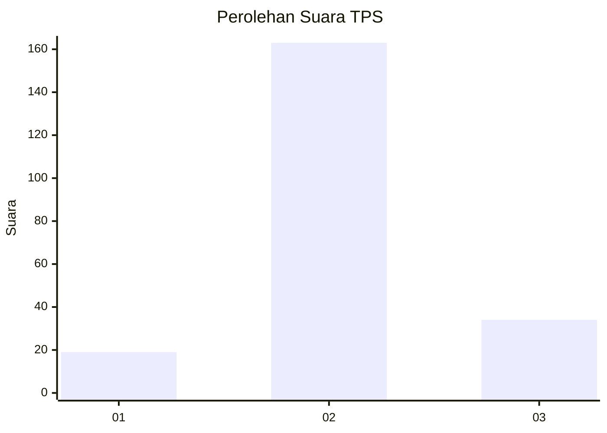
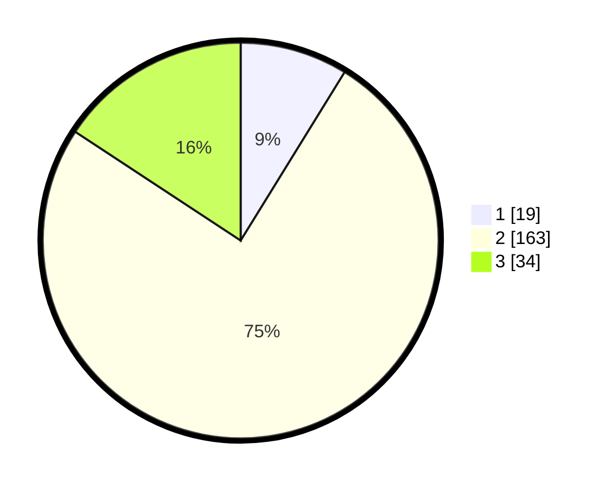

# Hasil

## Grafik

## Tabel

| No. | Nama Paslon    | Suara | Suara (raw) | Persentase |
|:--- |:-------------- | -----:| -----------:| ----------:|
| 1   | ANIES MUHAIMIN | 19    | [19][p-1]   | 8,80       |
| 2   | PRABOWO GIBRAN | 163   | [163][p-2]  | 75,46      |
| 3   | GANJAR MAHFUD  | 34    | [34][p-3]   | 15,74      |

[p-1]: https://github.com/gigit-pemilu/pemilu-2024/blob/main/pilpres/hitung-suara/sub/35-jawa-timur/sub/15-sidoarjo/sub/11-krian/sub/2005-gamping/sub/014-tps/sub/paslon-1.txt
[p-2]: https://github.com/gigit-pemilu/pemilu-2024/blob/main/pilpres/hitung-suara/sub/35-jawa-timur/sub/15-sidoarjo/sub/11-krian/sub/2005-gamping/sub/014-tps/sub/paslon-2.txt
[p-3]: https://github.com/gigit-pemilu/pemilu-2024/blob/main/pilpres/hitung-suara/sub/35-jawa-timur/sub/15-sidoarjo/sub/11-krian/sub/2005-gamping/sub/014-tps/sub/paslon-3.txt

## Foto C Plano

https://sirekap-obj-formc.kpu.go.id/1a0c/pemilu/ppwp/35/15/11/20/05/3515112005014-20240216-230543--161b05dd-5274-4c64-a4d7-8ab6e87d434d.jpg

https://sirekap-obj-formc.kpu.go.id/1a0c/pemilu/ppwp/35/15/11/20/05/3515112005014-20240216-225050--b4424f66-aa2b-4d72-93cb-fe691052c70f.jpg

https://sirekap-obj-formc.kpu.go.id/1a0c/pemilu/ppwp/35/15/11/20/05/3515112005014-20240216-225226--cf08432f-8b78-4ec9-9804-939df0c9184c.jpg

## Metadata

| Key        | Value               |
| ---------- | ------------------- |
| Time Stamp | 2024-02-24 22:31:28 |

