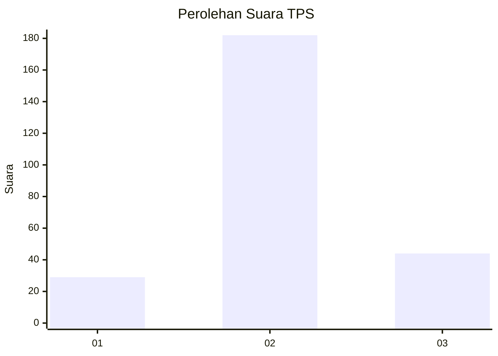
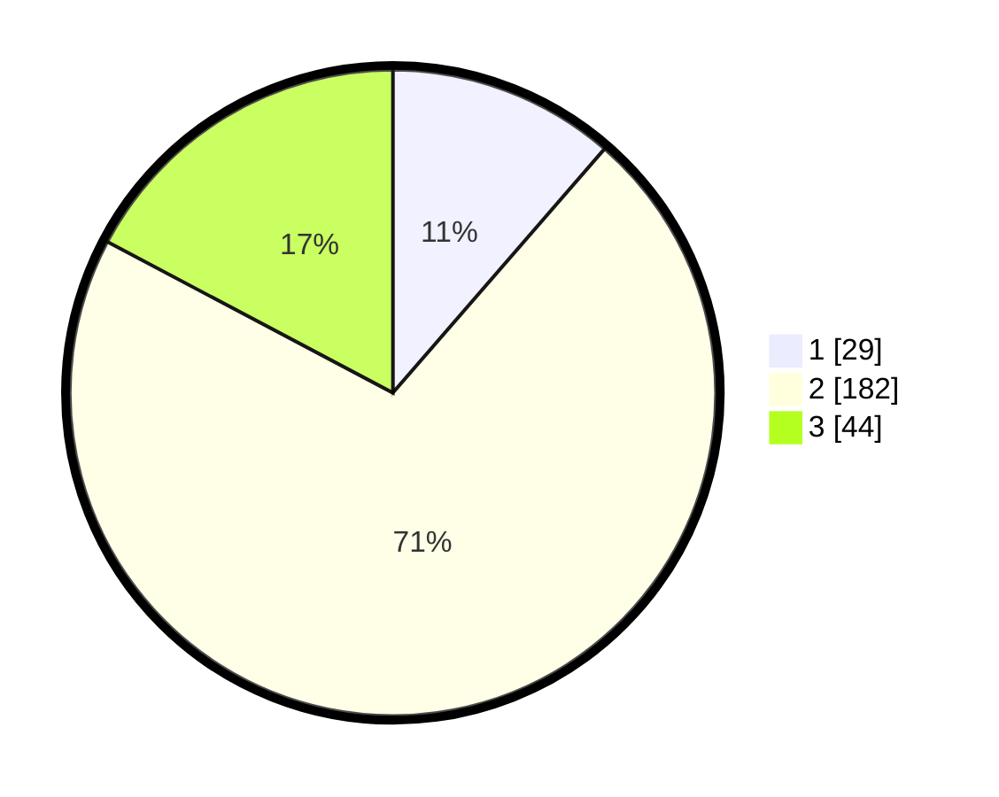

# Hasil

## Grafik

## Tabel

| No. | Nama Paslon    | Suara | Suara (raw) | Persentase |
|:--- |:-------------- | -----:| -----------:| ----------:|
| 1   | ANIES MUHAIMIN | 29    | [29][p-1]   | 11,37      |
| 2   | PRABOWO GIBRAN | 182   | [182][p-2]  | 71,37      |
| 3   | GANJAR MAHFUD  | 44    | [44][p-3]   | 17,25      |

[p-1]: https://github.com/gigit-pemilu/pemilu-2024/blob/main/pilpres/hitung-suara/sub/35-jawa-timur/sub/15-sidoarjo/sub/11-krian/sub/2006-terik/sub/003-tps/sub/paslon-1.txt
[p-2]: https://github.com/gigit-pemilu/pemilu-2024/blob/main/pilpres/hitung-suara/sub/35-jawa-timur/sub/15-sidoarjo/sub/11-krian/sub/2006-terik/sub/003-tps/sub/paslon-2.txt
[p-3]: https://github.com/gigit-pemilu/pemilu-2024/blob/main/pilpres/hitung-suara/sub/35-jawa-timur/sub/15-sidoarjo/sub/11-krian/sub/2006-terik/sub/003-tps/sub/paslon-3.txt

## Foto C Plano

https://sirekap-obj-formc.kpu.go.id/2c2c/pemilu/ppwp/35/15/11/20/06/3515112006003-20240215-051251--c906a807-2095-4b8d-ad59-fae798c8b01e.jpg

https://sirekap-obj-formc.kpu.go.id/2c2c/pemilu/ppwp/35/15/11/20/06/3515112006003-20240217-234638--d50c75f9-8782-41b0-a383-ac47d322a545.jpg

https://sirekap-obj-formc.kpu.go.id/2c2c/pemilu/ppwp/35/15/11/20/06/3515112006003-20240215-133852--17a2e32c-463b-4bbd-9898-ed01b7b73229.jpg

## Metadata

| Key        | Value               |
| ---------- | ------------------- |
| Time Stamp | 2024-02-24 22:31:28 |

