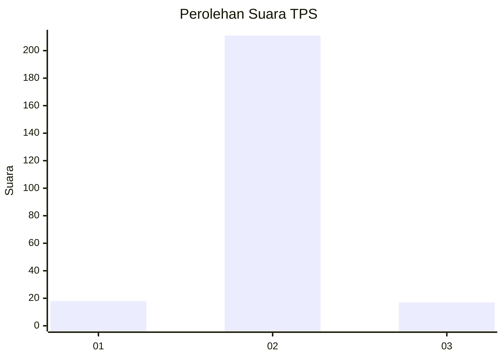
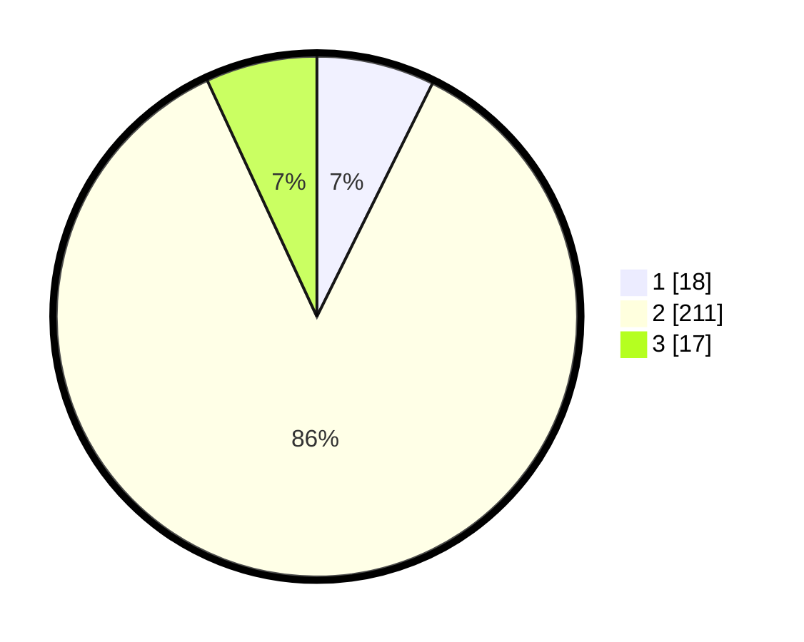

# Hasil

## Grafik

## Tabel

| No. | Nama Paslon    | Suara | Suara (raw) | Persentase |
|:--- |:-------------- | -----:| -----------:| ----------:|
| 1   | ANIES MUHAIMIN | 18    | [18][p-1]   | 7,32       |
| 2   | PRABOWO GIBRAN | 211   | [211][p-2]  | 85,77      |
| 3   | GANJAR MAHFUD  | 17    | [17][p-3]   | 6,91       |

[p-1]: https://github.com/gigit-pemilu/pemilu-2024/blob/main/pilpres/hitung-suara/sub/35-jawa-timur/sub/15-sidoarjo/sub/11-krian/sub/2007-junwangi/sub/006-tps/sub/paslon-1.txt
[p-2]: https://github.com/gigit-pemilu/pemilu-2024/blob/main/pilpres/hitung-suara/sub/35-jawa-timur/sub/15-sidoarjo/sub/11-krian/sub/2007-junwangi/sub/006-tps/sub/paslon-2.txt
[p-3]: https://github.com/gigit-pemilu/pemilu-2024/blob/main/pilpres/hitung-suara/sub/35-jawa-timur/sub/15-sidoarjo/sub/11-krian/sub/2007-junwangi/sub/006-tps/sub/paslon-3.txt

## Foto C Plano

https://sirekap-obj-formc.kpu.go.id/cda8/pemilu/ppwp/35/15/11/20/07/3515112007006-20240214-200041--e87e39fb-f43b-4739-9f59-c8df5314a607.jpg

https://sirekap-obj-formc.kpu.go.id/cda8/pemilu/ppwp/35/15/11/20/07/3515112007006-20240214-200207--681765bf-9cfc-4092-ba00-18e83220ea1b.jpg

https://sirekap-obj-formc.kpu.go.id/cda8/pemilu/ppwp/35/15/11/20/07/3515112007006-20240214-200248--85dd92dc-0821-4fcc-ad33-42955acd0f14.jpg

## Metadata

| Key        | Value               |
| ---------- | ------------------- |
| Time Stamp | 2024-02-24 22:31:28 |

