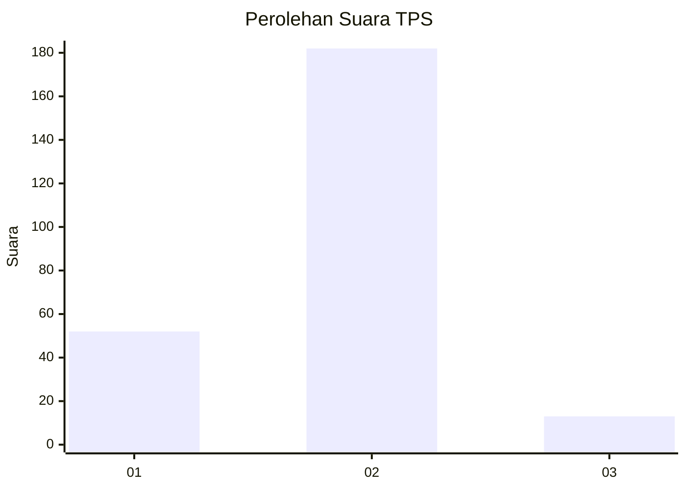
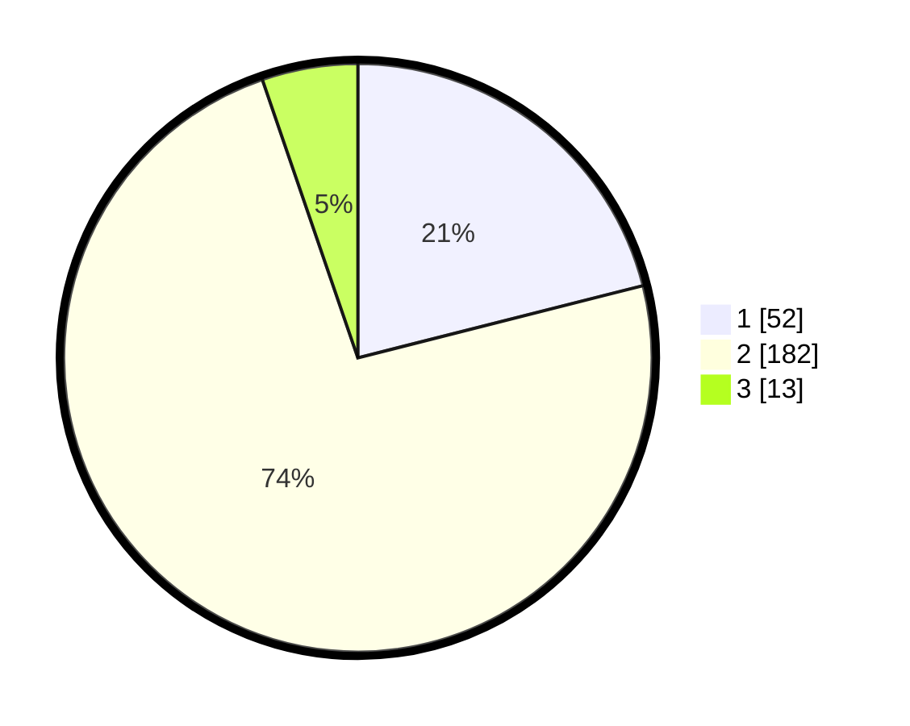

# Hasil

## Grafik

## Tabel

| No. | Nama Paslon    | Suara | Suara (raw) | Persentase |
|:--- |:-------------- | -----:| -----------:| ----------:|
| 1   | ANIES MUHAIMIN | 52    | [52][p-1]   | 21,05      |
| 2   | PRABOWO GIBRAN | 182   | [182][p-2]  | 73,68      |
| 3   | GANJAR MAHFUD  | 13    | [13][p-3]   | 5,26       |

[p-1]: https://github.com/gigit-pemilu/pemilu-2024/blob/main/pilpres/hitung-suara/sub/35-jawa-timur/sub/15-sidoarjo/sub/11-krian/sub/2018-sidomulyo/sub/007-tps/sub/paslon-1.txt
[p-2]: https://github.com/gigit-pemilu/pemilu-2024/blob/main/pilpres/hitung-suara/sub/35-jawa-timur/sub/15-sidoarjo/sub/11-krian/sub/2018-sidomulyo/sub/007-tps/sub/paslon-2.txt
[p-3]: https://github.com/gigit-pemilu/pemilu-2024/blob/main/pilpres/hitung-suara/sub/35-jawa-timur/sub/15-sidoarjo/sub/11-krian/sub/2018-sidomulyo/sub/007-tps/sub/paslon-3.txt

## Foto C Plano

https://sirekap-obj-formc.kpu.go.id/3d9a/pemilu/ppwp/35/15/11/20/18/3515112018007-20240214-223209--6fffce36-403d-44cb-9468-05a36a1faea8.jpg

https://sirekap-obj-formc.kpu.go.id/3d9a/pemilu/ppwp/35/15/11/20/18/3515112018007-20240214-185010--c253a05f-8c74-45a5-b6a1-49250cb05d29.jpg

https://sirekap-obj-formc.kpu.go.id/3d9a/pemilu/ppwp/35/15/11/20/18/3515112018007-20240214-185128--898dbc9c-24a9-4149-862c-ce80ff5757e8.jpg

## Metadata

| Key        | Value               |
| ---------- | ------------------- |
| Time Stamp | 2024-02-21 20:00:00 |

