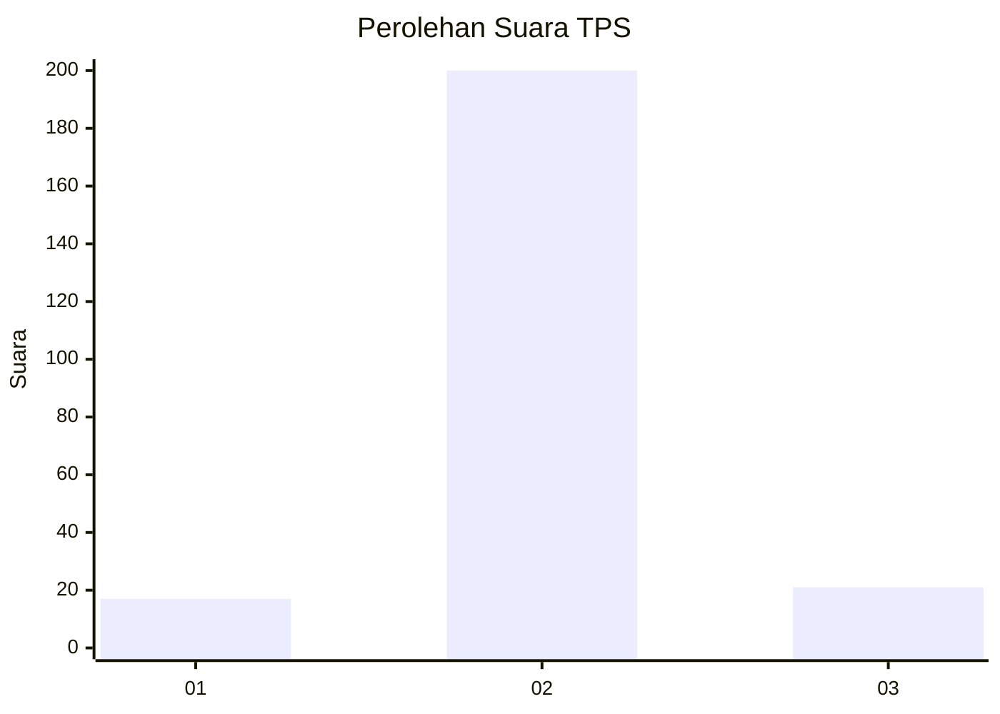
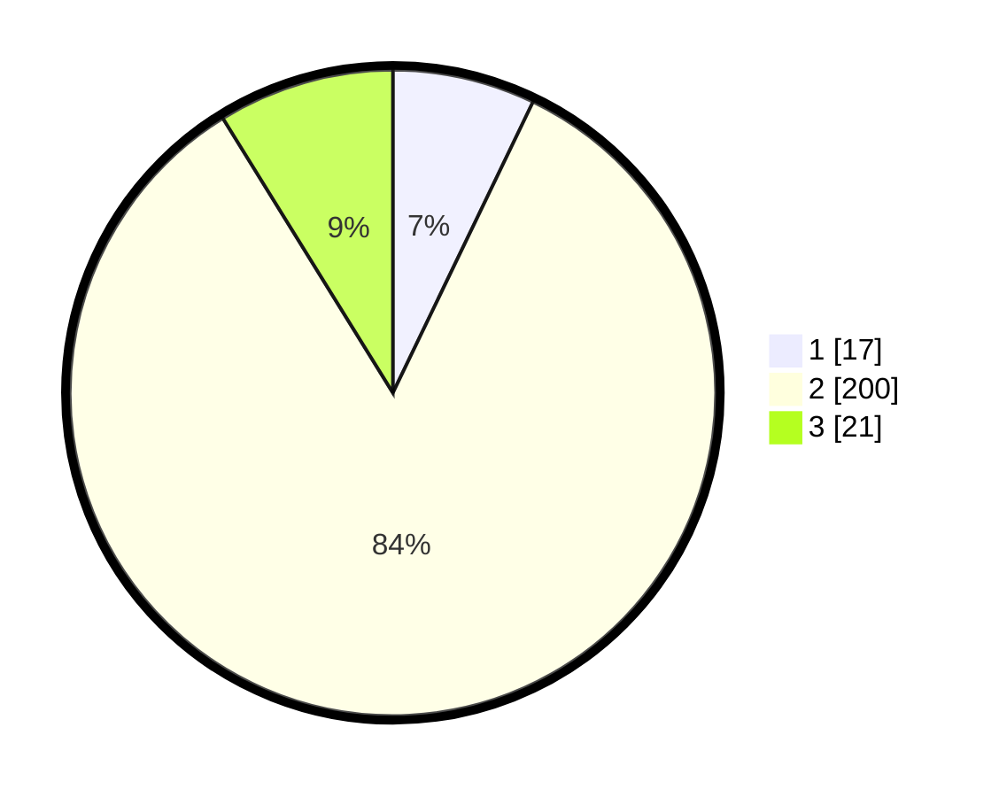

# Hasil

## Grafik

## Tabel

| No. | Nama Paslon    | Suara | Suara (raw) | Persentase |
|:--- |:-------------- | -----:| -----------:| ----------:|
| 1   | ANIES MUHAIMIN | 17    | [17][p-1]   | 7,14       |
| 2   | PRABOWO GIBRAN | 200   | [200][p-2]  | 84,03      |
| 3   | GANJAR MAHFUD  | 21    | [21][p-3]   | 8,82       |

[p-1]: https://github.com/gigit-pemilu/pemilu-2024/blob/main/pilpres/hitung-suara/sub/35-jawa-timur/sub/15-sidoarjo/sub/11-krian/sub/2019-tempel/sub/016-tps/sub/paslon-1.txt
[p-2]: https://github.com/gigit-pemilu/pemilu-2024/blob/main/pilpres/hitung-suara/sub/35-jawa-timur/sub/15-sidoarjo/sub/11-krian/sub/2019-tempel/sub/016-tps/sub/paslon-2.txt
[p-3]: https://github.com/gigit-pemilu/pemilu-2024/blob/main/pilpres/hitung-suara/sub/35-jawa-timur/sub/15-sidoarjo/sub/11-krian/sub/2019-tempel/sub/016-tps/sub/paslon-3.txt

## Foto C Plano

https://sirekap-obj-formc.kpu.go.id/eaf9/pemilu/ppwp/35/15/11/20/19/3515112019016-20240214-215345--c85a6d6d-cc8e-40d7-b76b-2998eee3a0d8.jpg

https://sirekap-obj-formc.kpu.go.id/eaf9/pemilu/ppwp/35/15/11/20/19/3515112019016-20240218-140824--a6bcd0b8-0e82-43a5-b4ff-51c9caebf4b7.jpg

https://sirekap-obj-formc.kpu.go.id/eaf9/pemilu/ppwp/35/15/11/20/19/3515112019016-20240214-220817--ba603dbb-c09e-4730-a1f1-17a20e506eaf.jpg

## Metadata

| Key        | Value               |
| ---------- | ------------------- |
| Time Stamp | 2024-02-19 06:16:00 |

