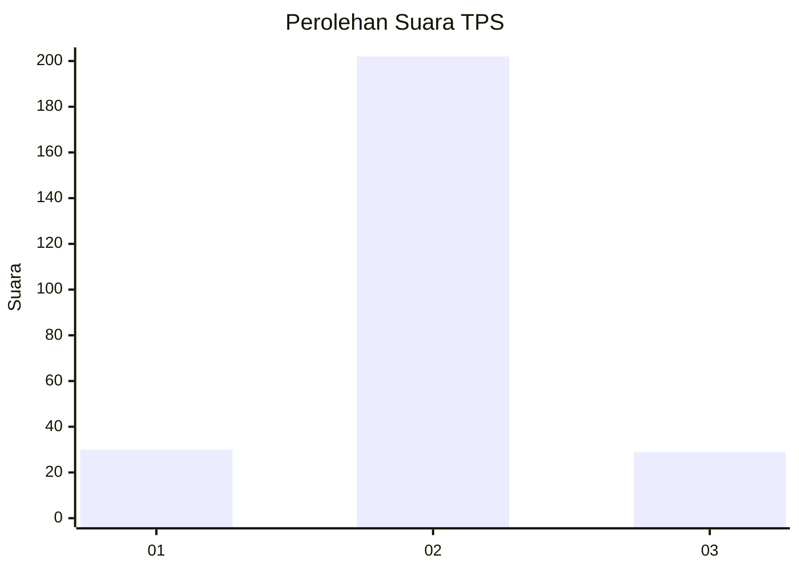
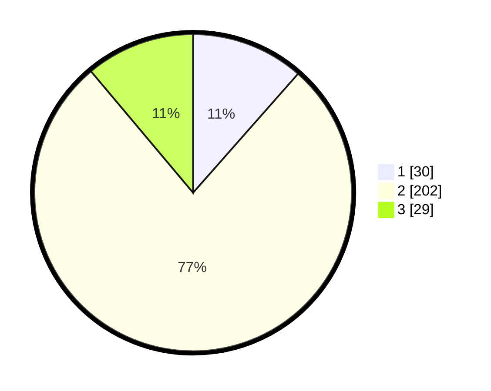

# Hasil

## Grafik

## Tabel

| No. | Nama Paslon    | Suara | Suara (raw) | Persentase |
|:--- |:-------------- | -----:| -----------:| ----------:|
| 1   | ANIES MUHAIMIN | 30    | [30][p-1]   | 11,49      |
| 2   | PRABOWO GIBRAN | 202   | [202][p-2]  | 77,39      |
| 3   | GANJAR MAHFUD  | 29    | [29][p-3]   | 11,11      |

[p-1]: https://github.com/gigit-pemilu/pemilu-2024-35-jawa-timur/blob/main/pilpres/hitung-suara/sub/35-jawa-timur/sub/15-sidoarjo/sub/11-krian/sub/2020-watugolong/sub/002-tps/sub/paslon-1.txt
[p-2]: https://github.com/gigit-pemilu/pemilu-2024-35-jawa-timur/blob/main/pilpres/hitung-suara/sub/35-jawa-timur/sub/15-sidoarjo/sub/11-krian/sub/2020-watugolong/sub/002-tps/sub/paslon-2.txt
[p-3]: https://github.com/gigit-pemilu/pemilu-2024-35-jawa-timur/blob/main/pilpres/hitung-suara/sub/35-jawa-timur/sub/15-sidoarjo/sub/11-krian/sub/2020-watugolong/sub/002-tps/sub/paslon-3.txt

## Foto C Plano

https://sirekap-obj-formc.kpu.go.id/8c30/pemilu/ppwp/35/15/11/20/20/3515112020002-20240219-154844--e8e108b3-a61d-4cab-99f9-e5336b8a242b.jpg

https://sirekap-obj-formc.kpu.go.id/8c30/pemilu/ppwp/35/15/11/20/20/3515112020002-20240219-155437--49be0121-97d7-48da-b7dc-930a5d220795.jpg

https://sirekap-obj-formc.kpu.go.id/8c30/pemilu/ppwp/35/15/11/20/20/3515112020002-20240219-154514--8b2fa32a-e34c-4e98-9388-8b5533c3389f.jpg

## Metadata

| Key        | Value               |
| ---------- | ------------------- |
| Time Stamp | 2024-02-25 02:00:00 |

