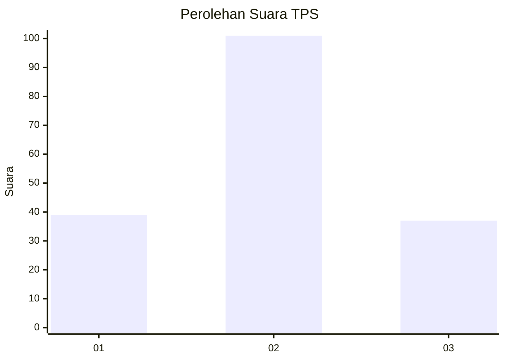
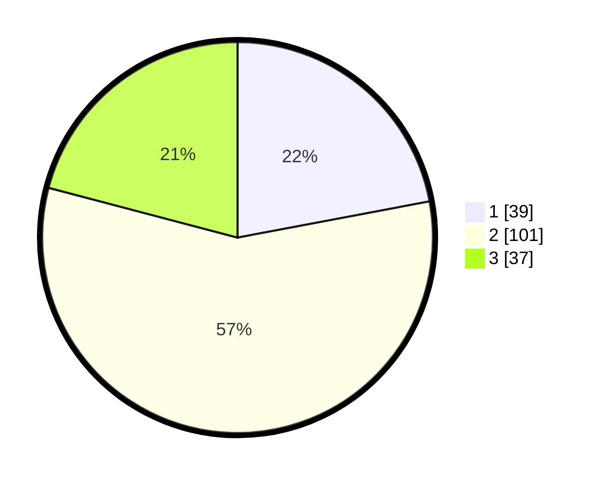

# Hasil

## Grafik

## Tabel

| No. | Nama Paslon    | Suara | Suara (raw) | Persentase |
|:--- |:-------------- | -----:| -----------:| ----------:|
| 1   | ANIES MUHAIMIN | 39    | [39][p-1]   | 22,03      |
| 2   | PRABOWO GIBRAN | 101   | [101][p-2]  | 57,06      |
| 3   | GANJAR MAHFUD  | 37    | [37][p-3]   | 20,90      |

[p-1]: https://github.com/gigit-pemilu/pemilu-2024/blob/main/pilpres/hitung-suara/sub/35-jawa-timur/sub/15-sidoarjo/sub/11-krian/sub/2021-barengkrajan/sub/017-tps/sub/paslon-1.txt
[p-2]: https://github.com/gigit-pemilu/pemilu-2024/blob/main/pilpres/hitung-suara/sub/35-jawa-timur/sub/15-sidoarjo/sub/11-krian/sub/2021-barengkrajan/sub/017-tps/sub/paslon-2.txt
[p-3]: https://github.com/gigit-pemilu/pemilu-2024/blob/main/pilpres/hitung-suara/sub/35-jawa-timur/sub/15-sidoarjo/sub/11-krian/sub/2021-barengkrajan/sub/017-tps/sub/paslon-3.txt

## Foto C Plano

https://sirekap-obj-formc.kpu.go.id/fc7a/pemilu/ppwp/35/15/11/20/21/3515112021017-20240214-194715--9a21b46b-e59b-4fd0-842a-41400e754d54.jpg

https://sirekap-obj-formc.kpu.go.id/fc7a/pemilu/ppwp/35/15/11/20/21/3515112021017-20240214-194744--79d93658-dec1-472a-b4db-435208bfd71c.jpg

https://sirekap-obj-formc.kpu.go.id/fc7a/pemilu/ppwp/35/15/11/20/21/3515112021017-20240214-194754--f664fe44-f3d3-4aba-ba53-a79f1a49003b.jpg

## Metadata

| Key        | Value               |
| ---------- | ------------------- |
| Time Stamp | 2024-02-24 22:31:28 |

