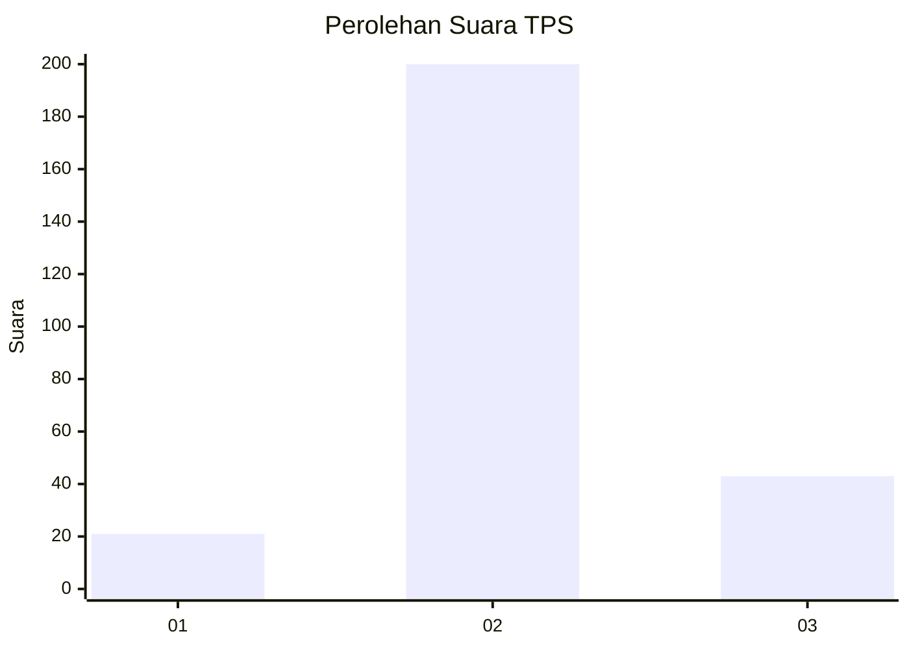
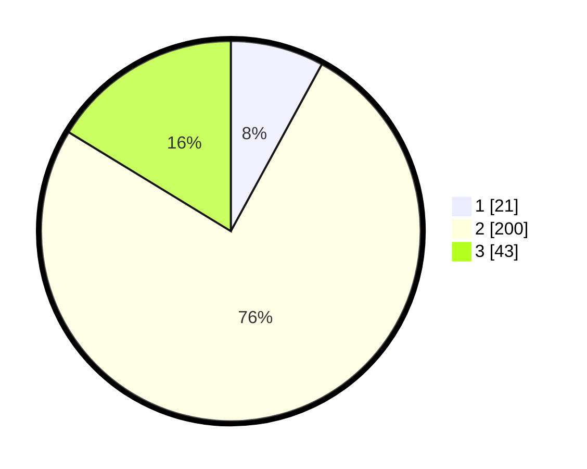

# Hasil

## Grafik

## Tabel

| No. | Nama Paslon    | Suara | Suara (raw) | Persentase |
|:--- |:-------------- | -----:| -----------:| ----------:|
| 1   | ANIES MUHAIMIN | 21    | [21][p-1]   | 7,95       |
| 2   | PRABOWO GIBRAN | 200   | [200][p-2]  | 75,76      |
| 3   | GANJAR MAHFUD  | 43    | [43][p-3]   | 16,29      |

[p-1]: https://github.com/gigit-pemilu/pemilu-2024-35-jawa-timur/blob/main/pilpres/hitung-suara/sub/35-jawa-timur/sub/15-sidoarjo/sub/12-balongbendo/sub/2004-bakungpringgodani/sub/007-tps/sub/paslon-1.txt
[p-2]: https://github.com/gigit-pemilu/pemilu-2024-35-jawa-timur/blob/main/pilpres/hitung-suara/sub/35-jawa-timur/sub/15-sidoarjo/sub/12-balongbendo/sub/2004-bakungpringgodani/sub/007-tps/sub/paslon-2.txt
[p-3]: https://github.com/gigit-pemilu/pemilu-2024-35-jawa-timur/blob/main/pilpres/hitung-suara/sub/35-jawa-timur/sub/15-sidoarjo/sub/12-balongbendo/sub/2004-bakungpringgodani/sub/007-tps/sub/paslon-3.txt

## Foto C Plano

https://sirekap-obj-formc.kpu.go.id/5f6f/pemilu/ppwp/35/15/12/20/04/3515122004007-20240216-151836--73dd70f6-2121-442e-9a3f-5feecf64d563.jpg

https://sirekap-obj-formc.kpu.go.id/5f6f/pemilu/ppwp/35/15/12/20/04/3515122004007-20240216-152227--5b4cebdb-e5e3-4cf2-b871-a26f460c20e7.jpg

https://sirekap-obj-formc.kpu.go.id/5f6f/pemilu/ppwp/35/15/12/20/04/3515122004007-20240217-182514--9e06c44e-4691-46d1-8b0c-da4f61605335.jpg

## Metadata

| Key        | Value               |
| ---------- | ------------------- |
| Time Stamp | 2024-02-24 22:31:28 |

