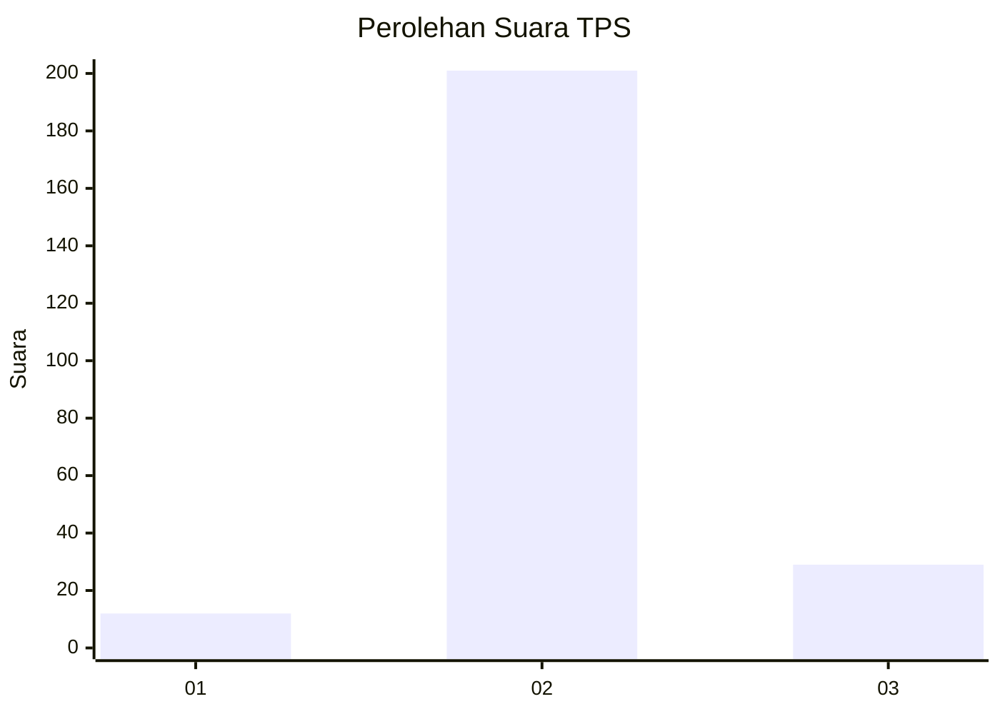
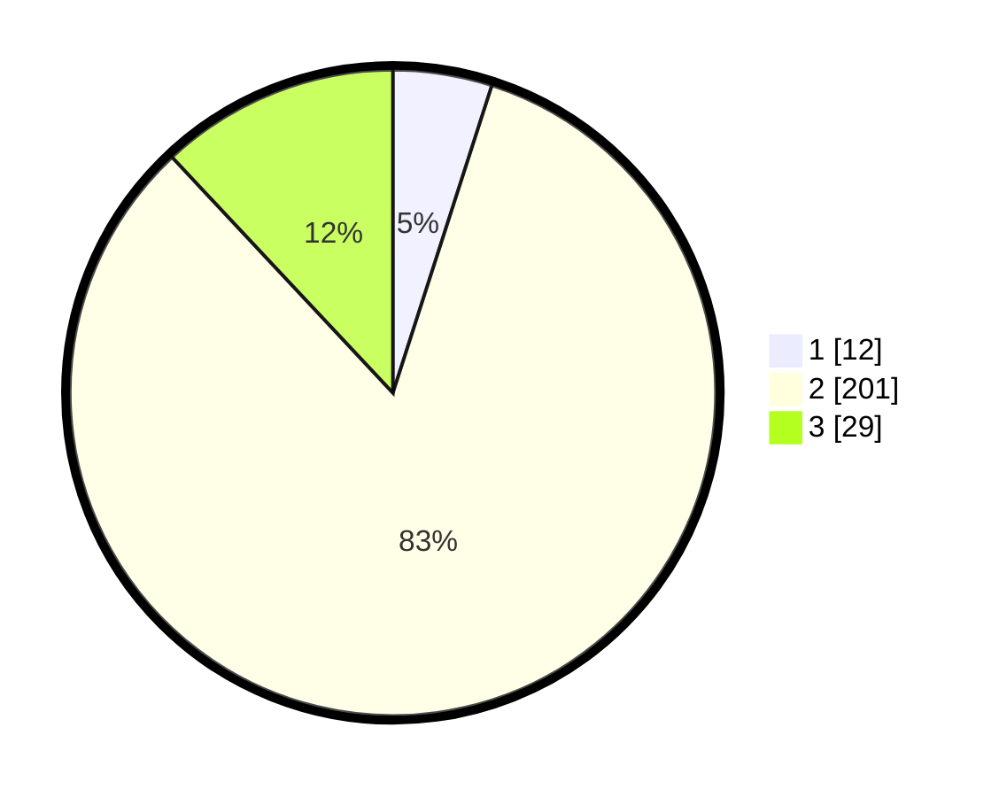

# Hasil

## Grafik

## Tabel

| No. | Nama Paslon    | Suara | Suara (raw) | Persentase |
|:--- |:-------------- | -----:| -----------:| ----------:|
| 1   | ANIES MUHAIMIN | 12    | [12][p-1]   | 4,96       |
| 2   | PRABOWO GIBRAN | 201   | [201][p-2]  | 83,06      |
| 3   | GANJAR MAHFUD  | 29    | [29][p-3]   | 11,98      |

[p-1]: https://github.com/gigit-pemilu/pemilu-2024-35-jawa-timur/blob/main/pilpres/hitung-suara/sub/35-jawa-timur/sub/15-sidoarjo/sub/12-balongbendo/sub/2006-seduri/sub/001-tps/sub/paslon-1.txt
[p-2]: https://github.com/gigit-pemilu/pemilu-2024-35-jawa-timur/blob/main/pilpres/hitung-suara/sub/35-jawa-timur/sub/15-sidoarjo/sub/12-balongbendo/sub/2006-seduri/sub/001-tps/sub/paslon-2.txt
[p-3]: https://github.com/gigit-pemilu/pemilu-2024-35-jawa-timur/blob/main/pilpres/hitung-suara/sub/35-jawa-timur/sub/15-sidoarjo/sub/12-balongbendo/sub/2006-seduri/sub/001-tps/sub/paslon-3.txt

## Foto C Plano

https://sirekap-obj-formc.kpu.go.id/874b/pemilu/ppwp/35/15/12/20/06/3515122006001-20240215-042251--7327ef9d-4418-4a55-821e-84da61dd8439.jpg

https://sirekap-obj-formc.kpu.go.id/874b/pemilu/ppwp/35/15/12/20/06/3515122006001-20240215-085336--573fe192-abd7-47e5-8dec-be7c0f4c6195.jpg

https://sirekap-obj-formc.kpu.go.id/874b/pemilu/ppwp/35/15/12/20/06/3515122006001-20240215-041749--a8f27f4f-8c7f-46f0-9bea-35c53a0258aa.jpg

## Metadata

| Key        | Value               |
| ---------- | ------------------- |
| Time Stamp | 2024-02-25 22:00:00 |

