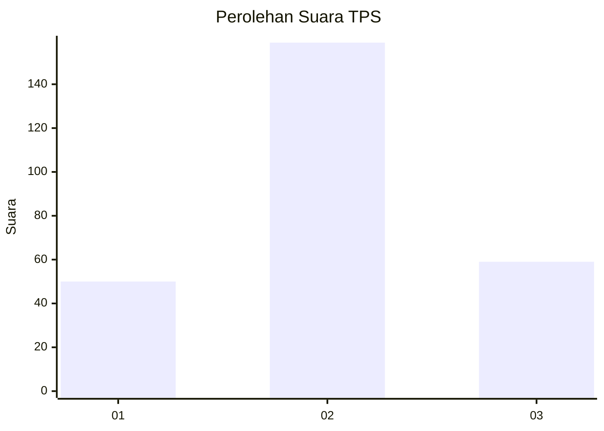
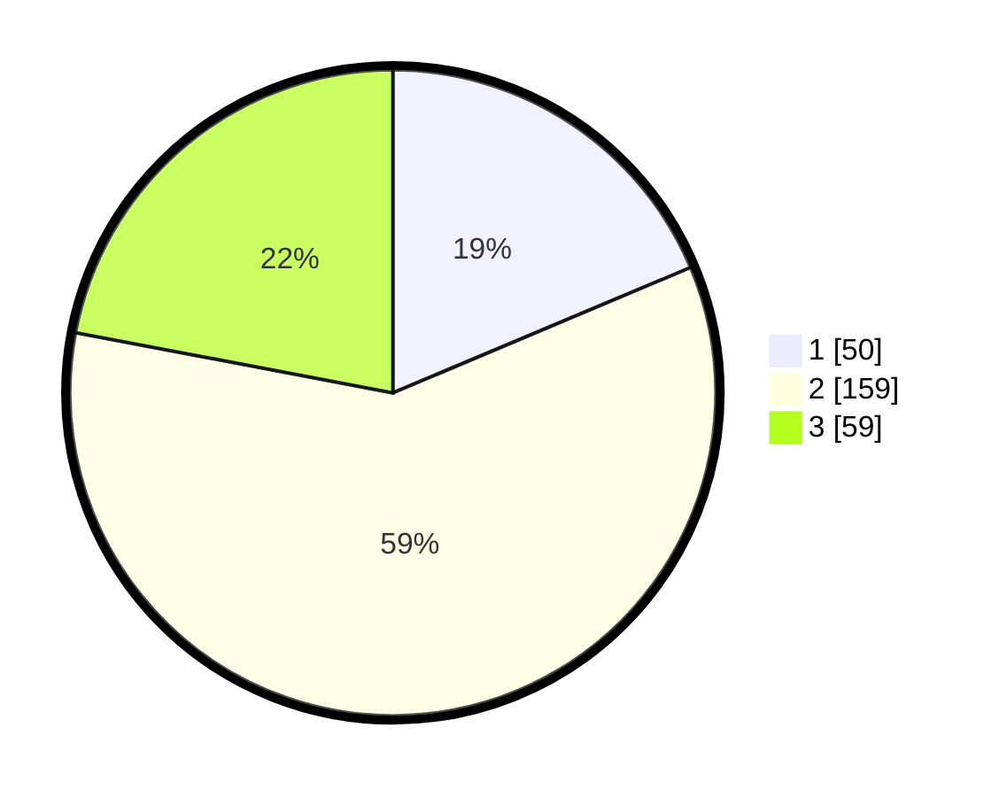

# Hasil

## Grafik

## Tabel

| No. | Nama Paslon    | Suara | Suara (raw) | Persentase |
|:--- |:-------------- | -----:| -----------:| ----------:|
| 1   | ANIES MUHAIMIN | 50    | [50][p-1]   | 18,66      |
| 2   | PRABOWO GIBRAN | 159   | [159][p-2]  | 59,33      |
| 3   | GANJAR MAHFUD  | 59    | [59][p-3]   | 22,01      |

[p-1]: https://github.com/gigit-pemilu/pemilu-2024-35-jawa-timur/blob/main/pilpres/hitung-suara/sub/35-jawa-timur/sub/15-sidoarjo/sub/12-balongbendo/sub/2007-bakalanwringinpitu/sub/002-tps/sub/paslon-1.txt
[p-2]: https://github.com/gigit-pemilu/pemilu-2024-35-jawa-timur/blob/main/pilpres/hitung-suara/sub/35-jawa-timur/sub/15-sidoarjo/sub/12-balongbendo/sub/2007-bakalanwringinpitu/sub/002-tps/sub/paslon-2.txt
[p-3]: https://github.com/gigit-pemilu/pemilu-2024-35-jawa-timur/blob/main/pilpres/hitung-suara/sub/35-jawa-timur/sub/15-sidoarjo/sub/12-balongbendo/sub/2007-bakalanwringinpitu/sub/002-tps/sub/paslon-3.txt

## Foto C Plano

https://sirekap-obj-formc.kpu.go.id/d5ae/pemilu/ppwp/35/15/12/20/07/3515122007002-20240214-232607--2895d01e-5491-4685-b44d-fb67355392ca.jpg

https://sirekap-obj-formc.kpu.go.id/d5ae/pemilu/ppwp/35/15/12/20/07/3515122007002-20240214-232630--52e60d8f-e693-4585-b5ef-814aaaf10137.jpg

https://sirekap-obj-formc.kpu.go.id/d5ae/pemilu/ppwp/35/15/12/20/07/3515122007002-20240214-232654--9962a738-8d4f-47a4-bf7e-b7ca292f3afc.jpg

## Metadata

| Key        | Value               |
| ---------- | ------------------- |
| Time Stamp | 2024-02-15 17:30:25 |

