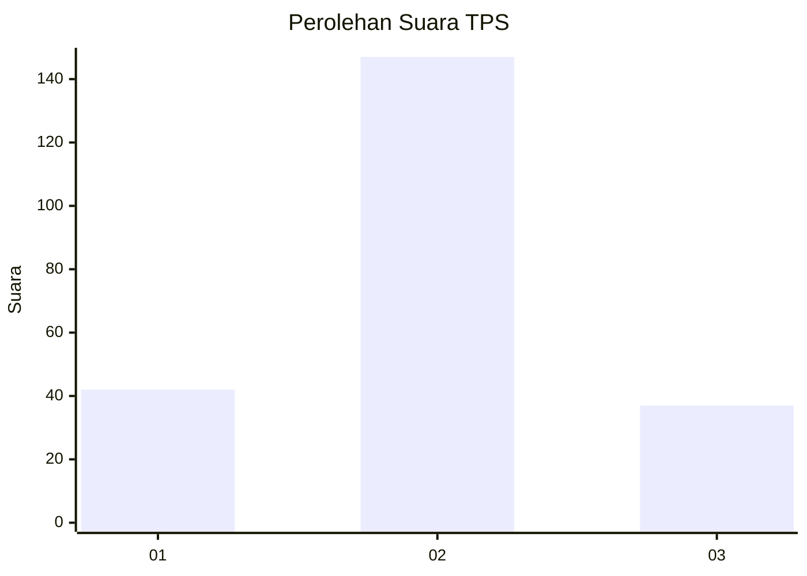
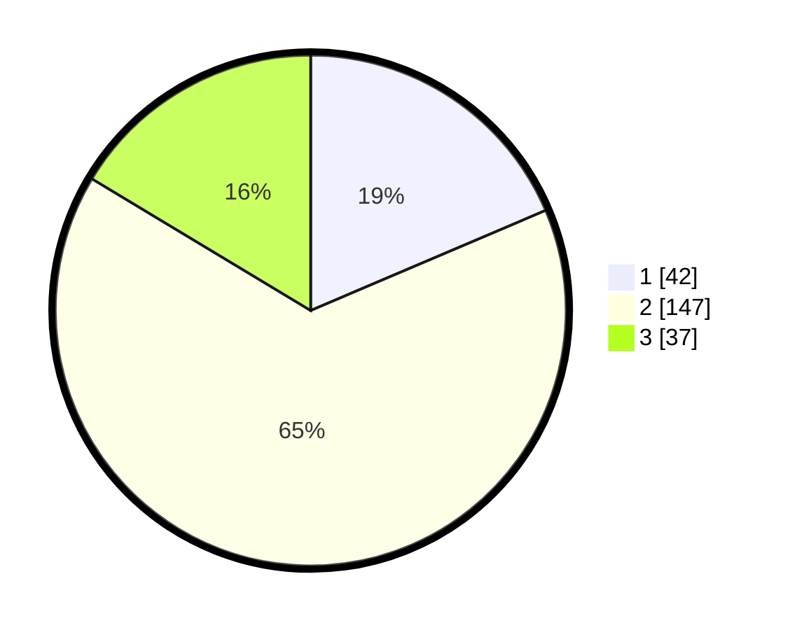

# Hasil

## Grafik

## Tabel

| No. | Nama Paslon    | Suara | Suara (raw) | Persentase |
|:--- |:-------------- | -----:| -----------:| ----------:|
| 1   | ANIES MUHAIMIN | 42    | [42][p-1]   | 18,58      |
| 2   | PRABOWO GIBRAN | 147   | [147][p-2]  | 65,04      |
| 3   | GANJAR MAHFUD  | 37    | [37][p-3]   | 16,37      |

[p-1]: https://github.com/gigit-pemilu/pemilu-2024/blob/main/pilpres/hitung-suara/sub/35-jawa-timur/sub/15-sidoarjo/sub/12-balongbendo/sub/2007-bakalanwringinpitu/sub/003-tps/sub/paslon-1.txt
[p-2]: https://github.com/gigit-pemilu/pemilu-2024/blob/main/pilpres/hitung-suara/sub/35-jawa-timur/sub/15-sidoarjo/sub/12-balongbendo/sub/2007-bakalanwringinpitu/sub/003-tps/sub/paslon-2.txt
[p-3]: https://github.com/gigit-pemilu/pemilu-2024/blob/main/pilpres/hitung-suara/sub/35-jawa-timur/sub/15-sidoarjo/sub/12-balongbendo/sub/2007-bakalanwringinpitu/sub/003-tps/sub/paslon-3.txt

## Foto C Plano

https://sirekap-obj-formc.kpu.go.id/7e95/pemilu/ppwp/35/15/12/20/07/3515122007003-20240218-212242--a06edc06-b7fe-473b-8597-f4dabbc67a59.jpg

https://sirekap-obj-formc.kpu.go.id/7e95/pemilu/ppwp/35/15/12/20/07/3515122007003-20240218-212306--39d31128-7165-42ba-922f-e1baae51a1f7.jpg

https://sirekap-obj-formc.kpu.go.id/7e95/pemilu/ppwp/35/15/12/20/07/3515122007003-20240216-200135--35e9a0e2-7301-4fc4-921c-8a8b9b8bcf84.jpg

## Metadata

| Key        | Value               |
| ---------- | ------------------- |
| Time Stamp | 2024-02-25 22:00:00 |

