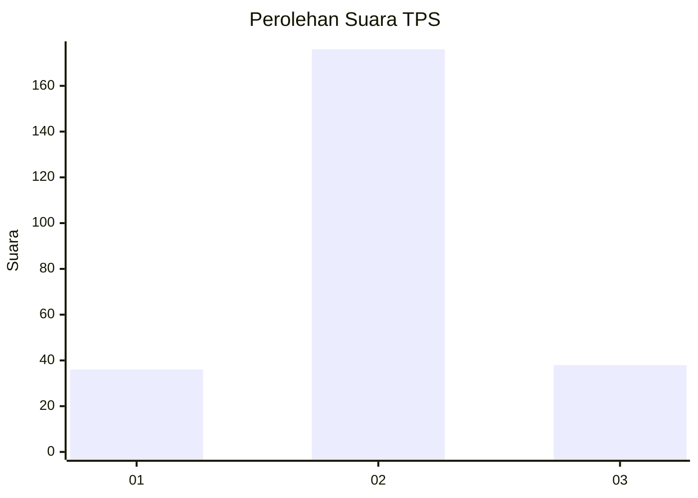

# Hasil

## Grafik

## Tabel

| No. | Nama Paslon    | Suara | Suara (raw) | Persentase |
|:--- |:-------------- | -----:| -----------:| ----------:|
| 1   | ANIES MUHAIMIN | 36    | [36][p-1]   | 14,40      |
| 2   | PRABOWO GIBRAN | 176   | [176][p-2]  | 70,40      |
| 3   | GANJAR MAHFUD  | 38    | [38][p-3]   | 15,20      |

[p-1]: https://github.com/gigit-pemilu/pemilu-2024/blob/main/pilpres/hitung-suara/sub/35-jawa-timur/sub/15-sidoarjo/sub/12-balongbendo/sub/2012-kemangsen/sub/009-tps/sub/paslon-1.txt
[p-2]: https://github.com/gigit-pemilu/pemilu-2024/blob/main/pilpres/hitung-suara/sub/35-jawa-timur/sub/15-sidoarjo/sub/12-balongbendo/sub/2012-kemangsen/sub/009-tps/sub/paslon-2.txt
[p-3]: https://github.com/gigit-pemilu/pemilu-2024/blob/main/pilpres/hitung-suara/sub/35-jawa-timur/sub/15-sidoarjo/sub/12-balongbendo/sub/2012-kemangsen/sub/009-tps/sub/paslon-3.txt

## Foto C Plano

https://sirekap-obj-formc.kpu.go.id/2aa6/pemilu/ppwp/35/15/12/20/12/3515122012009-20240214-215116--6bea89dc-0924-4419-9ae2-5d34c7f83459.jpg

https://sirekap-obj-formc.kpu.go.id/2aa6/pemilu/ppwp/35/15/12/20/12/3515122012009-20240214-215119--d5a63b10-a423-4c48-a8ab-1bd44b0e16b1.jpg

https://sirekap-obj-formc.kpu.go.id/2aa6/pemilu/ppwp/35/15/12/20/12/3515122012009-20240214-215121--7ccda2eb-37b4-4bb2-a62a-2355f497163b.jpg

## Metadata

| Key        | Value               |
| ---------- | ------------------- |
| Time Stamp | 2024-02-15 21:30:27 |

