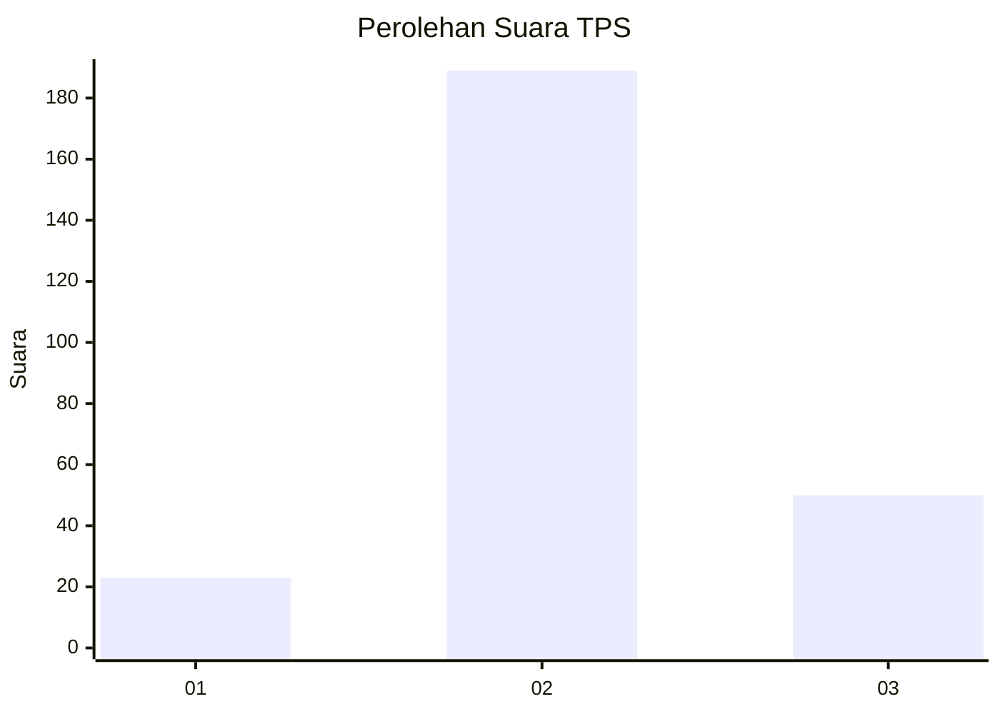
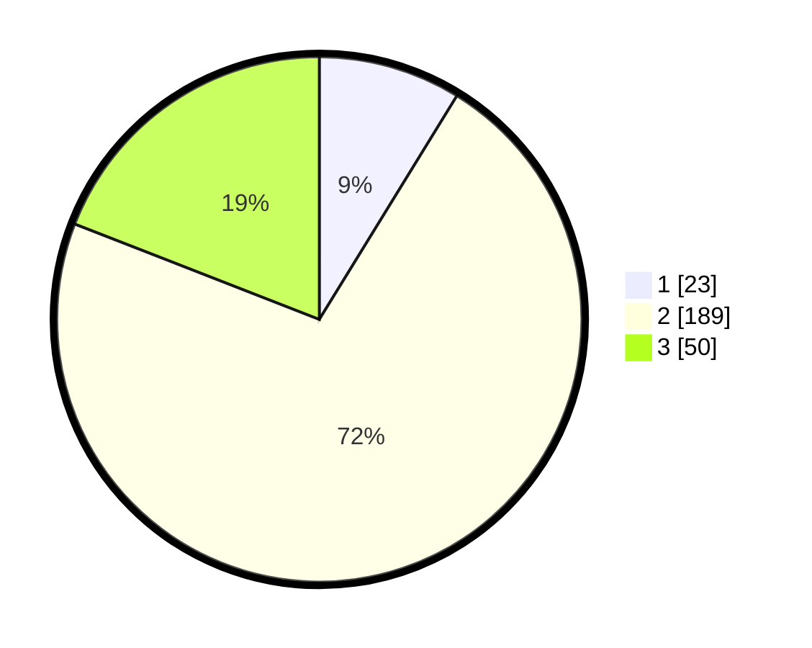

# Hasil

## Grafik

## Tabel

| No. | Nama Paslon    | Suara | Suara (raw) | Persentase |
|:--- |:-------------- | -----:| -----------:| ----------:|
| 1   | ANIES MUHAIMIN | 23    | [23][p-1]   | 8,78       |
| 2   | PRABOWO GIBRAN | 189   | [189][p-2]  | 72,14      |
| 3   | GANJAR MAHFUD  | 50    | [50][p-3]   | 19,08      |

[p-1]: https://github.com/gigit-pemilu/pemilu-2024-35-jawa-timur/blob/main/pilpres/hitung-suara/sub/35-jawa-timur/sub/15-sidoarjo/sub/12-balongbendo/sub/2013-jabaran/sub/004-tps/sub/paslon-1.txt
[p-2]: https://github.com/gigit-pemilu/pemilu-2024-35-jawa-timur/blob/main/pilpres/hitung-suara/sub/35-jawa-timur/sub/15-sidoarjo/sub/12-balongbendo/sub/2013-jabaran/sub/004-tps/sub/paslon-2.txt
[p-3]: https://github.com/gigit-pemilu/pemilu-2024-35-jawa-timur/blob/main/pilpres/hitung-suara/sub/35-jawa-timur/sub/15-sidoarjo/sub/12-balongbendo/sub/2013-jabaran/sub/004-tps/sub/paslon-3.txt

## Foto C Plano

https://sirekap-obj-formc.kpu.go.id/68d7/pemilu/ppwp/35/15/12/20/13/3515122013004-20240219-120337--b742b7a7-e120-413a-8d03-b0844d322f59.jpg

https://sirekap-obj-formc.kpu.go.id/68d7/pemilu/ppwp/35/15/12/20/13/3515122013004-20240219-124105--7e721818-b374-4297-aa12-604c75e49c43.jpg

https://sirekap-obj-formc.kpu.go.id/68d7/pemilu/ppwp/35/15/12/20/13/3515122013004-20240219-124646--5271c176-7037-441f-89d0-44757f3a2e0f.jpg

## Metadata

| Key        | Value               |
| ---------- | ------------------- |
| Time Stamp | 2024-02-21 22:00:00 |

