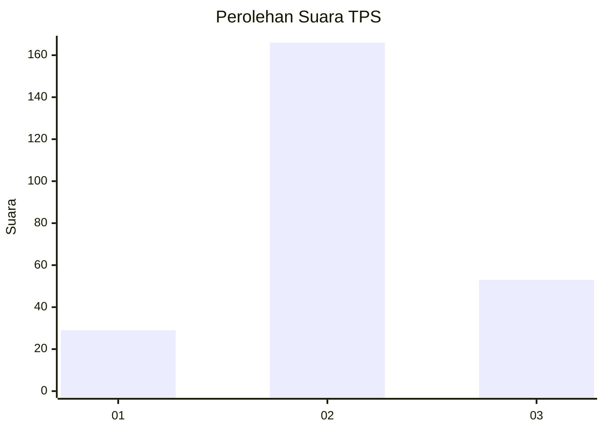
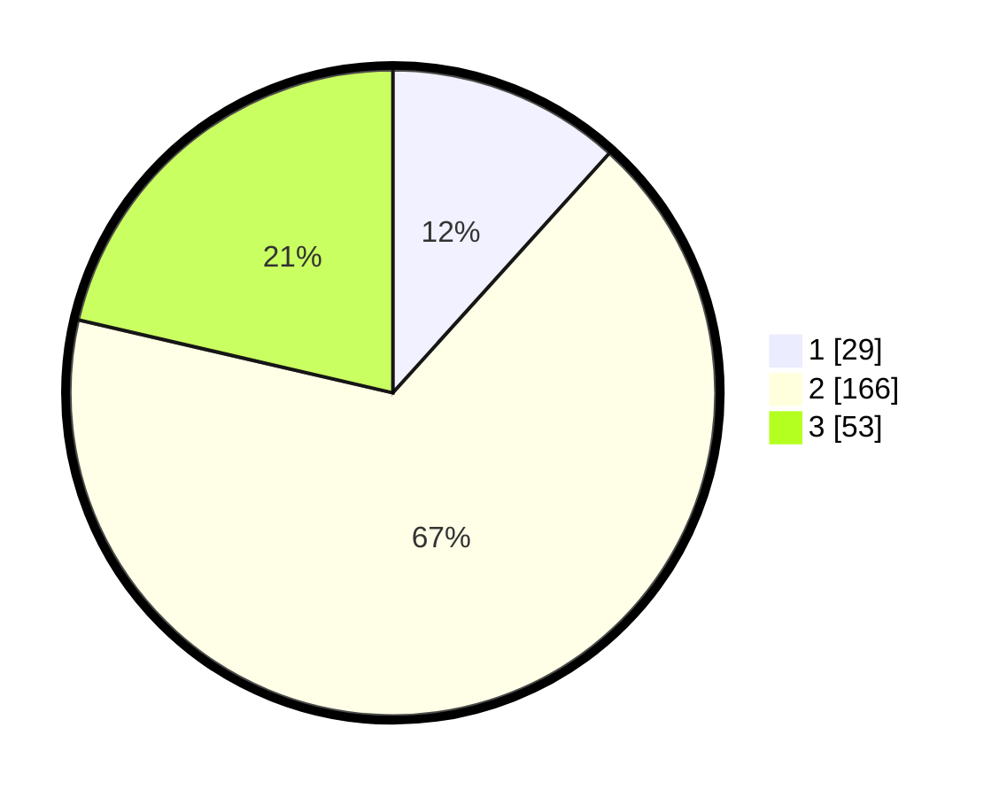

# Hasil

## Grafik

## Tabel

| No. | Nama Paslon    | Suara | Suara (raw) | Persentase |
|:--- |:-------------- | -----:| -----------:| ----------:|
| 1   | ANIES MUHAIMIN | 29    | [29][p-1]   | 11,69      |
| 2   | PRABOWO GIBRAN | 166   | [166][p-2]  | 66,94      |
| 3   | GANJAR MAHFUD  | 53    | [53][p-3]   | 21,37      |

[p-1]: https://github.com/gigit-pemilu/pemilu-2024/blob/main/pilpres/hitung-suara/sub/35-jawa-timur/sub/15-sidoarjo/sub/12-balongbendo/sub/2013-jabaran/sub/006-tps/sub/paslon-1.txt
[p-2]: https://github.com/gigit-pemilu/pemilu-2024/blob/main/pilpres/hitung-suara/sub/35-jawa-timur/sub/15-sidoarjo/sub/12-balongbendo/sub/2013-jabaran/sub/006-tps/sub/paslon-2.txt
[p-3]: https://github.com/gigit-pemilu/pemilu-2024/blob/main/pilpres/hitung-suara/sub/35-jawa-timur/sub/15-sidoarjo/sub/12-balongbendo/sub/2013-jabaran/sub/006-tps/sub/paslon-3.txt

## Foto C Plano

https://sirekap-obj-formc.kpu.go.id/02e5/pemilu/ppwp/35/15/12/20/13/3515122013006-20240218-185356--2ea7067d-3b06-46c2-9fe2-b600d848a126.jpg

https://sirekap-obj-formc.kpu.go.id/02e5/pemilu/ppwp/35/15/12/20/13/3515122013006-20240218-184635--0d25ab6e-0b98-4567-b9e7-d3a3693b6db2.jpg

https://sirekap-obj-formc.kpu.go.id/02e5/pemilu/ppwp/35/15/12/20/13/3515122013006-20240218-182606--94f7669c-c0d8-4292-92e9-ced23fbf67da.jpg

## Metadata

| Key        | Value               |
| ---------- | ------------------- |
| Time Stamp | 2024-02-24 22:31:28 |

