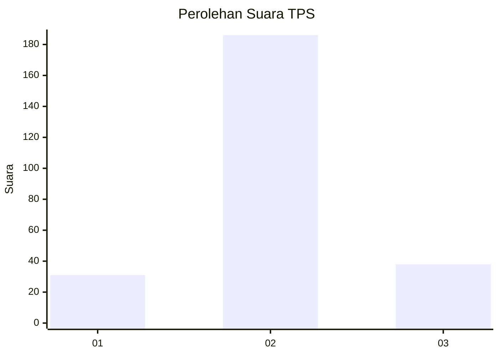
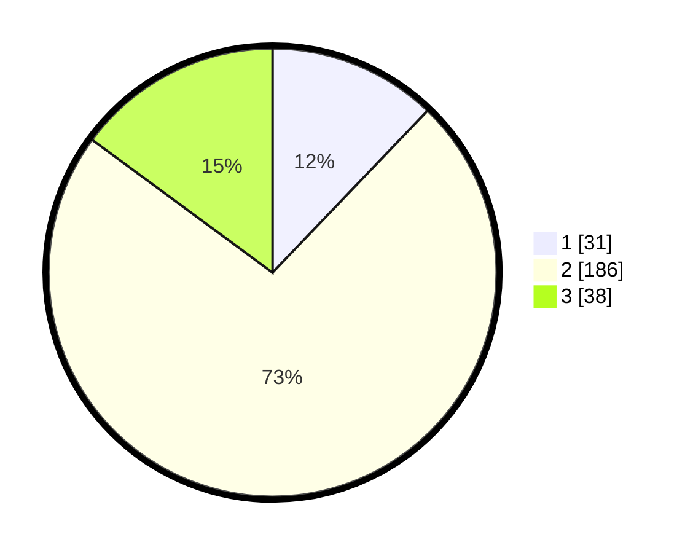

# Hasil

## Grafik

## Tabel

| No. | Nama Paslon    | Suara | Suara (raw) | Persentase |
|:--- |:-------------- | -----:| -----------:| ----------:|
| 1   | ANIES MUHAIMIN | 31    | [31][p-1]   | 12,16      |
| 2   | PRABOWO GIBRAN | 186   | [186][p-2]  | 72,94      |
| 3   | GANJAR MAHFUD  | 38    | [38][p-3]   | 14,90      |

[p-1]: https://github.com/gigit-pemilu/pemilu-2024/blob/main/pilpres/hitung-suara/sub/35-jawa-timur/sub/15-sidoarjo/sub/12-balongbendo/sub/2017-waruberon/sub/003-tps/sub/paslon-1.txt
[p-2]: https://github.com/gigit-pemilu/pemilu-2024/blob/main/pilpres/hitung-suara/sub/35-jawa-timur/sub/15-sidoarjo/sub/12-balongbendo/sub/2017-waruberon/sub/003-tps/sub/paslon-2.txt
[p-3]: https://github.com/gigit-pemilu/pemilu-2024/blob/main/pilpres/hitung-suara/sub/35-jawa-timur/sub/15-sidoarjo/sub/12-balongbendo/sub/2017-waruberon/sub/003-tps/sub/paslon-3.txt

## Foto C Plano

https://sirekap-obj-formc.kpu.go.id/fc4f/pemilu/ppwp/35/15/12/20/17/3515122017003-20240214-234810--058c7e25-0e50-4396-afac-65d309764cd7.jpg

https://sirekap-obj-formc.kpu.go.id/fc4f/pemilu/ppwp/35/15/12/20/17/3515122017003-20240214-234950--35074a1d-593b-4638-80b9-48213e106f09.jpg

https://sirekap-obj-formc.kpu.go.id/fc4f/pemilu/ppwp/35/15/12/20/17/3515122017003-20240214-235118--f3897318-8d24-455a-9dd2-19cc4ba66447.jpg

## Metadata

| Key        | Value               |
| ---------- | ------------------- |
| Time Stamp | 2024-02-25 13:00:00 |

