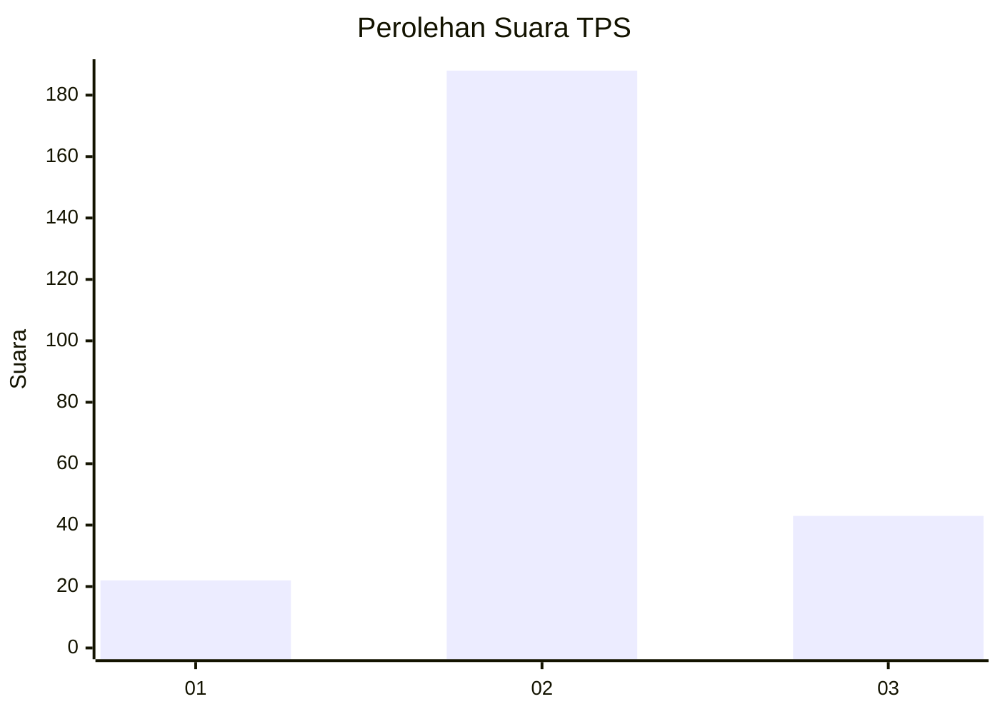
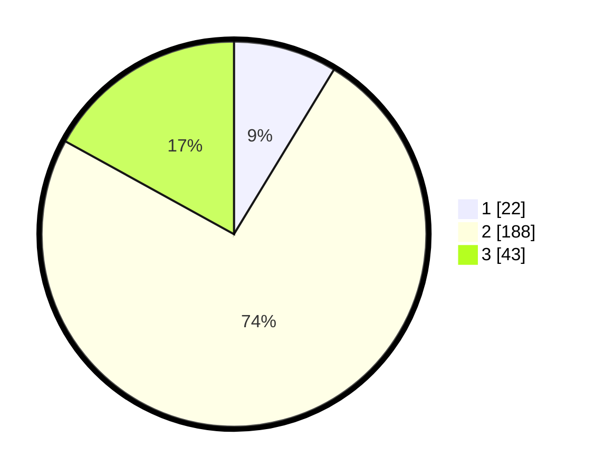

# Hasil

## Grafik

## Tabel

| No. | Nama Paslon    | Suara | Suara (raw) | Persentase |
|:--- |:-------------- | -----:| -----------:| ----------:|
| 1   | ANIES MUHAIMIN | 22    | [22][p-1]   | 8,70       |
| 2   | PRABOWO GIBRAN | 188   | [188][p-2]  | 74,31      |
| 3   | GANJAR MAHFUD  | 43    | [43][p-3]   | 17,00      |

[p-1]: https://github.com/gigit-pemilu/pemilu-2024/blob/main/pilpres/hitung-suara/sub/35-jawa-timur/sub/15-sidoarjo/sub/12-balongbendo/sub/2017-waruberon/sub/004-tps/sub/paslon-1.txt
[p-2]: https://github.com/gigit-pemilu/pemilu-2024/blob/main/pilpres/hitung-suara/sub/35-jawa-timur/sub/15-sidoarjo/sub/12-balongbendo/sub/2017-waruberon/sub/004-tps/sub/paslon-2.txt
[p-3]: https://github.com/gigit-pemilu/pemilu-2024/blob/main/pilpres/hitung-suara/sub/35-jawa-timur/sub/15-sidoarjo/sub/12-balongbendo/sub/2017-waruberon/sub/004-tps/sub/paslon-3.txt

## Foto C Plano

https://sirekap-obj-formc.kpu.go.id/9007/pemilu/ppwp/35/15/12/20/17/3515122017004-20240214-231719--82868607-3c68-4ae9-a3c8-da82ec2c555e.jpg

https://sirekap-obj-formc.kpu.go.id/9007/pemilu/ppwp/35/15/12/20/17/3515122017004-20240214-231910--86279dfa-00e4-4fd3-b3b2-554ec3d148cf.jpg

https://sirekap-obj-formc.kpu.go.id/9007/pemilu/ppwp/35/15/12/20/17/3515122017004-20240214-232101--4f7ebfce-35dd-46cd-8327-35ae95275706.jpg

## Metadata

| Key        | Value               |
| ---------- | ------------------- |
| Time Stamp | 2024-02-24 22:31:28 |

