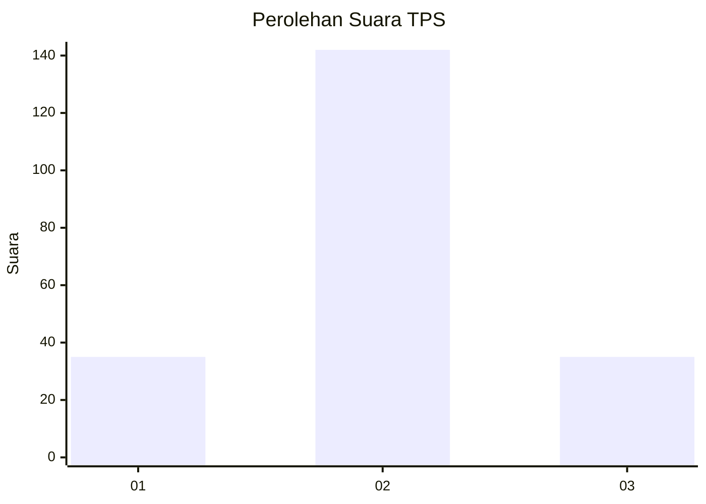
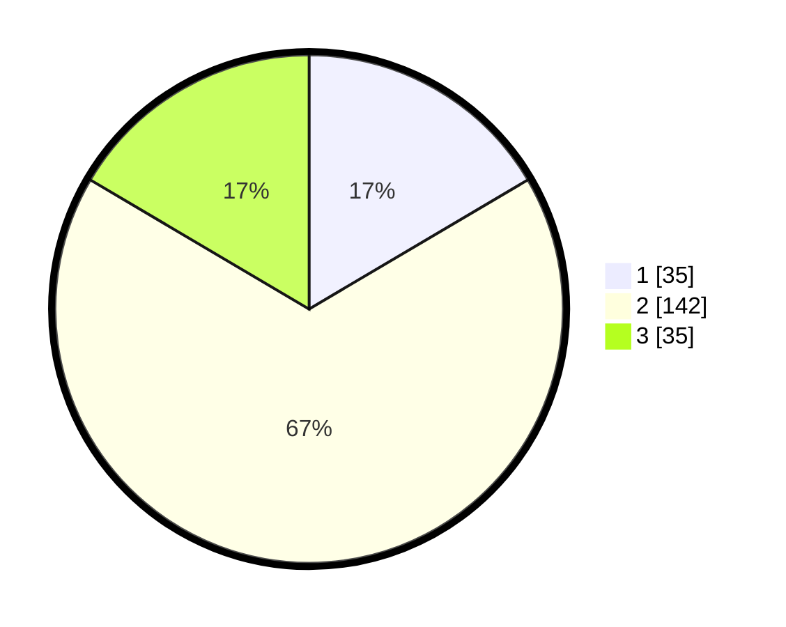

# Hasil

## Grafik

## Tabel

| No. | Nama Paslon    | Suara | Suara (raw) | Persentase |
|:--- |:-------------- | -----:| -----------:| ----------:|
| 1   | ANIES MUHAIMIN | 35    | [35][p-1]   | 16,51      |
| 2   | PRABOWO GIBRAN | 142   | [142][p-2]  | 66,98      |
| 3   | GANJAR MAHFUD  | 35    | [35][p-3]   | 16,51      |

[p-1]: https://github.com/gigit-pemilu/pemilu-2024-35-jawa-timur/blob/main/pilpres/hitung-suara/sub/35-jawa-timur/sub/15-sidoarjo/sub/13-taman/sub/1005-taman/sub/001-tps/sub/paslon-1.txt
[p-2]: https://github.com/gigit-pemilu/pemilu-2024-35-jawa-timur/blob/main/pilpres/hitung-suara/sub/35-jawa-timur/sub/15-sidoarjo/sub/13-taman/sub/1005-taman/sub/001-tps/sub/paslon-2.txt
[p-3]: https://github.com/gigit-pemilu/pemilu-2024-35-jawa-timur/blob/main/pilpres/hitung-suara/sub/35-jawa-timur/sub/15-sidoarjo/sub/13-taman/sub/1005-taman/sub/001-tps/sub/paslon-3.txt

## Foto C Plano

https://sirekap-obj-formc.kpu.go.id/1129/pemilu/ppwp/35/15/13/10/05/3515131005001-20240215-002853--81d6635b-8db2-4b69-a9c2-abe6f2864f8a.jpg

https://sirekap-obj-formc.kpu.go.id/1129/pemilu/ppwp/35/15/13/10/05/3515131005001-20240215-003104--7ef0b24a-dd42-4ed6-bae5-18e7e2789940.jpg

https://sirekap-obj-formc.kpu.go.id/1129/pemilu/ppwp/35/15/13/10/05/3515131005001-20240215-003257--9978eeec-0297-4386-87e8-755ecb717927.jpg

## Metadata

| Key        | Value               |
| ---------- | ------------------- |
| Time Stamp | 2024-02-16 12:51:22 |

