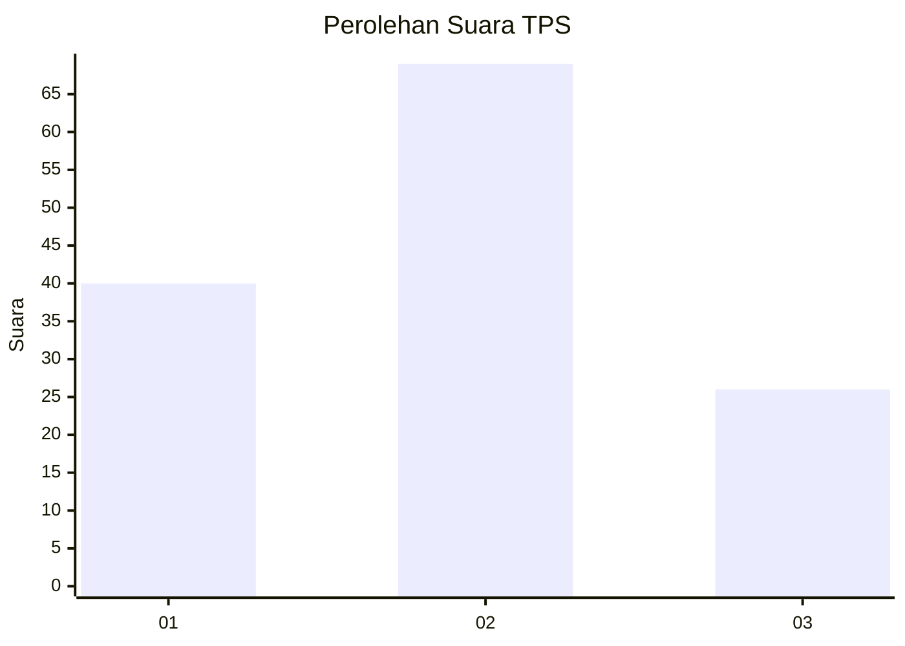
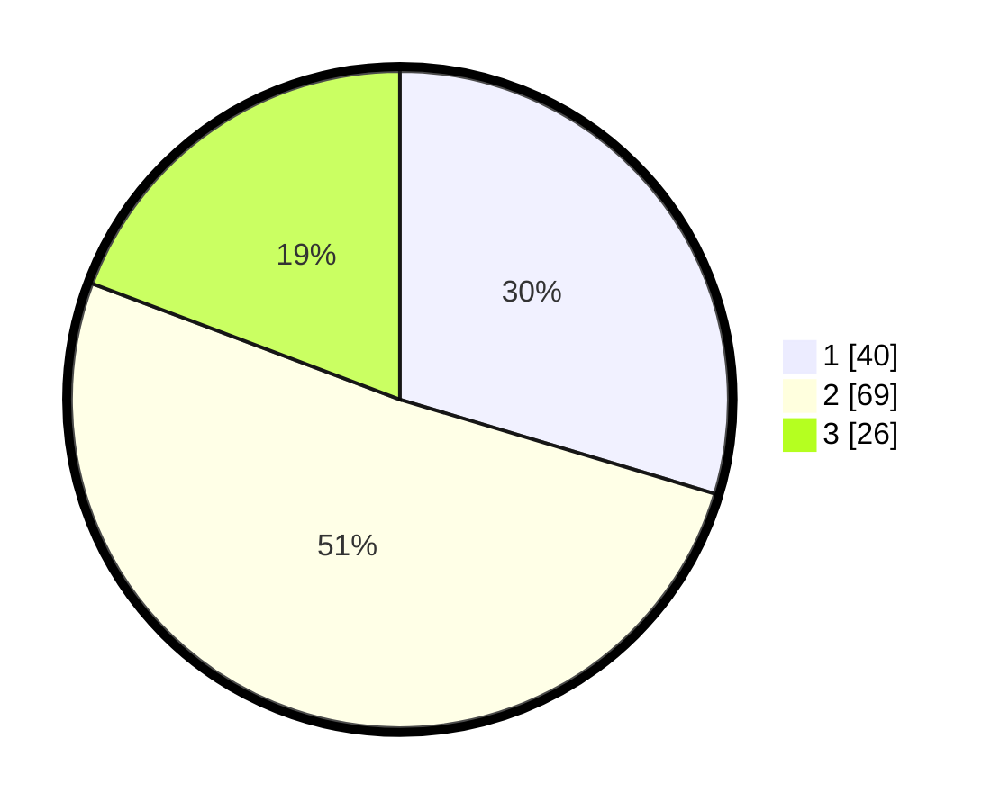

# Hasil

## Grafik

## Tabel

| No. | Nama Paslon    | Suara | Suara (raw) | Persentase |
|:--- |:-------------- | -----:| -----------:| ----------:|
| 1   | ANIES MUHAIMIN | 40    | [40][p-1]   | 29,63      |
| 2   | PRABOWO GIBRAN | 69    | [69][p-2]   | 51,11      |
| 3   | GANJAR MAHFUD  | 26    | [26][p-3]   | 19,26      |

[p-1]: https://github.com/gigit-pemilu/pemilu-2024-35-jawa-timur/blob/main/pilpres/hitung-suara/sub/35-jawa-timur/sub/15-sidoarjo/sub/13-taman/sub/1005-taman/sub/002-tps/sub/paslon-1.txt
[p-2]: https://github.com/gigit-pemilu/pemilu-2024-35-jawa-timur/blob/main/pilpres/hitung-suara/sub/35-jawa-timur/sub/15-sidoarjo/sub/13-taman/sub/1005-taman/sub/002-tps/sub/paslon-2.txt
[p-3]: https://github.com/gigit-pemilu/pemilu-2024-35-jawa-timur/blob/main/pilpres/hitung-suara/sub/35-jawa-timur/sub/15-sidoarjo/sub/13-taman/sub/1005-taman/sub/002-tps/sub/paslon-3.txt

## Foto C Plano

https://sirekap-obj-formc.kpu.go.id/3d9f/pemilu/ppwp/35/15/13/10/05/3515131005002-20240215-012044--3a012805-7a28-4bb6-8bb7-f234015934a0.jpg

https://sirekap-obj-formc.kpu.go.id/3d9f/pemilu/ppwp/35/15/13/10/05/3515131005002-20240215-012116--92ae60a6-73a5-4066-aac5-e225d9358178.jpg

https://sirekap-obj-formc.kpu.go.id/3d9f/pemilu/ppwp/35/15/13/10/05/3515131005002-20240215-012119--72d147a4-a01b-4629-8d35-adf590a0d85a.jpg

## Metadata

| Key        | Value               |
| ---------- | ------------------- |
| Time Stamp | 2024-02-25 16:00:00 |

