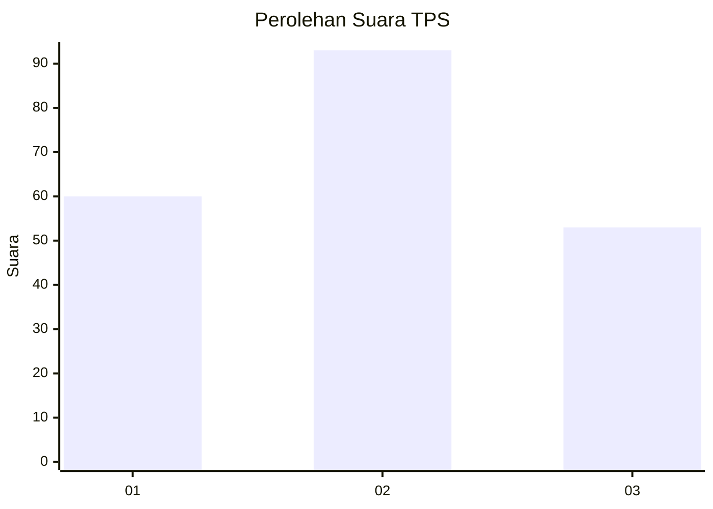
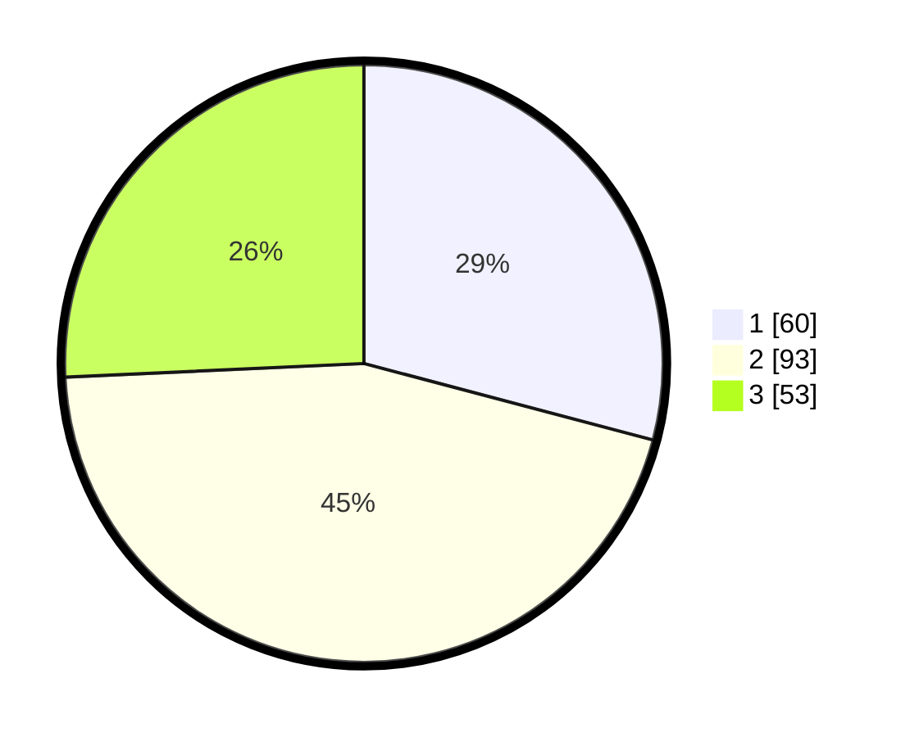

# Hasil

## Grafik

## Tabel

| No. | Nama Paslon    | Suara | Suara (raw) | Persentase |
|:--- |:-------------- | -----:| -----------:| ----------:|
| 1   | ANIES MUHAIMIN | 60    | [60][p-1]   | 29,13      |
| 2   | PRABOWO GIBRAN | 93    | [93][p-2]   | 45,15      |
| 3   | GANJAR MAHFUD  | 53    | [53][p-3]   | 25,73      |

[p-1]: https://github.com/gigit-pemilu/pemilu-2024-35-jawa-timur/blob/main/pilpres/hitung-suara/sub/35-jawa-timur/sub/15-sidoarjo/sub/13-taman/sub/1015-geluran/sub/029-tps/sub/paslon-1.txt
[p-2]: https://github.com/gigit-pemilu/pemilu-2024-35-jawa-timur/blob/main/pilpres/hitung-suara/sub/35-jawa-timur/sub/15-sidoarjo/sub/13-taman/sub/1015-geluran/sub/029-tps/sub/paslon-2.txt
[p-3]: https://github.com/gigit-pemilu/pemilu-2024-35-jawa-timur/blob/main/pilpres/hitung-suara/sub/35-jawa-timur/sub/15-sidoarjo/sub/13-taman/sub/1015-geluran/sub/029-tps/sub/paslon-3.txt

## Foto C Plano

https://sirekap-obj-formc.kpu.go.id/a422/pemilu/ppwp/35/15/13/10/15/3515131015029-20240217-213112--d8fa19e0-951d-4dee-84e6-a7aa470a374a.jpg

https://sirekap-obj-formc.kpu.go.id/a422/pemilu/ppwp/35/15/13/10/15/3515131015029-20240217-214031--78d2b9e6-3c03-40aa-848b-441b5bc3574d.jpg

https://sirekap-obj-formc.kpu.go.id/a422/pemilu/ppwp/35/15/13/10/15/3515131015029-20240217-214338--2e6ef915-c2a9-4c98-9cea-9d1dc53ca92d.jpg

## Metadata

| Key        | Value               |
| ---------- | ------------------- |
| Time Stamp | 2024-02-25 12:00:00 |

