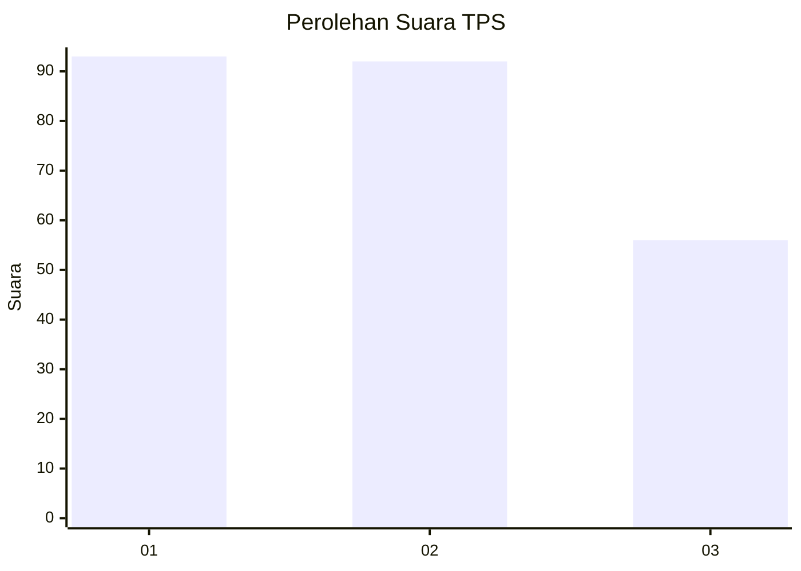
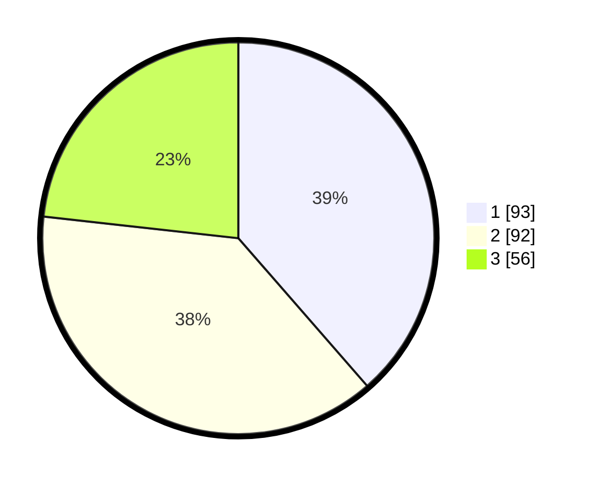

# Hasil

## Grafik

## Tabel

| No. | Nama Paslon    | Suara | Suara (raw) | Persentase |
|:--- |:-------------- | -----:| -----------:| ----------:|
| 1   | ANIES MUHAIMIN | 93    | [93][p-1]   | 38,59      |
| 2   | PRABOWO GIBRAN | 92    | [92][p-2]   | 38,17      |
| 3   | GANJAR MAHFUD  | 56    | [56][p-3]   | 23,24      |

[p-1]: https://github.com/gigit-pemilu/pemilu-2024-35-jawa-timur/blob/main/pilpres/hitung-suara/sub/35-jawa-timur/sub/15-sidoarjo/sub/13-taman/sub/1015-geluran/sub/037-tps/sub/paslon-1.txt
[p-2]: https://github.com/gigit-pemilu/pemilu-2024-35-jawa-timur/blob/main/pilpres/hitung-suara/sub/35-jawa-timur/sub/15-sidoarjo/sub/13-taman/sub/1015-geluran/sub/037-tps/sub/paslon-2.txt
[p-3]: https://github.com/gigit-pemilu/pemilu-2024-35-jawa-timur/blob/main/pilpres/hitung-suara/sub/35-jawa-timur/sub/15-sidoarjo/sub/13-taman/sub/1015-geluran/sub/037-tps/sub/paslon-3.txt

## Foto C Plano

https://sirekap-obj-formc.kpu.go.id/85c2/pemilu/ppwp/35/15/13/10/15/3515131015037-20240215-031734--bfe6d4fd-a7f8-403f-a41c-ff5fc9aa1965.jpg

https://sirekap-obj-formc.kpu.go.id/85c2/pemilu/ppwp/35/15/13/10/15/3515131015037-20240215-031908--ed2550b9-ba06-4c6a-9601-e8efff919cb9.jpg

https://sirekap-obj-formc.kpu.go.id/85c2/pemilu/ppwp/35/15/13/10/15/3515131015037-20240215-032154--9a36db2a-c447-4508-96c3-f9f1b986fdd0.jpg

## Metadata

| Key        | Value               |
| ---------- | ------------------- |
| Time Stamp | 2024-02-16 12:51:22 |

