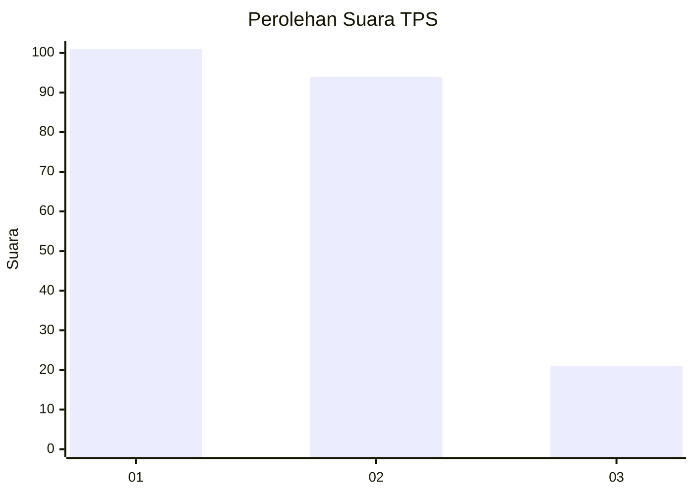
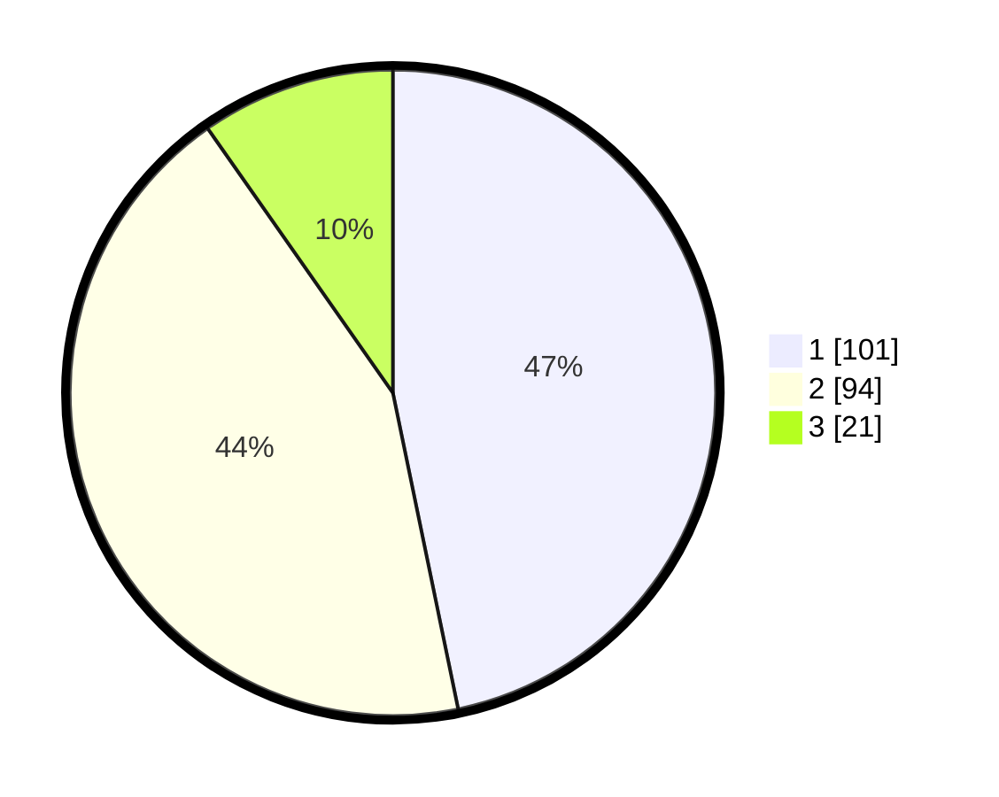

# Hasil

## Grafik

## Tabel

| No. | Nama Paslon    | Suara | Suara (raw) | Persentase |
|:--- |:-------------- | -----:| -----------:| ----------:|
| 1   | ANIES MUHAIMIN | 101   | [101][p-1]  | 46,76      |
| 2   | PRABOWO GIBRAN | 94    | [94][p-2]   | 43,52      |
| 3   | GANJAR MAHFUD  | 21    | [21][p-3]   | 9,72       |

[p-1]: https://github.com/gigit-pemilu/pemilu-2024/blob/main/pilpres/hitung-suara/sub/35-jawa-timur/sub/15-sidoarjo/sub/13-taman/sub/1018-ketegan/sub/004-tps/sub/paslon-1.txt
[p-2]: https://github.com/gigit-pemilu/pemilu-2024/blob/main/pilpres/hitung-suara/sub/35-jawa-timur/sub/15-sidoarjo/sub/13-taman/sub/1018-ketegan/sub/004-tps/sub/paslon-2.txt
[p-3]: https://github.com/gigit-pemilu/pemilu-2024/blob/main/pilpres/hitung-suara/sub/35-jawa-timur/sub/15-sidoarjo/sub/13-taman/sub/1018-ketegan/sub/004-tps/sub/paslon-3.txt

## Foto C Plano

https://sirekap-obj-formc.kpu.go.id/f0c1/pemilu/ppwp/35/15/13/10/18/3515131018004-20240214-233942--9d081183-8bab-4054-b2cc-d66ef8b859d6.jpg

https://sirekap-obj-formc.kpu.go.id/f0c1/pemilu/ppwp/35/15/13/10/18/3515131018004-20240214-234047--12ac2b99-d4e4-418a-a2d6-dc3bb60d814a.jpg

https://sirekap-obj-formc.kpu.go.id/f0c1/pemilu/ppwp/35/15/13/10/18/3515131018004-20240214-234130--18b85395-8fe0-4013-9815-cfa018e39487.jpg

## Metadata

| Key        | Value               |
| ---------- | ------------------- |
| Time Stamp | 2024-02-16 12:51:22 |

