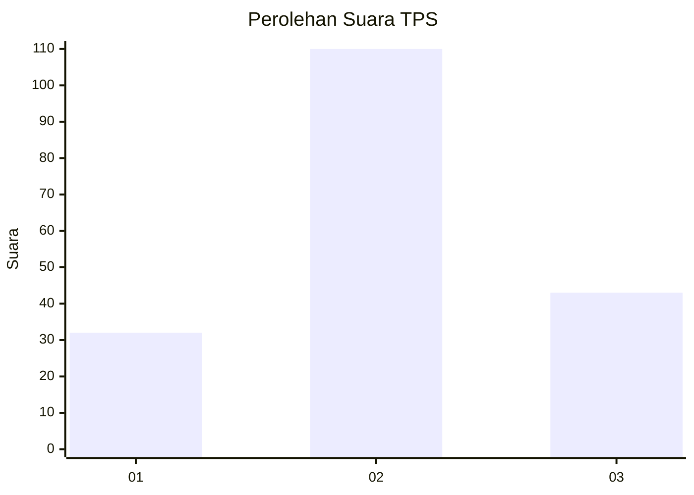
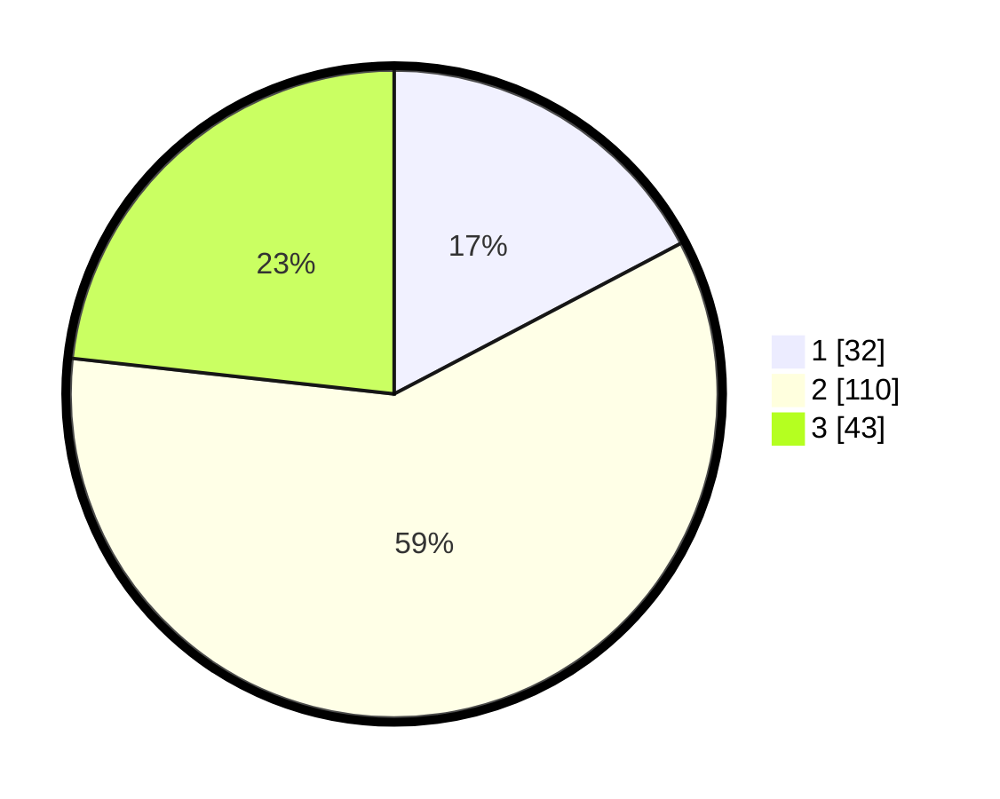

# Hasil

## Grafik

## Tabel

| No. | Nama Paslon    | Suara | Suara (raw) | Persentase |
|:--- |:-------------- | -----:| -----------:| ----------:|
| 1   | ANIES MUHAIMIN | 32    | [32][p-1]   | 17,30      |
| 2   | PRABOWO GIBRAN | 110   | [110][p-2]  | 59,46      |
| 3   | GANJAR MAHFUD  | 43    | [43][p-3]   | 23,24      |

[p-1]: https://github.com/gigit-pemilu/pemilu-2024/blob/main/pilpres/hitung-suara/sub/35-jawa-timur/sub/15-sidoarjo/sub/13-taman/sub/1019-sepanjang/sub/022-tps/sub/paslon-1.txt
[p-2]: https://github.com/gigit-pemilu/pemilu-2024/blob/main/pilpres/hitung-suara/sub/35-jawa-timur/sub/15-sidoarjo/sub/13-taman/sub/1019-sepanjang/sub/022-tps/sub/paslon-2.txt
[p-3]: https://github.com/gigit-pemilu/pemilu-2024/blob/main/pilpres/hitung-suara/sub/35-jawa-timur/sub/15-sidoarjo/sub/13-taman/sub/1019-sepanjang/sub/022-tps/sub/paslon-3.txt

## Foto C Plano

https://sirekap-obj-formc.kpu.go.id/13e0/pemilu/ppwp/35/15/13/10/19/3515131019022-20240214-212957--b543d552-c587-437a-a981-5cc2a0ba2ea3.jpg

https://sirekap-obj-formc.kpu.go.id/13e0/pemilu/ppwp/35/15/13/10/19/3515131019022-20240214-202331--3cbc0bd6-1597-4870-9d1f-1892f20ad813.jpg

https://sirekap-obj-formc.kpu.go.id/13e0/pemilu/ppwp/35/15/13/10/19/3515131019022-20240214-202449--f2f8e0d8-4daa-424c-8271-d8c8c3a313e6.jpg

## Metadata

| Key        | Value               |
| ---------- | ------------------- |
| Time Stamp | 2024-02-15 15:30:25 |

