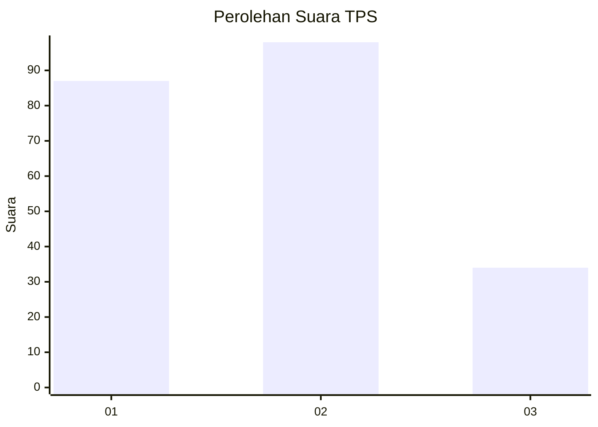
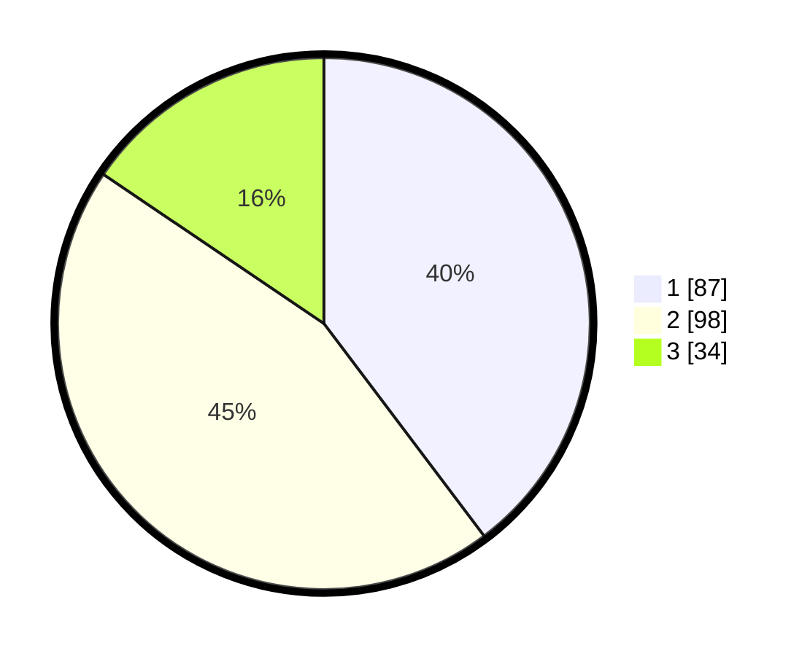

# Hasil

## Grafik

## Tabel

| No. | Nama Paslon    | Suara | Suara (raw) | Persentase |
|:--- |:-------------- | -----:| -----------:| ----------:|
| 1   | ANIES MUHAIMIN | 87    | [87][p-1]   | 39,73      |
| 2   | PRABOWO GIBRAN | 98    | [98][p-2]   | 44,75      |
| 3   | GANJAR MAHFUD  | 34    | [34][p-3]   | 15,53      |

[p-1]: https://github.com/gigit-pemilu/pemilu-2024-35-jawa-timur/blob/main/pilpres/hitung-suara/sub/35-jawa-timur/sub/15-sidoarjo/sub/13-taman/sub/1021-wonocolo/sub/007-tps/sub/paslon-1.txt
[p-2]: https://github.com/gigit-pemilu/pemilu-2024-35-jawa-timur/blob/main/pilpres/hitung-suara/sub/35-jawa-timur/sub/15-sidoarjo/sub/13-taman/sub/1021-wonocolo/sub/007-tps/sub/paslon-2.txt
[p-3]: https://github.com/gigit-pemilu/pemilu-2024-35-jawa-timur/blob/main/pilpres/hitung-suara/sub/35-jawa-timur/sub/15-sidoarjo/sub/13-taman/sub/1021-wonocolo/sub/007-tps/sub/paslon-3.txt

## Foto C Plano

https://sirekap-obj-formc.kpu.go.id/64fa/pemilu/ppwp/35/15/13/10/21/3515131021007-20240215-064858--61703537-2e8c-45d2-95e2-907251df3fb7.jpg

https://sirekap-obj-formc.kpu.go.id/64fa/pemilu/ppwp/35/15/13/10/21/3515131021007-20240214-223204--517bfa5f-4cc0-4ab2-8caf-4f9778f9494c.jpg

https://sirekap-obj-formc.kpu.go.id/64fa/pemilu/ppwp/35/15/13/10/21/3515131021007-20240214-202706--0403ef3b-6f69-46b2-b1a7-ce915a3b0793.jpg

## Metadata

| Key        | Value               |
| ---------- | ------------------- |
| Time Stamp | 2024-02-24 22:31:28 |

