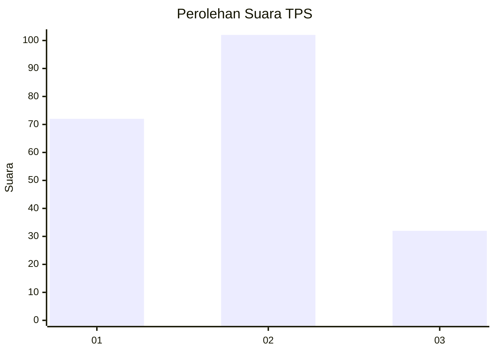
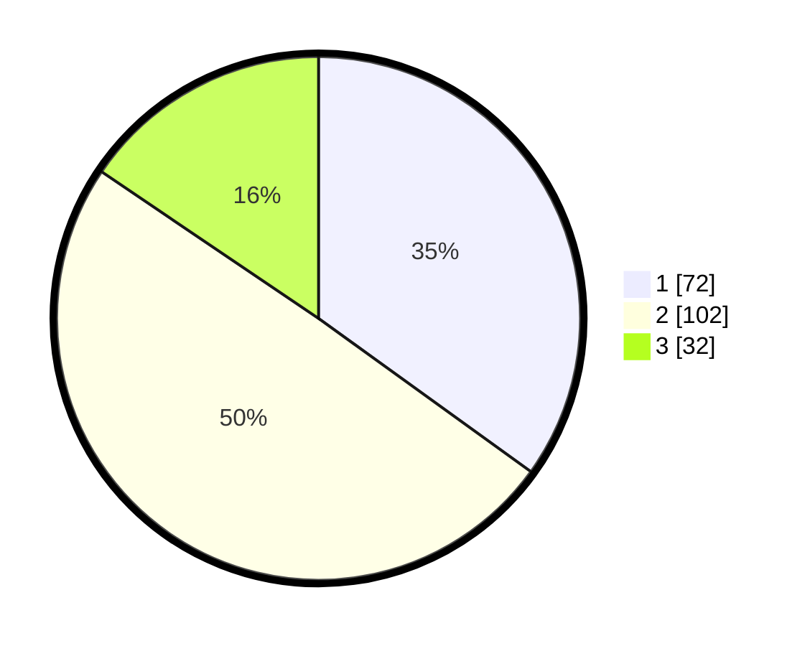

# Hasil

## Grafik

## Tabel

| No. | Nama Paslon    | Suara | Suara (raw) | Persentase |
|:--- |:-------------- | -----:| -----------:| ----------:|
| 1   | ANIES MUHAIMIN | 72    | [72][p-1]   | 34,95      |
| 2   | PRABOWO GIBRAN | 102   | [102][p-2]  | 49,51      |
| 3   | GANJAR MAHFUD  | 32    | [32][p-3]   | 15,53      |

[p-1]: https://github.com/gigit-pemilu/pemilu-2024/blob/main/pilpres/hitung-suara/sub/35-jawa-timur/sub/15-sidoarjo/sub/13-taman/sub/1021-wonocolo/sub/010-tps/sub/paslon-1.txt
[p-2]: https://github.com/gigit-pemilu/pemilu-2024/blob/main/pilpres/hitung-suara/sub/35-jawa-timur/sub/15-sidoarjo/sub/13-taman/sub/1021-wonocolo/sub/010-tps/sub/paslon-2.txt
[p-3]: https://github.com/gigit-pemilu/pemilu-2024/blob/main/pilpres/hitung-suara/sub/35-jawa-timur/sub/15-sidoarjo/sub/13-taman/sub/1021-wonocolo/sub/010-tps/sub/paslon-3.txt

## Foto C Plano

https://sirekap-obj-formc.kpu.go.id/0310/pemilu/ppwp/35/15/13/10/21/3515131021010-20240215-023054--77b0a5f7-d4c3-4b59-9997-d66859853374.jpg

https://sirekap-obj-formc.kpu.go.id/0310/pemilu/ppwp/35/15/13/10/21/3515131021010-20240215-023258--28733b8c-0e4b-49ef-a9da-178f1eb6db9e.jpg

https://sirekap-obj-formc.kpu.go.id/0310/pemilu/ppwp/35/15/13/10/21/3515131021010-20240215-023549--117587a3-99b4-4d74-82e5-217928d2c1e7.jpg

## Metadata

| Key        | Value               |
| ---------- | ------------------- |
| Time Stamp | 2024-02-16 13:00:29 |

