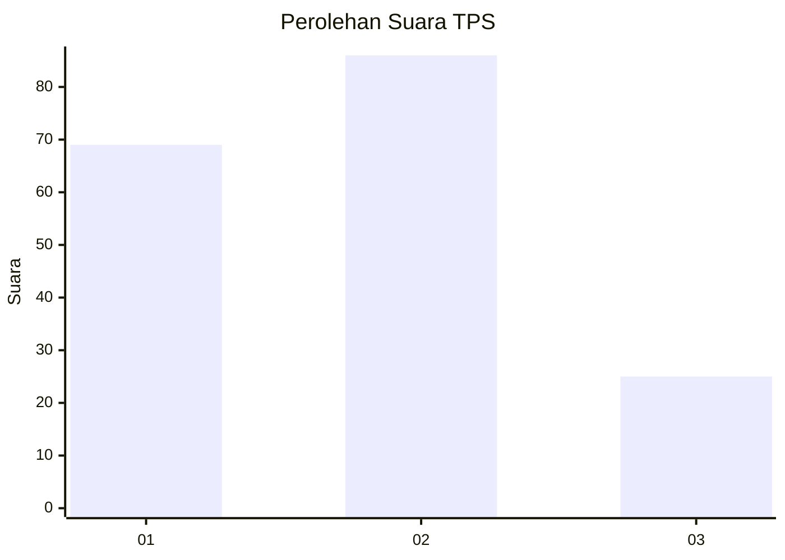
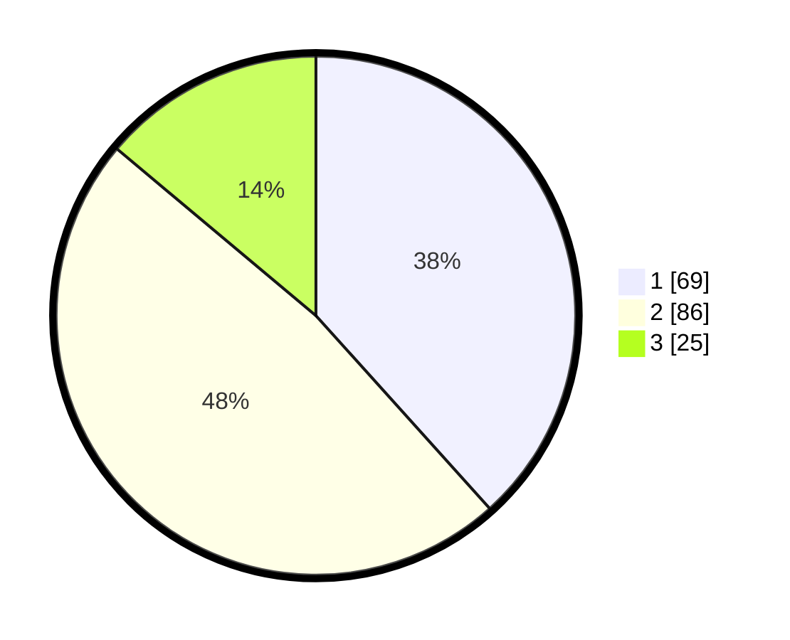

# Hasil

## Grafik

## Tabel

| No. | Nama Paslon    | Suara | Suara (raw) | Persentase |
|:--- |:-------------- | -----:| -----------:| ----------:|
| 1   | ANIES MUHAIMIN | 69    | [69][p-1]   | 38,33      |
| 2   | PRABOWO GIBRAN | 86    | [86][p-2]   | 47,78      |
| 3   | GANJAR MAHFUD  | 25    | [25][p-3]   | 13,89      |

[p-1]: https://github.com/gigit-pemilu/pemilu-2024/blob/main/pilpres/hitung-suara/sub/35-jawa-timur/sub/15-sidoarjo/sub/13-taman/sub/1022-ngelom/sub/013-tps/sub/paslon-1.txt
[p-2]: https://github.com/gigit-pemilu/pemilu-2024/blob/main/pilpres/hitung-suara/sub/35-jawa-timur/sub/15-sidoarjo/sub/13-taman/sub/1022-ngelom/sub/013-tps/sub/paslon-2.txt
[p-3]: https://github.com/gigit-pemilu/pemilu-2024/blob/main/pilpres/hitung-suara/sub/35-jawa-timur/sub/15-sidoarjo/sub/13-taman/sub/1022-ngelom/sub/013-tps/sub/paslon-3.txt

## Foto C Plano

https://sirekap-obj-formc.kpu.go.id/f19b/pemilu/ppwp/35/15/13/10/22/3515131022013-20240217-141043--497dc9b0-6994-45d5-9a9c-5e5a35a2067a.jpg

https://sirekap-obj-formc.kpu.go.id/f19b/pemilu/ppwp/35/15/13/10/22/3515131022013-20240217-135336--48d7f0e6-c6d1-46de-bd45-eeb5180f50be.jpg

https://sirekap-obj-formc.kpu.go.id/f19b/pemilu/ppwp/35/15/13/10/22/3515131022013-20240217-135516--a75a67d6-d5a8-4550-af8d-8bd5ee69b3f0.jpg

## Metadata

| Key        | Value               |
| ---------- | ------------------- |
| Time Stamp | 2024-02-25 13:00:00 |

