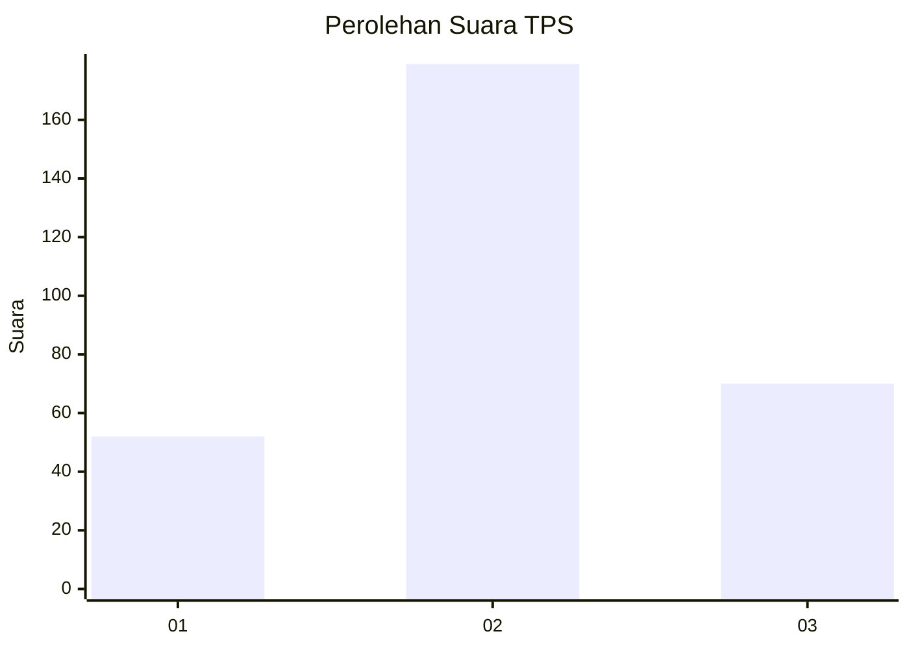
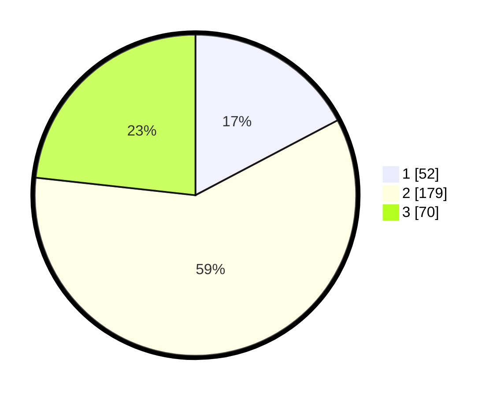

# Hasil

## Grafik

## Tabel

| No. | Nama Paslon    | Suara | Suara (raw) | Persentase |
|:--- |:-------------- | -----:| -----------:| ----------:|
| 1   | ANIES MUHAIMIN | 52    | [52][p-1]   | 17,28      |
| 2   | PRABOWO GIBRAN | 179   | [179][p-2]  | 59,47      |
| 3   | GANJAR MAHFUD  | 70    | [70][p-3]   | 23,26      |

[p-1]: https://github.com/gigit-pemilu/pemilu-2024/blob/main/pilpres/hitung-suara/sub/35-jawa-timur/sub/15-sidoarjo/sub/13-taman/sub/1022-ngelom/sub/016-tps/sub/paslon-1.txt
[p-2]: https://github.com/gigit-pemilu/pemilu-2024/blob/main/pilpres/hitung-suara/sub/35-jawa-timur/sub/15-sidoarjo/sub/13-taman/sub/1022-ngelom/sub/016-tps/sub/paslon-2.txt
[p-3]: https://github.com/gigit-pemilu/pemilu-2024/blob/main/pilpres/hitung-suara/sub/35-jawa-timur/sub/15-sidoarjo/sub/13-taman/sub/1022-ngelom/sub/016-tps/sub/paslon-3.txt

## Foto C Plano

https://sirekap-obj-formc.kpu.go.id/1e32/pemilu/ppwp/35/15/13/10/22/3515131022016-20240216-185913--3887f6a1-6a71-4eb5-91d3-de09724a8712.jpg

https://sirekap-obj-formc.kpu.go.id/1e32/pemilu/ppwp/35/15/13/10/22/3515131022016-20240217-194453--36f992b0-1cbc-46df-9fa8-ff1418a61136.jpg

https://sirekap-obj-formc.kpu.go.id/1e32/pemilu/ppwp/35/15/13/10/22/3515131022016-20240216-190112--9a810898-d781-4199-a1f5-99aafae42526.jpg

## Metadata

| Key        | Value               |
| ---------- | ------------------- |
| Time Stamp | 2024-02-19 06:16:00 |

