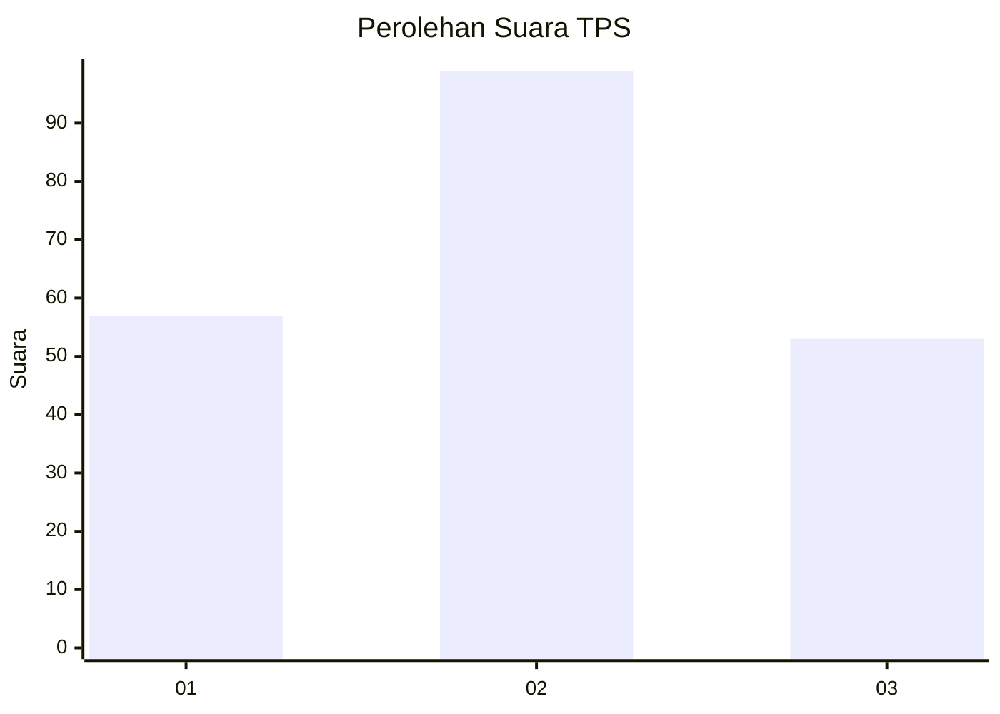
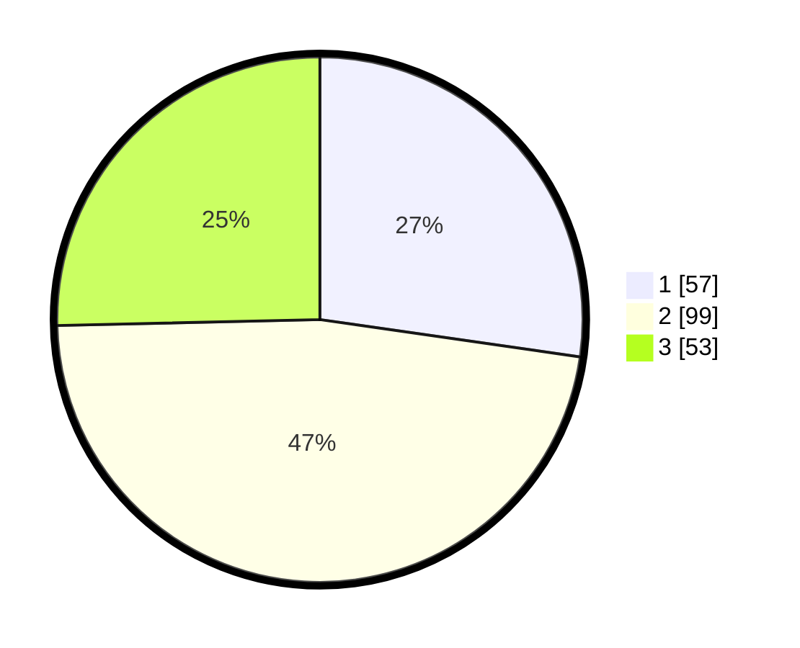

# Hasil

## Grafik

## Tabel

| No. | Nama Paslon    | Suara | Suara (raw) | Persentase |
|:--- |:-------------- | -----:| -----------:| ----------:|
| 1   | ANIES MUHAIMIN | 57    | [57][p-1]   | 27,27      |
| 2   | PRABOWO GIBRAN | 99    | [99][p-2]   | 47,37      |
| 3   | GANJAR MAHFUD  | 53    | [53][p-3]   | 25,36      |

[p-1]: https://github.com/gigit-pemilu/pemilu-2024/blob/main/pilpres/hitung-suara/sub/35-jawa-timur/sub/15-sidoarjo/sub/13-taman/sub/2002-wage/sub/048-tps/sub/paslon-1.txt
[p-2]: https://github.com/gigit-pemilu/pemilu-2024/blob/main/pilpres/hitung-suara/sub/35-jawa-timur/sub/15-sidoarjo/sub/13-taman/sub/2002-wage/sub/048-tps/sub/paslon-2.txt
[p-3]: https://github.com/gigit-pemilu/pemilu-2024/blob/main/pilpres/hitung-suara/sub/35-jawa-timur/sub/15-sidoarjo/sub/13-taman/sub/2002-wage/sub/048-tps/sub/paslon-3.txt

## Foto C Plano

https://sirekap-obj-formc.kpu.go.id/5402/pemilu/ppwp/35/15/13/20/02/3515132002048-20240215-023511--e156ef71-80e5-4ba4-9bc6-f358a3a09dac.jpg

https://sirekap-obj-formc.kpu.go.id/5402/pemilu/ppwp/35/15/13/20/02/3515132002048-20240215-023039--dd49bda0-1129-4ef5-aef4-c9f390e9c76e.jpg

https://sirekap-obj-formc.kpu.go.id/5402/pemilu/ppwp/35/15/13/20/02/3515132002048-20240215-023344--e37e63e3-b86f-4ffe-81c9-f82a31b45692.jpg

## Metadata

| Key        | Value               |
| ---------- | ------------------- |
| Time Stamp | 2024-02-16 16:25:10 |

