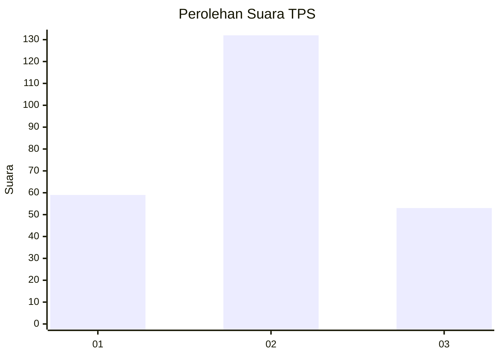
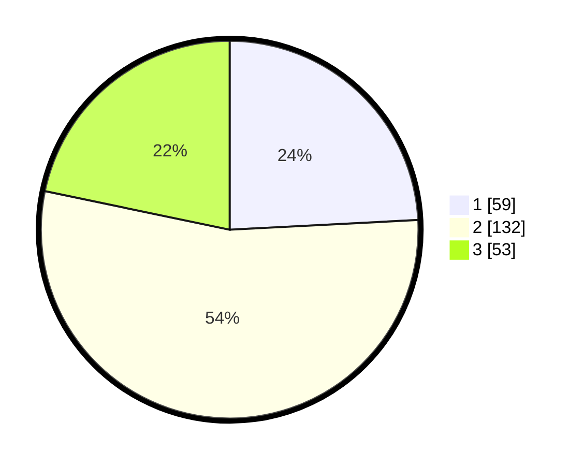

# Hasil

## Grafik

## Tabel

| No. | Nama Paslon    | Suara | Suara (raw) | Persentase |
|:--- |:-------------- | -----:| -----------:| ----------:|
| 1   | ANIES MUHAIMIN | 59    | [59][p-1]   | 24,18      |
| 2   | PRABOWO GIBRAN | 132   | [132][p-2]  | 54,10      |
| 3   | GANJAR MAHFUD  | 53    | [53][p-3]   | 21,72      |

[p-1]: https://github.com/gigit-pemilu/pemilu-2024/blob/main/pilpres/hitung-suara/sub/35-jawa-timur/sub/15-sidoarjo/sub/13-taman/sub/2003-kedungturi/sub/027-tps/sub/paslon-1.txt
[p-2]: https://github.com/gigit-pemilu/pemilu-2024/blob/main/pilpres/hitung-suara/sub/35-jawa-timur/sub/15-sidoarjo/sub/13-taman/sub/2003-kedungturi/sub/027-tps/sub/paslon-2.txt
[p-3]: https://github.com/gigit-pemilu/pemilu-2024/blob/main/pilpres/hitung-suara/sub/35-jawa-timur/sub/15-sidoarjo/sub/13-taman/sub/2003-kedungturi/sub/027-tps/sub/paslon-3.txt

## Foto C Plano

https://sirekap-obj-formc.kpu.go.id/883f/pemilu/ppwp/35/15/13/20/03/3515132003027-20240217-120304--41023a31-37e9-45f0-9511-512735a07d68.jpg

https://sirekap-obj-formc.kpu.go.id/883f/pemilu/ppwp/35/15/13/20/03/3515132003027-20240217-120552--3cdb0b45-253b-4805-829f-31bdf1148b2a.jpg

https://sirekap-obj-formc.kpu.go.id/883f/pemilu/ppwp/35/15/13/20/03/3515132003027-20240217-121022--f639c6d8-487a-4f9a-9178-e51f6482e950.jpg

## Metadata

| Key        | Value               |
| ---------- | ------------------- |
| Time Stamp | 2024-02-25 15:00:00 |

