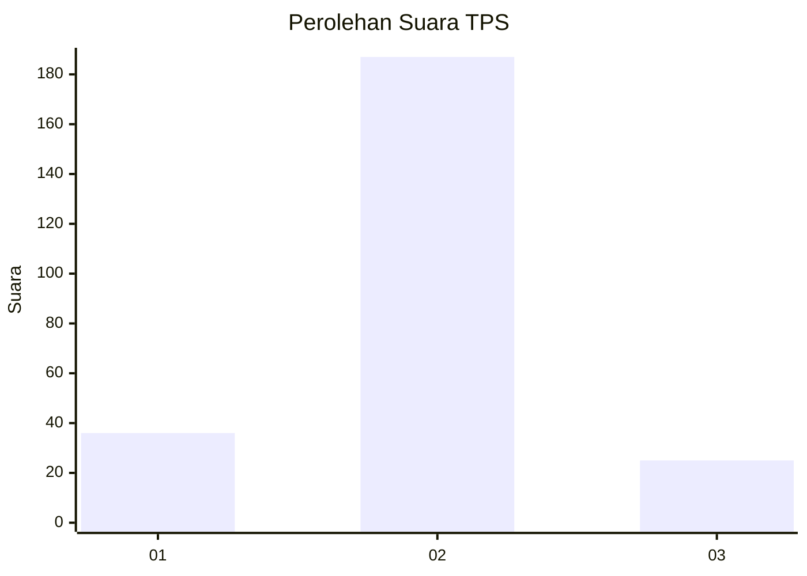
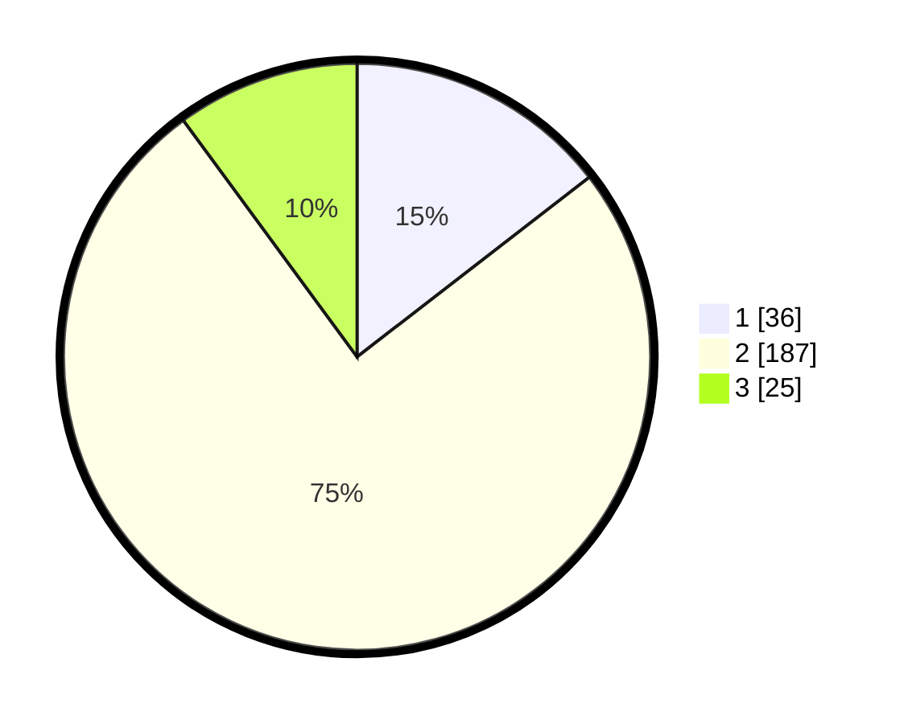

# Hasil

## Grafik

## Tabel

| No. | Nama Paslon    | Suara | Suara (raw) | Persentase |
|:--- |:-------------- | -----:| -----------:| ----------:|
| 1   | ANIES MUHAIMIN | 36    | [36][p-1]   | 14,52      |
| 2   | PRABOWO GIBRAN | 187   | [187][p-2]  | 75,40      |
| 3   | GANJAR MAHFUD  | 25    | [25][p-3]   | 10,08      |

[p-1]: https://github.com/gigit-pemilu/pemilu-2024-35-jawa-timur/blob/main/pilpres/hitung-suara/sub/35-jawa-timur/sub/15-sidoarjo/sub/13-taman/sub/2007-sambibulu/sub/004-tps/sub/paslon-1.txt
[p-2]: https://github.com/gigit-pemilu/pemilu-2024-35-jawa-timur/blob/main/pilpres/hitung-suara/sub/35-jawa-timur/sub/15-sidoarjo/sub/13-taman/sub/2007-sambibulu/sub/004-tps/sub/paslon-2.txt
[p-3]: https://github.com/gigit-pemilu/pemilu-2024-35-jawa-timur/blob/main/pilpres/hitung-suara/sub/35-jawa-timur/sub/15-sidoarjo/sub/13-taman/sub/2007-sambibulu/sub/004-tps/sub/paslon-3.txt

## Foto C Plano

https://sirekap-obj-formc.kpu.go.id/0d13/pemilu/ppwp/35/15/13/20/07/3515132007004-20240217-102725--a413df14-feb0-4f2b-8de2-9a82f36e1ecc.jpg

https://sirekap-obj-formc.kpu.go.id/0d13/pemilu/ppwp/35/15/13/20/07/3515132007004-20240217-103015--a05dab99-e6be-46a3-83e6-877ad2a82cca.jpg

https://sirekap-obj-formc.kpu.go.id/0d13/pemilu/ppwp/35/15/13/20/07/3515132007004-20240217-103303--d547e296-efbc-43f4-bbc5-92ef81d2c4ea.jpg

## Metadata

| Key        | Value               |
| ---------- | ------------------- |
| Time Stamp | 2024-02-25 11:00:00 |

