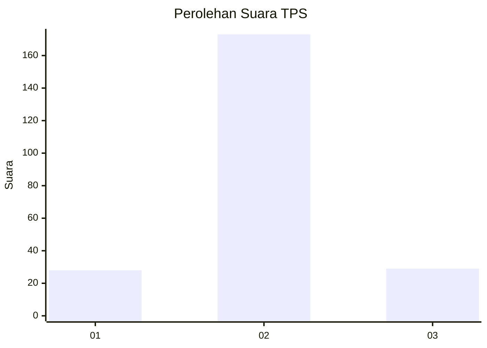
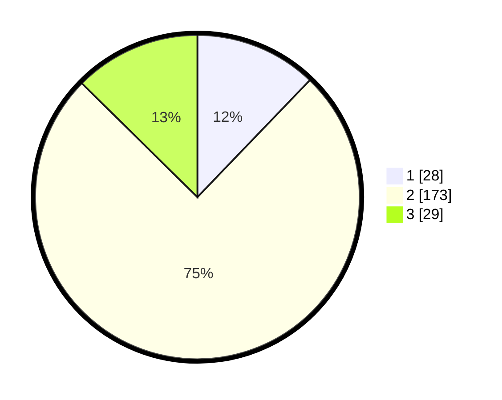

# Hasil

## Grafik

## Tabel

| No. | Nama Paslon    | Suara | Suara (raw) | Persentase |
|:--- |:-------------- | -----:| -----------:| ----------:|
| 1   | ANIES MUHAIMIN | 28    | [28][p-1]   | 12,17      |
| 2   | PRABOWO GIBRAN | 173   | [173][p-2]  | 75,22      |
| 3   | GANJAR MAHFUD  | 29    | [29][p-3]   | 12,61      |

[p-1]: https://github.com/gigit-pemilu/pemilu-2024/blob/main/pilpres/hitung-suara/sub/35-jawa-timur/sub/15-sidoarjo/sub/13-taman/sub/2008-bringinbendo/sub/010-tps/sub/paslon-1.txt
[p-2]: https://github.com/gigit-pemilu/pemilu-2024/blob/main/pilpres/hitung-suara/sub/35-jawa-timur/sub/15-sidoarjo/sub/13-taman/sub/2008-bringinbendo/sub/010-tps/sub/paslon-2.txt
[p-3]: https://github.com/gigit-pemilu/pemilu-2024/blob/main/pilpres/hitung-suara/sub/35-jawa-timur/sub/15-sidoarjo/sub/13-taman/sub/2008-bringinbendo/sub/010-tps/sub/paslon-3.txt

## Foto C Plano

https://sirekap-obj-formc.kpu.go.id/975c/pemilu/ppwp/35/15/13/20/08/3515132008010-20240216-172124--525dfbe7-6c34-4354-9fb5-35d2f1df4311.jpg

https://sirekap-obj-formc.kpu.go.id/975c/pemilu/ppwp/35/15/13/20/08/3515132008010-20240216-172402--da099f59-7685-4762-be23-64af832512bc.jpg

https://sirekap-obj-formc.kpu.go.id/975c/pemilu/ppwp/35/15/13/20/08/3515132008010-20240216-172514--bfbbe61c-7815-41c6-8303-e625b3870c89.jpg

## Metadata

| Key        | Value               |
| ---------- | ------------------- |
| Time Stamp | 2024-02-25 16:00:00 |

## DATA PEMILIH TETAP

Jumlah pemilih dalam DPT: **275**.
 * L: **645**.
 * P: **829**.

## DATA PENGGUNA HAK PILIH

Jumlah pengguna hak pilih dalam DPT: **225**.
 * L: **665**.
 * P: **862**.

Jumlah pengguna hak pilih dalam DPTb: **802**.
 * L: **820**.
 * P: **2**.

Jumlah pengguna hak pilih dalam DPK: **2**.
 * L: **82**.
 * P: **8**.

Jumlah pengguna hak pilih: **270**.
 * L: **488**.
 * P: **602**.

## JUMLAH SUARA SAH DAN TIDAK SAH

JUMLAH SELURUH SUARA SAH: **230**.

JUMLAH SUARA TIDAK SAH: **1**.

JUMLAH SELURUH SUARA SAH DAN SUARA TIDAK SAH: **231**.

