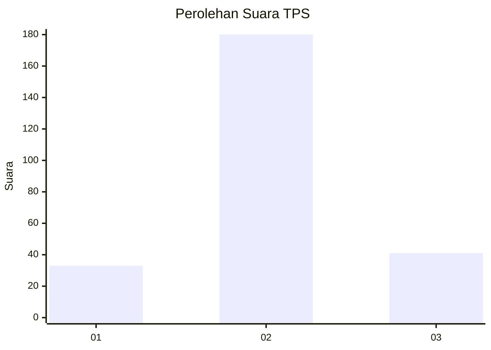
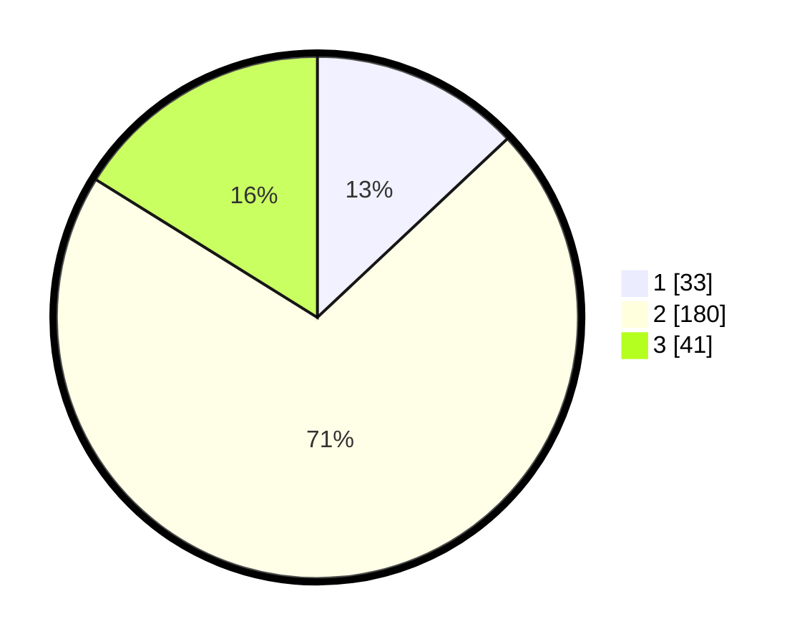

# Hasil

## Grafik

## Tabel

| No. | Nama Paslon    | Suara | Suara (raw) | Persentase |
|:--- |:-------------- | -----:| -----------:| ----------:|
| 1   | ANIES MUHAIMIN | 33    | [33][p-1]   | 12,99      |
| 2   | PRABOWO GIBRAN | 180   | [180][p-2]  | 70,87      |
| 3   | GANJAR MAHFUD  | 41    | [41][p-3]   | 16,14      |

[p-1]: https://github.com/gigit-pemilu/pemilu-2024/blob/main/pilpres/hitung-suara/sub/35-jawa-timur/sub/15-sidoarjo/sub/13-taman/sub/2009-sidodadi/sub/002-tps/sub/paslon-1.txt
[p-2]: https://github.com/gigit-pemilu/pemilu-2024/blob/main/pilpres/hitung-suara/sub/35-jawa-timur/sub/15-sidoarjo/sub/13-taman/sub/2009-sidodadi/sub/002-tps/sub/paslon-2.txt
[p-3]: https://github.com/gigit-pemilu/pemilu-2024/blob/main/pilpres/hitung-suara/sub/35-jawa-timur/sub/15-sidoarjo/sub/13-taman/sub/2009-sidodadi/sub/002-tps/sub/paslon-3.txt

## Foto C Plano

https://sirekap-obj-formc.kpu.go.id/bab2/pemilu/ppwp/35/15/13/20/09/3515132009002-20240220-111926--676dac14-1c10-4ee1-8840-371895766242.jpg

https://sirekap-obj-formc.kpu.go.id/bab2/pemilu/ppwp/35/15/13/20/09/3515132009002-20240220-112048--5d78fac8-4ffa-48f9-9560-a951830e426f.jpg

https://sirekap-obj-formc.kpu.go.id/bab2/pemilu/ppwp/35/15/13/20/09/3515132009002-20240220-112017--d9d6972a-2c08-41b7-b2f0-83888e09b1fe.jpg

## Metadata

| Key        | Value               |
| ---------- | ------------------- |
| Time Stamp | 2024-02-25 14:00:00 |

