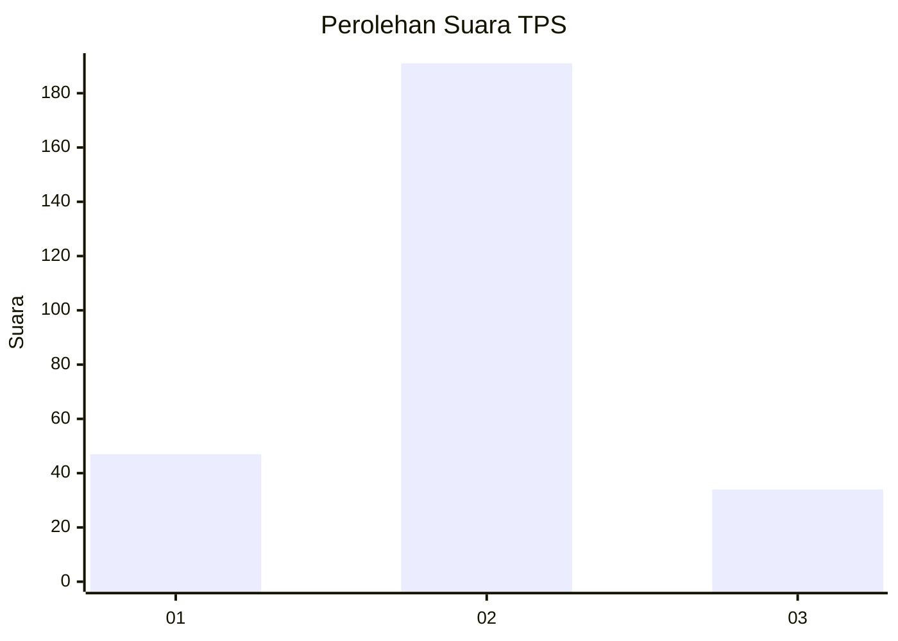
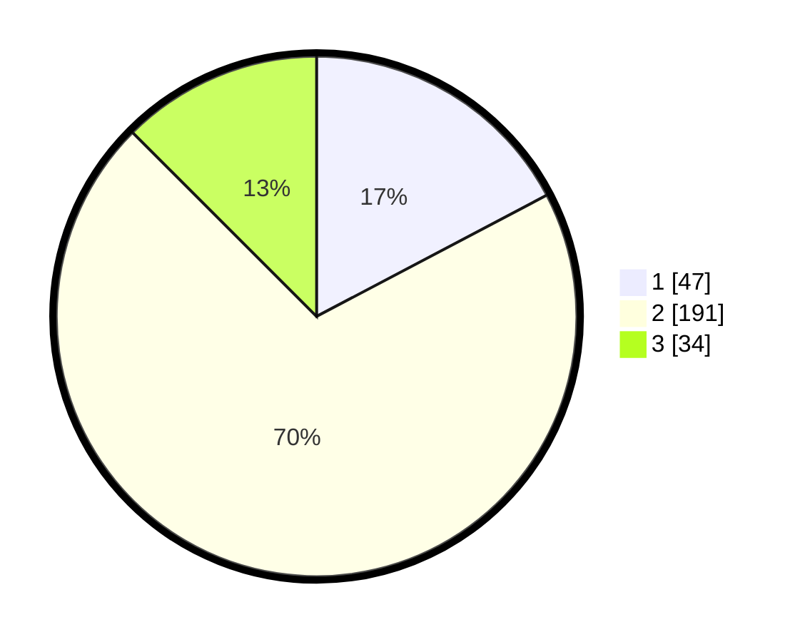

# Hasil

## Grafik

## Tabel

| No. | Nama Paslon    | Suara | Suara (raw) | Persentase |
|:--- |:-------------- | -----:| -----------:| ----------:|
| 1   | ANIES MUHAIMIN | 47    | [47][p-1]   | 17,28      |
| 2   | PRABOWO GIBRAN | 191   | [191][p-2]  | 70,22      |
| 3   | GANJAR MAHFUD  | 34    | [34][p-3]   | 12,50      |

[p-1]: https://github.com/gigit-pemilu/pemilu-2024-35-jawa-timur/blob/main/pilpres/hitung-suara/sub/35-jawa-timur/sub/15-sidoarjo/sub/13-taman/sub/2009-sidodadi/sub/010-tps/sub/paslon-1.txt
[p-2]: https://github.com/gigit-pemilu/pemilu-2024-35-jawa-timur/blob/main/pilpres/hitung-suara/sub/35-jawa-timur/sub/15-sidoarjo/sub/13-taman/sub/2009-sidodadi/sub/010-tps/sub/paslon-2.txt
[p-3]: https://github.com/gigit-pemilu/pemilu-2024-35-jawa-timur/blob/main/pilpres/hitung-suara/sub/35-jawa-timur/sub/15-sidoarjo/sub/13-taman/sub/2009-sidodadi/sub/010-tps/sub/paslon-3.txt

## Foto C Plano

https://sirekap-obj-formc.kpu.go.id/1657/pemilu/ppwp/35/15/13/20/09/3515132009010-20240217-141115--5f76df4d-d080-4d06-83e0-bb8cceafb334.jpg

https://sirekap-obj-formc.kpu.go.id/1657/pemilu/ppwp/35/15/13/20/09/3515132009010-20240214-204025--303abc3f-c4fd-44bd-85b6-948410671b2f.jpg

https://sirekap-obj-formc.kpu.go.id/1657/pemilu/ppwp/35/15/13/20/09/3515132009010-20240217-141235--07da2a6a-8be4-4b61-b551-83b92fa26ee5.jpg

## Metadata

| Key        | Value               |
| ---------- | ------------------- |
| Time Stamp | 2024-02-17 14:45:18 |

