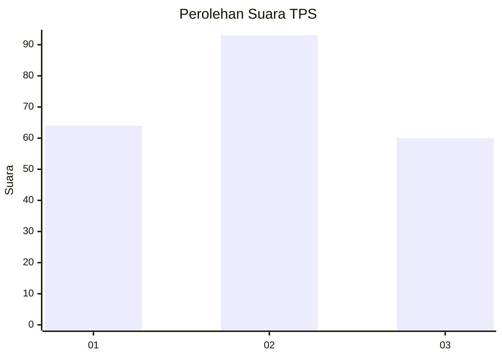
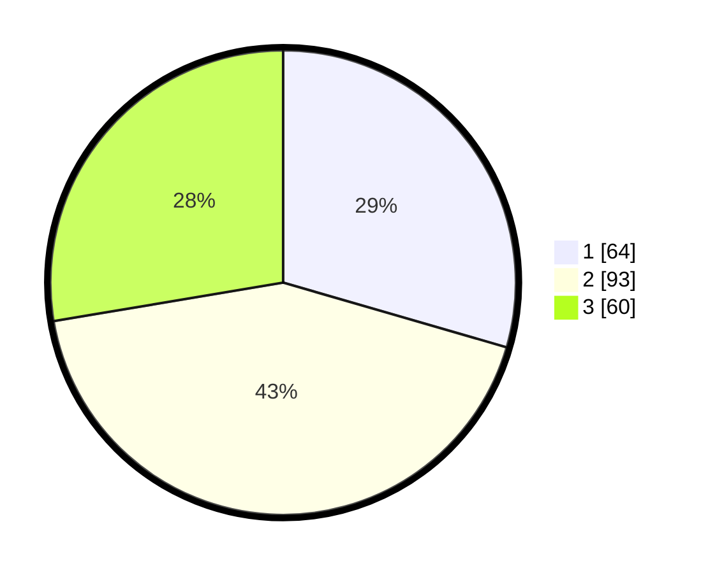

# Hasil

## Grafik

## Tabel

| No. | Nama Paslon    | Suara | Suara (raw) | Persentase |
|:--- |:-------------- | -----:| -----------:| ----------:|
| 1   | ANIES MUHAIMIN | 64    | [64][p-1]   | 29,49      |
| 2   | PRABOWO GIBRAN | 93    | [93][p-2]   | 42,86      |
| 3   | GANJAR MAHFUD  | 60    | [60][p-3]   | 27,65      |

[p-1]: https://github.com/gigit-pemilu/pemilu-2024-35-jawa-timur/blob/main/pilpres/hitung-suara/sub/35-jawa-timur/sub/15-sidoarjo/sub/13-taman/sub/2009-sidodadi/sub/020-tps/sub/paslon-1.txt
[p-2]: https://github.com/gigit-pemilu/pemilu-2024-35-jawa-timur/blob/main/pilpres/hitung-suara/sub/35-jawa-timur/sub/15-sidoarjo/sub/13-taman/sub/2009-sidodadi/sub/020-tps/sub/paslon-2.txt
[p-3]: https://github.com/gigit-pemilu/pemilu-2024-35-jawa-timur/blob/main/pilpres/hitung-suara/sub/35-jawa-timur/sub/15-sidoarjo/sub/13-taman/sub/2009-sidodadi/sub/020-tps/sub/paslon-3.txt

## Foto C Plano

https://sirekap-obj-formc.kpu.go.id/5494/pemilu/ppwp/35/15/13/20/09/3515132009020-20240216-200902--d1a0a477-819c-4583-a4f2-87a5d1c9f36c.jpg

https://sirekap-obj-formc.kpu.go.id/5494/pemilu/ppwp/35/15/13/20/09/3515132009020-20240216-211153--29a6343f-b62d-4411-ae02-20dd31010c38.jpg

https://sirekap-obj-formc.kpu.go.id/5494/pemilu/ppwp/35/15/13/20/09/3515132009020-20240216-201152--44e24e2d-d8ad-48ea-9886-26570ad6c7cb.jpg

## Metadata

| Key        | Value               |
| ---------- | ------------------- |
| Time Stamp | 2024-02-24 22:31:28 |

